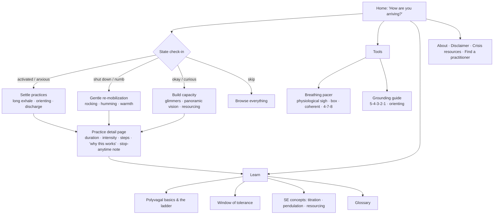
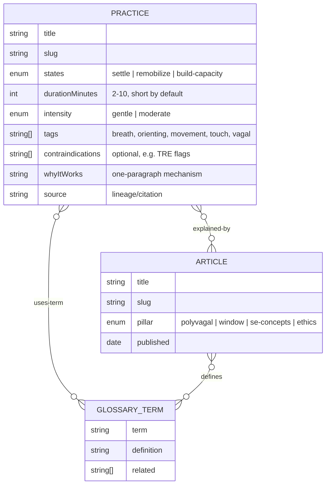
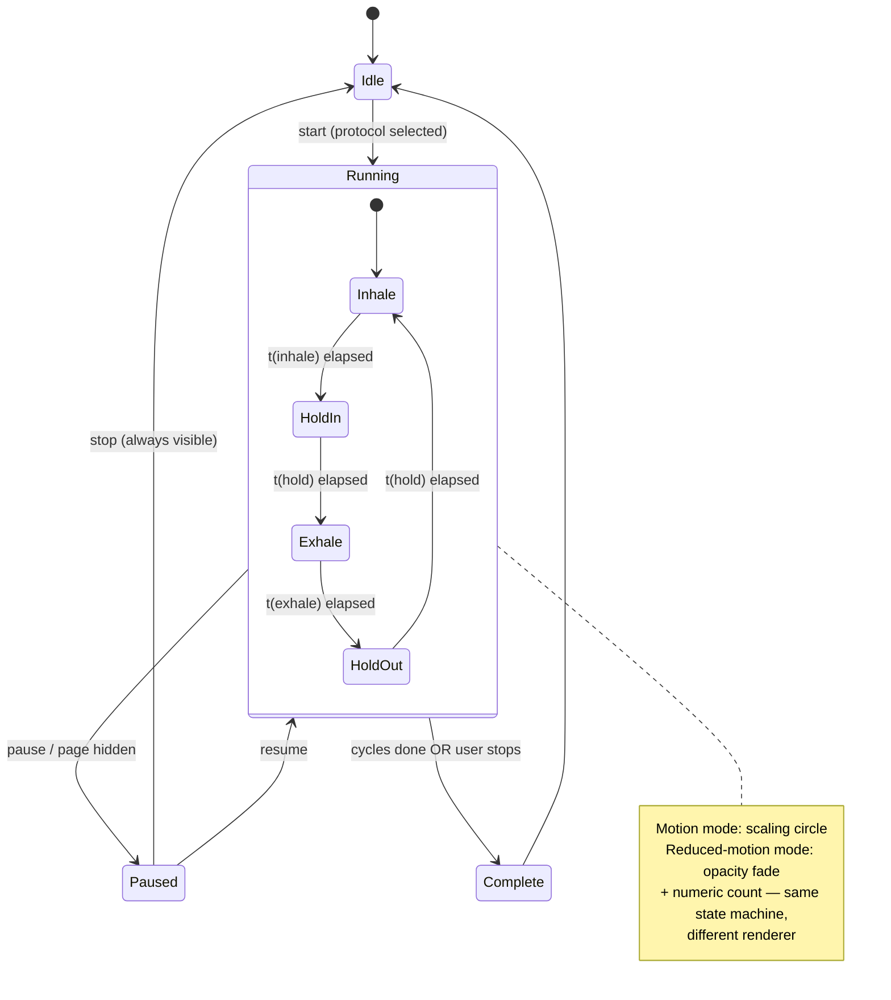
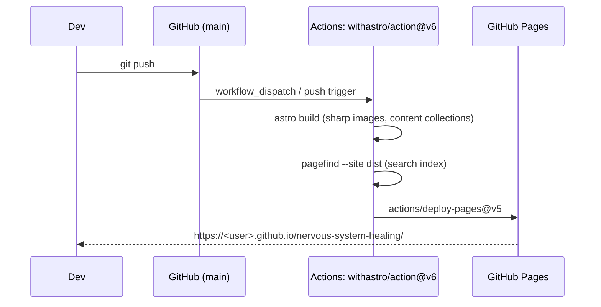

# Nervous System Healing Site — Astro + Tailwind on GitHub Pages

## Problem Statement

We want to build a static website focused on nervous system healing, somatic
experiencing, and body-based regulation — education plus practical,
interactive tools (breathing pacers, grounding exercises, state-aware practice
suggestions). Constraints and preferences:

- **Hosting**: GitHub Pages (free, static-only, no server).
- **Stack**: AstroJS + Tailwind CSS.
- **Theme**: healing the nervous system, the body, somatic experiencing —
  which imposes real *content-design* obligations (trauma-sensitive UX,
  invitational language, honest evidence posture), not just visual theming.

This exploration establishes the architecture, content model, feature set,
and trauma-informed design constraints before any code is written.

## Executive Summary

- **Stack**: Astro 7 (static output) + Tailwind CSS v4 via `@tailwindcss/vite`
  (the `@astrojs/tailwind` integration is deprecated), deployed with
  `withastro/action@v6` to GitHub Pages. Content lives in Markdown/MDX content
  collections; interactivity is vanilla web-component islands (0 KB framework)
  with Preact available if state gets complex.
- **Product shape**: a free, evidence-honest "toolbox + map" —
  (1) a **practice library** of short somatic exercises filtered by nervous
  system state (activated / shut down / building capacity),
  (2) an **interactive breathing pacer** and grounding tools,
  (3) a **learn section** teaching polyvagal theory, window of tolerance, and
  SE concepts (titration, pendulation, resourcing),
  (4) a **"how are you arriving?" check-in** that routes to matched practices.
  Research shows this exact combination — free, interactive, state-aware,
  trauma-informed — is a genuine gap: the niche is split between
  practitioner-gated training, $57–$350 guru courses, and general meditation
  libraries; only NeuroFit (paid app) executes state → matched micro-practice.
- **Non-negotiable design constraints**: invitational microcopy, short doses
  by default, visible exits, `prefers-reduced-motion` alternatives for the
  pacer, disclaimer + crisis resources, no shame-based streaks.

## Current State In The Repository

The repository is a greenfield: it contains only
`.claude/skills/explore/SKILL.md` (this skill) and now
`docs/explorations/` (this document). There is no `package.json`, no source
tree, and the directory is not yet a git repository. Everything below is
therefore a from-scratch design, with the proposed file layout serving as the
map for implementation.

Proposed source layout (referenced throughout this doc):

```
astro.config.mjs
src/
  content.config.ts          ← content collections (practices, articles, glossary)
  styles/global.css          ← Tailwind v4 import + @theme design tokens
  layouts/Base.astro
  components/
    BreathingPacer.astro     ← web-component island
    StateCheckIn.astro       ← "how are you arriving?" router
    PracticeCard.astro
  content/
    practices/*.md           ← exercise library entries
    learn/*.mdx              ← polyvagal / SE education articles
    glossary/*.md
  pages/
    index.astro
    practices/[...slug].astro
    learn/[...slug].astro
    tools/breathing.astro
    404.astro
.github/workflows/deploy.yml
public/                      ← audio files, CNAME (if custom domain)
```

## External Research

### Tech stack (verified on npm, 2026-07-04)

- **Astro `7.0.6`** is current stable (7.0 released 2026-06-22; requires
  Node ≥ 22.12). The Content Layer API is the only collections API now
  (legacy collections removed in v6); collections are defined in
  `src/content.config.ts` with `glob()` loaders and Zod 4 schemas imported
  from `astro/zod`. Caveats: Astro 7's Rust compiler errors on invalid HTML,
  and Markdown/MDX processing moved from remark/rehype to the native
  "Sätteri" pipeline — remark/rehype plugins need porting or an explicit
  opt-back-in via `@astrojs/markdown-remark`. Pinning Astro 6.3.x is a
  defensible conservative option; 7 is the default recommendation.
- **Tailwind CSS `4.3.2`** integrates via `@tailwindcss/vite` in
  `vite.plugins` — *not* the deprecated `@astrojs/tailwind` integration.
  v4 is CSS-first: no `tailwind.config.js`; theme tokens live in
  `@theme { … }` inside `global.css`. Dark mode via
  `@custom-variant dark (&:where(.dark, .dark *));` plus a pre-paint inline
  script toggling `.dark` on `<html>`.
- **GitHub Pages**: official flow is `withastro/action@v6` +
  `actions/deploy-pages@v5`, Pages source set to "GitHub Actions". For a
  project page (`user.github.io/repo`) set
  `site: 'https://user.github.io'` and `base: '/repo'` and prefix internal
  links with `import.meta.env.BASE_URL`; a custom domain drops `base` and
  adds `public/CNAME`. `src/pages/404.astro` emits `/404.html`, which Pages
  picks up automatically. Images are fine: `astro:assets` runs sharp at
  build time, no server needed.
- **Search**: Pagefind (`pagefind@1.5.2`, optionally `astro-pagefind@2.0.1`)
  is the static-site consensus — indexes `dist/` post-build
  (`astro build && pagefind --site dist`), no backend.
- **Islands**: community rule of thumb — vanilla `<script>`/web components
  for small widgets (a breathing pacer is the textbook case: 0 KB framework,
  no hydration directive needed); add `@astrojs/preact` (~3 KB) only when
  state/composition gets painful; avoid Alpine (global load, not true islands).
- **View transitions**: prefer native CSS `@view-transition` over Astro's
  `<ClientRouter />` — *unless* we later want a persistent audio player
  across navigations, which is ClientRouter's one remaining strong use case.

### Domain and prior art

The market splits three ways, all with money-back guarantees and big free
content funnels:

| Model | Examples | Price |
|---|---|---|
| One-time course | The Workout Witch, Irene Lyon 21-Day Tune-Up, DNRS, re-origin | $57–$350 |
| Membership | Othership, NeuroFit, Primal Trust | $17–$96/mo |
| Freemium library | Insight Timer, Huberman NSDR ecosystem | free / ~$60 yr |

Key observations:

- **NeuroFit** is the closest comp for the interactive core: daily 60-second
  check-in → matched 3–5 min somatic exercise, stress-pattern insights.
  It is paid ($19.99/mo). No one does this well *free on the open web*.
- **SE International** (traumahealing.org) is practitioner-facing; the
  consumer-facing SE offering is thin — mostly "find a practitioner."
- Content pillars users expect: polyvagal theory (ventral/sympathetic/dorsal,
  Deb Dana's ladder, glimmers, neuroception), window of tolerance (Siegel),
  SE concepts (felt sense, titration, pendulation, resourcing — with deeper
  trauma renegotiation explicitly flagged as practitioner territory),
  orienting/grounding (5-4-3-2-1, panoramic vision, self-holding), breathwork
  (physiological sigh, box 4-4-4-4, coherent ~5.5 breaths/min, 4-7-8), vagus
  nerve exercises (humming, cold, Rosenberg's basic exercise), co-regulation,
  and TRE (with its standard contraindication list).
- **Trauma-informed design** has real literature (SAMHSA's six principles,
  CHI 2022 "Trauma-Informed Computing"): invitational language ("if it feels
  okay, you might…"), short doses by default, always-visible stop/exit,
  choice over prescription, safety/resourcing content sequenced before
  activation content, no graphic trauma descriptions, no punitive streaks,
  and "supports stress relief and well-being" framing rather than medical
  claims. Brain-retraining programs (DNRS et al.) draw criticism for weak
  evidence — an **evidence-honest posture is a differentiator**.
- **Visual conventions**: sage/earth/beige palettes, circles and soft shapes,
  breathing-tempo animation as brand motif, humanist type with generous
  line-height, dimmed session screens, and — doubly important here —
  `prefers-reduced-motion` support where the pacer degrades to opacity fade
  or numeric countdown rather than scaling motion (WCAG C39).

## Key Findings

1. **The stack is a near-perfect fit.** Everything this site needs — content
   collections, build-time image optimization, tiny interactive islands,
   static search — works on GitHub Pages with zero server. There is no
   feature in the concept that forces SSR.
2. **The differentiator is not content volume, it's the interaction model.**
   Free somatic content is abundant (YouTube, blogs). What's scarce is a
   free, well-designed *state-aware* experience: check in → get matched to a
   2–5 minute practice → learn why it works. That's a static-site-sized
   product.
3. **Trauma-informed design is an architectural concern, not a coat of
   paint.** Titration applied to content design (short by default, opt-in
   depth, visible exits) shapes the content schema itself — practices need
   `duration`, `intensity`, `contraindications`, and `state` fields from
   day one.
4. **Reduced motion is a first-class requirement**, not an accessibility
   afterthought: the flagship widget (breathing pacer) is *made of motion*,
   and part of the audience is motion-sensitive. The pacer needs a designed
   non-vestibular mode.
5. **Legal/ethical framing is settled convention**: educational-not-medical
   disclaimer, crisis resources (988, Crisis Text Line), referral triggers
   (complex trauma, dissociation, pregnancy/cardiac for TRE) linking to the
   SE practitioner directory.

## Options And Tradeoffs

### A. Site architecture

| Option | Pros | Cons |
|---|---|---|
| **A1. Content site + interactive tool islands** (recommended) | Fits static hosting perfectly; SEO-friendly education content; each tool is an independent island; incremental delivery | "App-like" cohesion (cross-page state) needs localStorage conventions |
| A2. SPA-style "app" (one page, heavy client JS) | App feel, persistent state trivially | Fights Astro's model; worse SEO; heavier JS for an audience on phones; GitHub Pages routing hacks |
| A3. Pure prose/blog, no interactivity | Simplest | Abandons the differentiator; research says the gap is interactive tools |

### B. Interactivity layer

| Option | Pros | Cons |
|---|---|---|
| **B1. Vanilla web components in `<script>` tags** (recommended start) | 0 KB framework; Astro-idiomatic; pacer/timers/check-in are all simple state machines | Verbose if components multiply and share state |
| B2. Preact islands | Hooks/signals; still tiny (~3 KB) | Unneeded for v1 widgets; add later only if pain appears |
| B3. Alpine.js | Quick sprinkles | Global script on every page, no per-island hydration |

### C. Check-in / personalization persistence

| Option | Pros | Cons |
|---|---|---|
| **C1. localStorage only, no accounts** (recommended) | Zero backend; maximal privacy (health-adjacent data never leaves the device — a genuine trust feature worth stating on the page) | No cross-device sync |
| C2. Backend service (Supabase/Workers) | Sync, streaks, analytics | Cost/complexity; privacy burden; contradicts "free static site"; punitive-streak temptation |

### D. Audio (guided practices)

| Option | Pros | Cons |
|---|---|---|
| **D1. Defer audio to v2; launch text-guided practices with timers** (recommended) | No recording pipeline needed; text is translatable, searchable, accessible | Audio is the niche's dominant format; must come eventually |
| D2. Self-hosted audio in `public/` | Simple; works on Pages | Repo bloat (Git LFS or careful sizing); recording quality bar |
| D3. Embed YouTube/SoundCloud | Free hosting | Third-party trackers on a "safe space" site — bad fit |

### E. Astro version

| Option | Pros | Cons |
|---|---|---|
| **E1. Astro 7** (recommended) | Current; fastest builds; what `npm create astro` ships | ~2 weeks old; Sätteri pipeline breaks remark/rehype plugins |
| E2. Pin Astro 6.3.x | Max plugin compatibility | Migration debt from day one |

We have no existing remark/rehype plugin investment, so E1's main risk doesn't
apply — start on 7.

## Recommendation

Build **A1 + B1 + C1 + D1 + E1**: an Astro 7 static content site with
web-component tool islands, localStorage-only personalization, text-first
practices, deployed to GitHub Pages.

### Site map



### Content model



### Breathing pacer state machine (the flagship island)



### Deploy pipeline



### Delivery order

1. **Milestone 1 — skeleton**: scaffold, Tailwind v4 tokens (sage/earth
   palette in `@theme`), base layout, deploy workflow, 404, disclaimer page.
2. **Milestone 2 — breathing pacer**: the flagship tool with 4 protocols and
   a reduced-motion mode. This alone is shareable.
3. **Milestone 3 — practice library**: ~12 seed practices across the three
   states, content collection + filtered index.
4. **Milestone 4 — check-in router + learn section**: home-page check-in,
   4 core articles, glossary, Pagefind search.
5. **v2 candidates**: self-hosted guided audio (persistent player via
   `<ClientRouter />`), gentle practice journal (localStorage), dark
   "evening mode".

## Example Code

`astro.config.mjs`:

```js
import { defineConfig } from "astro/config";
import tailwindcss from "@tailwindcss/vite";
import sitemap from "@astrojs/sitemap";

export default defineConfig({
  site: "https://crs.github.io",
  base: "/nervous-system-healing",
  trailingSlash: "always",
  integrations: [sitemap()],
  vite: { plugins: [tailwindcss()] },
});
```

`src/styles/global.css` — Tailwind v4 CSS-first theme:

```css
@import "tailwindcss";

@custom-variant dark (&:where(.dark, .dark *));

@theme {
  --color-sage-50: oklch(0.97 0.01 150);
  --color-sage-500: oklch(0.62 0.06 150);
  --color-sage-900: oklch(0.30 0.04 150);
  --color-clay-100: oklch(0.93 0.03 60);
  --color-night-800: oklch(0.28 0.02 260);
  --font-body: "Source Serif 4", ui-serif, serif;
  --ease-breath: cubic-bezier(0.37, 0, 0.63, 1); /* sinusoidal, breath-like */
}
```

`src/content.config.ts` — the trauma-informed schema is the point:

```ts
import { defineCollection } from "astro:content";
import { glob } from "astro/loaders";
import { z } from "astro/zod";

const practices = defineCollection({
  loader: glob({ pattern: "**/*.md", base: "./src/content/practices" }),
  schema: z.object({
    title: z.string(),
    states: z.array(z.enum(["settle", "remobilize", "build-capacity"])),
    durationMinutes: z.number().min(1).max(10), // titration: short by design
    intensity: z.enum(["gentle", "moderate"]).default("gentle"),
    tags: z.array(z.string()),
    contraindications: z.array(z.string()).default([]),
    whyItWorks: z.string(), // evidence-honest mechanism, cited
    source: z.string(),     // lineage: Levine, Dana, Rosenberg, Huberman…
  }),
});

export const collections = { practices /*, articles, glossary */ };
```

`BreathingPacer.astro` island sketch (vanilla web component, 0 KB framework):

```astro
<breathing-pacer data-protocol="physiological-sigh"></breathing-pacer>

<script>
  const PROTOCOLS = {
    "physiological-sigh": { inhale: 2, inhale2: 1, exhale: 6, holdOut: 0 },
    "box":               { inhale: 4, holdIn: 4, exhale: 4, holdOut: 4 },
    "coherent":          { inhale: 5.5, exhale: 5.5 },            // ~5.5 bpm
    "four-seven-eight":  { inhale: 4, holdIn: 7, exhale: 8 },
  };

  class BreathingPacer extends HTMLElement {
    connectedCallback() {
      this.reduced = matchMedia("(prefers-reduced-motion: reduce)").matches;
      // render: scaling circle, or opacity-fade + numeric count if reduced
      // controls: start / pause / stop — stop is ALWAYS visible
      // pause automatically on document.visibilitychange
    }
  }
  customElements.define("breathing-pacer", BreathingPacer);
</script>
```

Invitational microcopy convention (applies everywhere):

> "If it feels okay, let your next exhale be a little longer than your
> inhale. You can stop at any time — you're in charge here."

## Risks And Open Questions

- **Scope creep toward "app."** The niche's paid products (trackers, HRV,
  accounts) will tempt feature-matching. The static, private, free framing
  is the identity — hold the line at localStorage.
- **Content responsibility.** We're writing about trauma for potentially
  traumatized readers. Mitigations are structural (schema fields, sequencing
  safety-first, invitational voice) but a review pass against the
  trauma-informed content guides should gate every published article.
  Open question: should the user (or a practitioner contact) review seed
  content before it goes public?
- **Medical-claim drift.** Copy must stay at "supports stress relief and
  well-being," never "treats PTSD." A `CONTENT_GUIDELINES.md` codifying voice
  + claims rules would keep this durable.
- **Astro 7 freshness.** ~2 weeks old; Sätteri MDX pipeline may bite if we
  later want remark plugins (reading time, heading anchors). Fallback is
  documented (`@astrojs/markdown-remark` opt-in).
- **`base` path friction.** Project-page URLs (`/nervous-system-healing/…`)
  require disciplined link helpers; a custom domain later removes `base` and
  simplifies everything. Open question: is a custom domain (e.g. a `.org`)
  desired at launch?
- **Audio timing.** Text-first is the plan, but audio is the niche's dominant
  format; deferring too long may cap usefulness for eyes-closed practice.

## Implementation Checklist

- [ ] Milestone 1 — skeleton
  - [ ] `git init`, scaffold `npm create astro@latest` (Astro 7, strict TS, empty template)
  - [ ] Add Tailwind v4 via `@tailwindcss/vite`; create `global.css` with `@theme` palette (sage/clay/night) and `--ease-breath`
  - [ ] `astro.config.mjs`: `site`, `base: '/nervous-system-healing'`, `trailingSlash: 'always'`, sitemap
  - [ ] `Base.astro` layout: humanist type, generous line-height, skip-link, dark-mode pre-paint script
  - [ ] `404.astro`, `about.astro` with disclaimer, crisis resources (988, Crisis Text Line), SE practitioner directory link
  - [ ] `.github/workflows/deploy.yml` with `withastro/action@v6`; Pages source = GitHub Actions; verify live URL
- [ ] Milestone 2 — breathing pacer
  - [ ] `<breathing-pacer>` web component: 4 protocols, start/pause/always-visible-stop, visibilitychange auto-pause
  - [ ] Reduced-motion renderer (opacity fade + numeric count), verified with `prefers-reduced-motion` emulation
  - [ ] Optional audio chime cues (user opt-in, off by default)
  - [ ] `/tools/breathing/` page with protocol picker and "why this works" notes
- [ ] Milestone 3 — practice library
  - [ ] `content.config.ts` with `practices` collection schema (states, duration, intensity, contraindications, whyItWorks, source)
  - [ ] Write 12 seed practices (4 per state) from the researched canon: long-exhale, orienting, 5-4-3-2-1, self-holding, humming, rocking, panoramic vision, glimmers, Rosenberg basic exercise, physiological sigh, shaking/discharge, resourcing
  - [ ] `/practices/` index with state filter; `PracticeCard` + detail pages with stop-anytime note
- [ ] Milestone 4 — check-in + learn
  - [ ] Home-page `StateCheckIn` island → routes to filtered practice list (choice preserved: "browse everything" always offered)
  - [ ] 4 learn articles: polyvagal basics + ladder, window of tolerance, titration/pendulation/resourcing, when-to-seek-a-practitioner
  - [ ] Glossary collection + pages
  - [ ] Pagefind: `astro build && pagefind --site dist` in CI, search UI in header
- [ ] Cross-cutting
  - [ ] `CONTENT_GUIDELINES.md`: invitational voice, claims policy, review gate
  - [ ] Lighthouse a11y pass ≥ 95 on all templates; keyboard-only walkthrough

## Validation Checklist

- [ ] `npm run build` succeeds and deployed site loads at the GitHub Pages URL with correct `base`-prefixed links, styles, and images
- [ ] 404 page renders for a bad URL on the live site
- [ ] Breathing pacer: each protocol's timing verified against spec (e.g. box = 4-4-4-4); stop button reachable at every moment; tab-hide pauses the session
- [ ] With `prefers-reduced-motion: reduce` emulated, no scaling/translating animation anywhere; pacer shows fade + count mode
- [ ] Every practice page shows duration, intensity, and the stop-anytime note; contraindicated practices (TRE-adjacent) show their flags
- [ ] Check-in routes to correct state-filtered lists and never forces a choice (skip path works)
- [ ] Disclaimer + crisis resources reachable from every page footer
- [ ] Pagefind returns results for "orienting", "vagus", "window of tolerance" on the live site
- [ ] Lighthouse: accessibility ≥ 95, performance ≥ 95 on home, practice detail, and pacer pages
- [ ] Copy review: no medical claims, invitational voice throughout, no punitive gamification anywhere

## References

Stack:
- Astro 7 release — https://astro.build/blog/astro-7/ · upgrade guide — https://docs.astro.build/en/guides/upgrade-to/v7/
- GitHub Pages deploy guide — https://docs.astro.build/en/guides/deploy/github/
- Tailwind v4 + Astro — https://tailwindcss.com/docs/installation/framework-guides/astro · `@astrojs/tailwind` deprecation — https://docs.astro.build/en/guides/integrations-guide/tailwind/
- Tailwind dark mode (v4 custom variant) — https://tailwindcss.com/docs/dark-mode
- Content collections / images / islands — https://docs.astro.build/en/guides/content-collections/ · https://docs.astro.build/en/guides/images/ · https://docs.astro.build/en/concepts/islands/
- Pagefind — https://pagefind.app/ · astro-pagefind — https://github.com/shishkin/astro-pagefind
- Trailing slashes on Pages — https://firxworx.com/blog/astro-guide-to-taming-trailing-slashes/

Domain:
- SE International — https://traumahealing.org/ · practitioner directory — https://directory.traumahealing.org
- Polyvagal Institute — https://www.polyvagalinstitute.org/ · Deb Dana — https://www.rhythmofregulation.com/ · ladder overview — https://traumatherapistnetwork.com/understanding-the-polyvagal-ladder-a-brief-overview/
- SE concepts — https://positivepsychology.com/somatic-experiencing/
- TRE — https://treglobal.org/
- Breath/vagus protocols — https://oxygenadvantage.com/blogs/science/how-to-stimulate-the-vagus-nerve-with-breathing-exercises · https://www.calm.com/blog/vagus-nerve-exercises · https://www.hubermanlab.com/nsdr
- Freeze-to-safety practice mapping — https://restorewithawareness.com/blog/somatic-exercises-to-bring-you-from-freeze-to-safety-and-connection
- NeuroFit (closest comp) — https://neurofit.app/ · Othership — https://www.othership.us/app · Curable — https://www.curablehealth.com/ · Irene Lyon — https://irenelyon.com/ · Primal Trust — https://www.primaltrust.org/
- Trauma-informed design — https://uxcontent.com/a-guide-to-trauma-informed-content-design/ · Trauma-Informed Computing (CHI 2022) — https://dl.acm.org/doi/fullHtml/10.1145/3491102.3517475 · scoping review — https://pmc.ncbi.nlm.nih.gov/articles/PMC12304634/
- Reduced motion (WCAG C39) — https://www.w3.org/WAI/WCAG22/Techniques/css/C39
- Wellness UX conventions — https://www.uxmatters.com/mt/archives/2024/07/leveraging-the-psychology-of-color-in-ux-design-for-health-and-wellness-apps.php · https://www.bighuman.com/blog/trends-in-mindfulness-app-design
