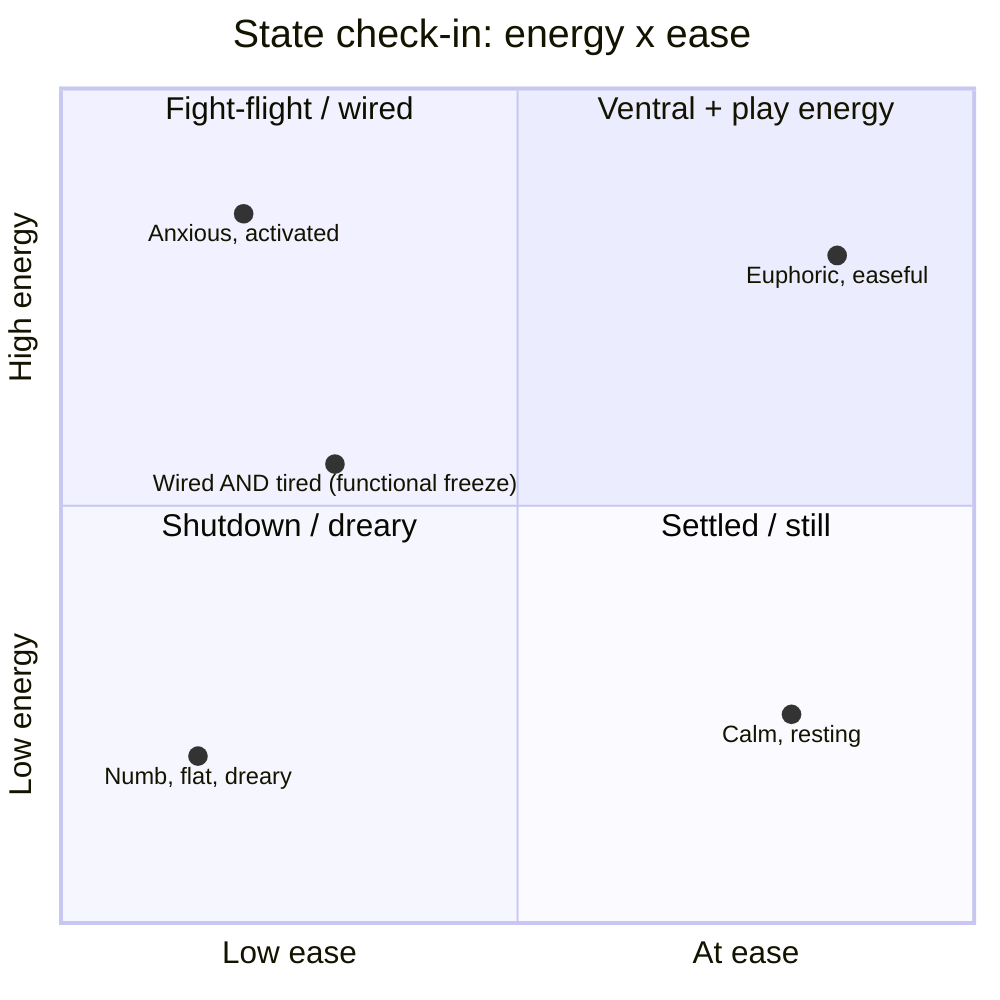
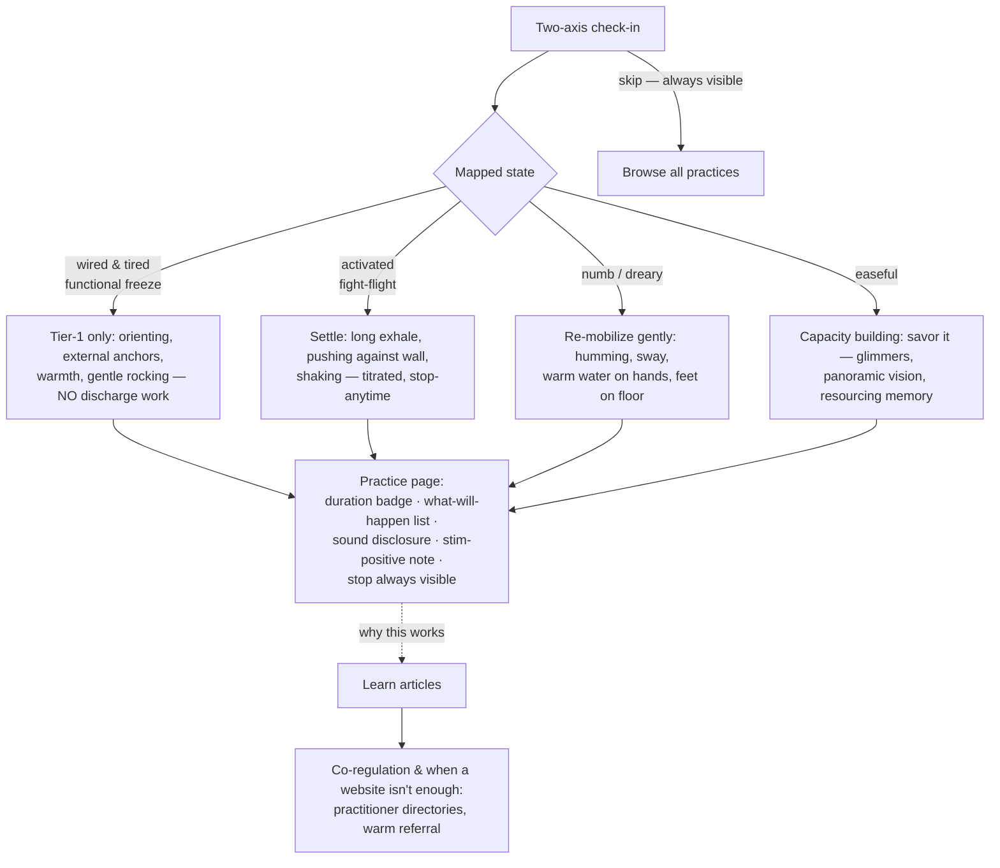
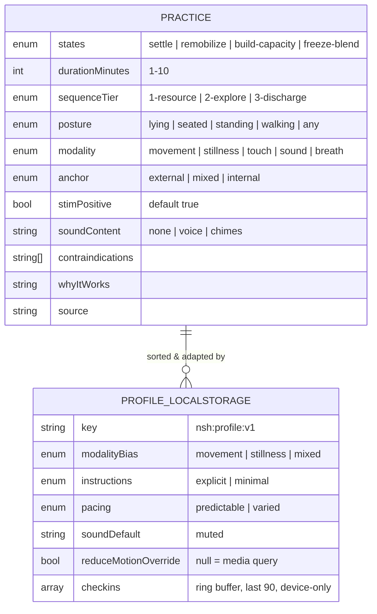

# Founding Persona & Neurodivergent-First Personalization

## Problem Statement

Exploration [0001](0001_%5B_%5D_NERVOUS_SYSTEM_HEALING_SITE.md) designed a
generic nervous-system-healing site. The site's founder — and therefore its
first, most concrete user — has now described his own profile and healing
history. The design question: **how should the founder's lived experience
reshape the site's content model, check-in design, practice adaptations,
voice, and visual design** — without turning an educational site into a
medical tool, and without publishing more personal detail than intended?

> **Privacy note (decide before the repo goes public).** This repo deploys to
> GitHub Pages, which on the free tier means a **public repository**. This
> document distills the founder's story into a design persona and keeps
> clinical details to what is design-relevant, but it still describes a real
> person. Before first push to a public remote, the owner should either
> (a) approve this level of detail, (b) prune this section, or (c) keep the
> repo private and pay for Pages, or deploy `dist/` only.

### The founding persona ("R")

Design-relevant traits, distilled from the founder's own account:

- **Neurodivergent — autistic + ADHD (AuDHD), late-identified.** Years of
  therapy "didn't meet him" until he identified his autism himself and found
  a neurodivergent-affirming therapist. Implication: the site must never
  assume neurotypical interoception, stillness tolerance, or instruction
  style.
- **Mixed autonomic picture — his own working hypothesis** (not a diagnosis
  this site makes): long-term bracing/"freeze-thaw" energy; often frozen or
  dreary, sometimes fight-flight activated, occasionally euphoric ventral
  ease. Trouble sleeping; hard to just sit in a chair. This maps precisely
  onto the polyvagal literature's **blended states** ("wired and tired",
  functional freeze) — the 3-button check-in from 0001 cannot represent it.
- **Body-level pattern**: whole-body bracing, under-engaged musculoskeletal
  structure, flat-footed gait, tight/misaligned myofascial system. What has
  helped: **Irene Lyon's work, Pilates, mobility work, myofascial release,
  massage, co-regulation with a good bodyworker, IFS, ketamine (with
  clinicians)**.
- **Early/preverbal history**: C-section birth, ~7 days NICU, not breastfed,
  attachment field complicated by a grandparent with probable borderline
  traits. The somatic literature treats exactly this cluster as preverbal
  imprinting that talk therapy alone tends not to reach — which matches his
  experience of therapy.
- **Creole — Black/African, European, possibly Native American ancestry —
  raised racially isolated among white people.** The wellness space's
  default-white imagery and voice is a representation gap he has lived.

## Executive Summary

- **Reframe the product**: not a generic calm-app clone but a
  **neurodivergent-first somatic education site** built for nervous systems
  like the founder's — which, per universal-design logic, makes it better
  for everyone (explicit expectations, concrete anchors, short doses, no
  shame mechanics).
- **Five concrete deltas to 0001's design**:
  1. **Check-in becomes two-axis** (energy × ease, How We Feel-style) with
     named blended states — "wired & tired" / functional freeze must be
     representable, since it's the founder's dominant state.
  2. **Practice schema grows ND-adaptation fields**: posture, modality
     (movement/stillness/touch/sound), anchor type (external-first),
     stim-positive flag, explicit-vs-minimal instruction variants.
  3. **A preferences island** (`localStorage`, no accounts): movement↔
     stillness bias, instruction verbosity, pacing, sound default muted,
     motion override — applied pre-paint via an `is:inline` head script.
  4. **Four new content pillars**: functional freeze & blended states;
     early/preverbal trauma and why co-regulation matters; restlessness and
     sleep ("can't sit still" as signal, NSDR as bridge); embodied
     racialized/intergenerational trauma (Menakem) with mixed-identity
     awareness.
  5. **Typography/voice corrections**: body font switches from the serif
     proposed in 0001 to a humanist sans per the BDA style guide; literal,
     concrete microcopy replaces vague "notice your body" phrasing;
     stim-positive copy ("moving, rocking, fidgeting are welcome here").
- **Hold the ethical line**: the site describes mechanisms and the founder's
  first-person experience ("what helped me"), links practitioners for
  clinical modalities (SE, IFS, KAP), and never diagnoses the reader.

## Current State In The Repository

- [`docs/explorations/0001_[_]_NERVOUS_SYSTEM_HEALING_SITE.md`](0001_%5B_%5D_NERVOUS_SYSTEM_HEALING_SITE.md)
  is committed (unimplemented). This exploration **amends** it; 0001's
  milestones remain the build order, with the deltas below folded in.
- No source tree exists yet. Files this exploration modifies *in 0001's
  proposed layout*: `src/content.config.ts` (schema extensions),
  `src/components/StateCheckIn.astro` (two-axis redesign),
  `src/styles/global.css` (typography + tokens), `src/layouts/Base.astro`
  (pre-paint profile script), plus new `src/components/Preferences.astro`
  and new entries under `src/content/learn/` and `src/content/practices/`.

## External Research

### Domain: adapting somatic work to this profile

- **Autistic interoception**: ~74% of autistic adults report significant
  interoceptive *confusion* (ISQ) and ~50% co-occurring alexithymia — but
  meta-analysis finds no deficit in interoceptive *accuracy*; the gap is in
  labeling, trust, and granularity. Interoception is trainable (Kelly
  Mahler's curriculum: concrete signals → abstract emotions, external
  scaffolds, adjustable language load). Practice implication: **concrete,
  externally anchored prompts** ("press your feet into the floor, feel the
  pressure") instead of vague ones ("notice what you feel"); inward focus
  always optional.
- **ADHD practice design**: classic silent sitting maximizes exactly what
  ADHD is weakest at. What works: brevity (90s–5min), movement-based
  practices, guided audio over silence, body/senses anchors over breath,
  **novelty rotation** (interest-based nervous system, INCUP), habit
  stacking, body doubling (85% of 220 ND participants reported improved task
  completion), and reframing mind-wandering as the rep, not the failure.
- **Blended states**: Deb Dana treats the three polyvagal circuits as
  **dials, not switches**. Freeze = sympathetic + dorsal simultaneously —
  "foot on the gas and the brake": flat outside, alarmed inside ("wired and
  tired"). **Functional freeze** (Irene & Seth Lyon's framing) is its
  chronic, still-functioning form. **Thaw releases the bound fight/flight
  energy underneath** — which can feel like surges of anger/activation and
  is precisely why titration, pendulation, and *capacity before discharge*
  (Lyon's repeated warning) must be baked into content sequencing. Fawn
  (Pete Walker) belongs alongside fight/flight/freeze.
- **Bracing/armoring**: chronic guarding patterns concentrate in psoas
  (incomplete fight/flight → hip restriction, shallow breath via fascial
  links to the diaphragm, "ready-for-threat" baseline), jaw, and diaphragm —
  the literature's description matches the founder's flat-footed, braced,
  under-engaged pattern. Somatic approach: slow, small, toward ease, never
  forcing through the barrier.
- **Preverbal trauma**: C-section, NICU stays, early medical procedures, and
  attachment disruption are stored somatically/implicitly — no narrative for
  talk therapy to reframe. Anchor text: Kain & Terrell, *Nurturing
  Resilience*. Healing is framed as relational — **practitioner
  co-regulation is the intervention**, which both explains the founder's
  bodywork experience and sets an honest limit on what a website can do.
- **Culturally attuned somatics**: Resmaa Menakem (*My Grandmother's Hands*,
  somatic abolitionism) — racialized and intergenerational trauma live in
  the body and healing is embodied practice, not cognition alone. Multiracial
  identity literature describes "in-between/third-space" experience and
  clinical under-preparedness; the wellness industry is critiqued as built
  on a white default in imagery and voice.
- **Sleep/restlessness**: "wired and tired" drives sleep difficulty;
  restlessness is reframed as **residual mobilization energy — a signal, not
  a discipline failure**. NSDR/yoga nidra works as a lying-down, fully
  guided bridge (matches both ADHD and autistic preferences) — with the
  honest caveat that it does not replace sleep.
- **Ketamine context**: KAP literature pairs dosing with somatic integration
  in a "neuroplasticity window"; provider-delivered, evidence still largely
  clinic-reported. Content stays descriptive, first-person where relevant,
  and refers out.

### UX: neurodivergent-first design patterns

- **Autistic-friendly**: UK Home Office guidance (simple low-arousal colors,
  literal language, no idioms, descriptive buttons, consistent predictable
  layouts, never autoplay); W3C COGA's 8 objectives — notably "make short
  critical paths", "let users control when content moves", and Objective 8,
  **"support a personalized interface"**, which formally licenses the
  preferences design. Every practice states up front: duration, exactly what
  will happen, and whether there's sound/voice.
- **ADHD-friendly**: one-tap start above the fold; visible time estimates
  everywhere (time-blindness turns unlabeled commitments into threats);
  progressive disclosure (`<details>`); a shuffle/"surprise me" mechanism;
  **no streaks** — streak resets trigger all-or-nothing abandonment; Finch's
  warm-return pattern ("you came back") and non-resettable totals instead.
- **Static-site personalization**: single versioned localStorage key,
  applied to `<html>` as `data-*` attributes by an `is:inline` head script
  before paint (re-applied on `astro:after-swap` if ClientRouter is ever
  added); sounds muted by default; `prefers-reduced-motion` as default with
  user override; explicit "your data never leaves this device" statement +
  JSON export.
- **Exemplars**: Goblin Tools (zero ceremony, one tool per page), Finch
  (non-punitive return), Tiimo (visualized time, ND-led design), How We Feel
  (two-axis mood → granular labels — the model for the check-in), Restful
  (sensory-first for AuDHD adults). Stim-positive guidance: never instruct
  "be still"; explicitly permit rocking/fidgeting. Pacing preference splits:
  ADHD often wants varied faster pacing, autistic users predictable pacing —
  offer it as a setting.
- **Reading**: BDA dyslexia style guide — humanist sans, 16–19px, 1.5 line
  height, 60–70ch, left-aligned, off-white background, no all-caps
  (0001's `TITLE_IN_CAPS` filenames are fine; its serif body font and any
  all-caps UI text are not); TL;DR-first article template with expandable
  depth; identical section order per page type.

## Key Findings

1. **The founder's profile is not an edge case to accommodate — it's the
   design center.** Concrete-external-first anchors, short guided doses,
   choice over prescription, no shame mechanics: every one of these helps
   neurotypical stressed users too. ND-first is universal design here.
2. **The 0001 check-in is wrong for its own founder.** Three discrete
   buttons (activated / shut down / okay) cannot express "frozen outside,
   alarmed inside" — the founder's *dominant* state and the single most
   common presentation in the functional-freeze literature. Two axes with
   named blends fixes this cheaply.
3. **Content sequencing is a safety feature**: capacity/resourcing content
   must be structurally sequenced before discharge/activation content
   (Lyon: "capacity before discharge"), because thaw releases fight/flight
   energy. The schema needs a `sequenceTier` field, not just tags.
4. **A website cannot co-regulate** — and pretending otherwise would be
   dishonest. The site's honest role: education, titrated micro-practices,
   and warm referral to relational work (bodyworkers, SEPs, ND-affirming
   therapists). A "practice with me" guided-companion audio mode is the
   closest ethical approximation (v2).
5. **Representation is a content decision, not a photo-filter decision**:
   name racialized and intergenerational embodiment as a first-class learn
   pillar (Menakem), reflect mixed/"third-space" identity, and avoid the
   white-wellness visual template.
6. **First-person founder voice solves the authority problem.** "What helped
   me" (Irene Lyon's work, myofascial release, IFS, co-regulation, KAP with
   clinicians) is honest, legally safer than prescriptive claims, and — per
   the ND community's strong preference for lived-experience design — more
   trustworthy than guru voice.

## Options And Tradeoffs

### A. How much of the founder's story to publish

| Option | Pros | Cons |
|---|---|---|
| A1. None — generic site | Zero privacy risk | Loses the trust engine; wellness sites without a "why" read as content farms |
| **A2. Distilled "why this site exists" page — founder-approved details only** (recommended) | Lived-experience credibility; controls disclosure precisely | Requires an explicit approval pass before go-live |
| A3. Full personal narrative | Maximum resonance | Publishes health history to the open web, irreversibly (caches/archives) |

### B. Check-in model

| Option | Pros | Cons |
|---|---|---|
| B1. Keep 0001's 3 buttons | Simplest | Cannot represent blended states; misroutes the founder every time |
| **B2. Two-axis picker (energy × ease) → named state incl. blends → routed practices** (recommended) | Represents "wired & tired"; granularity builds interoceptive vocabulary (Mahler); still one screen | Slightly more complex island; needs careful literal labeling |
| B3. Free-text/emotion-wheel granularity (144 words) | Max granularity | Overwhelming wall of options — anti-ADHD; label-heavy — hard with alexithymia |

### C. ND adaptation mechanism

| Option | Pros | Cons |
|---|---|---|
| C1. Separate "ND mode" toggle | Discoverable | Othering ("normal mode" vs "special mode"); two content paths to maintain |
| **C2. ND-first defaults + granular preferences (verbosity, modality bias, pacing, sound, motion)** (recommended) | One content path; COGA Objective 8 pattern; benefits everyone | Preference UI must itself stay simple (≤5 controls) |
| C3. Per-practice variant pages | Explicit | Combinatorial content explosion |

### D. Body typography

| Option | Pros | Cons |
|---|---|---|
| D1. Keep 0001's Source Serif 4 | "Warm" aesthetic | Against BDA guidance for ND/dyslexic readers |
| **D2. Humanist sans default (e.g. Atkinson Hyperlegible Next or Open Sans), serif only for sparse display headings** (recommended) | Readability for the actual audience; Atkinson is purpose-built and free | Slightly less "literary" feel |

## Recommendation

Adopt **A2 + B2 + C2 + D2** as amendments to 0001, plus the four new content
pillars. The product statement sharpens to:

> A free, neurodivergent-first somatic education site — built by an AuDHD
> founder for nervous systems that live in blended states — offering
> titrated, concrete, stim-positive micro-practices, honest education about
> freeze/thaw and early trauma, and warm referral to relational work.

### Two-axis check-in → blended states



The picker is one tap on a 2D field (or two simple sliders — literal labels,
no metaphors). The mapped state names are shown back in plain language
("that sounds like *wired and tired* — activated underneath, shut down on
top") which itself teaches interoceptive vocabulary.

### Routing with sequencing safety



### Extended content + profile model



`sequenceTier` enforces the safety sequencing: tier-3 (discharge-adjacent)
practices are never surfaced from a freeze-blend check-in and always carry
capacity-first framing.

### New content pillars (added to 0001's learn section)

1. **Functional freeze & blended states** — the ladder plus dials-not-
   switches; wired-and-tired; why thaw can feel like anger; titration.
2. **Early & preverbal trauma** — C-section/NICU/attachment imprints, why
   talk therapy alone often doesn't reach them, why co-regulation with a
   practitioner matters (Kain & Terrell, Lyon); explicitly the founder's
   story if approved (Option A2).
3. **Restlessness & sleep** — "can't sit still" as signal; bracing, psoas,
   jaw, diaphragm; NSDR as a bridge (with the not-a-sleep-substitute
   caveat).
4. **The body remembers history** — racialized and intergenerational trauma
   as embodied (Menakem, somatic abolitionism), mixed/"third-space"
   identity, and why this site doesn't look like the white-wellness
   template.

Plus a **neurodivergence & interoception** article (alexithymia without
deficit-framing; interoception as trainable; Mahler's concrete→abstract
ladder) — arguably the site's most differentiating single page.

## Example Code

Pre-paint profile application in `src/layouts/Base.astro`:

```astro
<script is:inline>
  try {
    const p = JSON.parse(localStorage.getItem("nsh:profile:v1") ?? "{}");
    const html = document.documentElement;
    html.dataset.instructions = p.prefs?.instructions ?? "explicit";
    html.dataset.modalityBias = p.prefs?.modalityBias ?? "mixed";
    const osReduced = matchMedia("(prefers-reduced-motion: reduce)").matches;
    html.dataset.motion =
      p.prefs?.reduceMotionOverride ?? (osReduced ? "reduced" : "full");
    // sounds are muted by default site-wide; only an explicit opt-in unmutes
  } catch {} // never let personalization break the page
</script>
```

Practice frontmatter, ND-adapted (`src/content/practices/orienting.md`):

```yaml
title: "Slow looking (orienting)"
states: ["freeze-blend", "settle"]
durationMinutes: 2
sequenceTier: 1
posture: "any"
modality: "movement"
anchor: "external"          # eyes on the room, not inward focus
stimPositive: true
soundContent: "none"
whyItWorks: >
  Turning the head slowly to look around tells the threat-detection system,
  through the eyes and neck, that the environment is safe to explore.
source: "Somatic Experiencing (Levine); Lyon"
```

Instruction verbosity via data attribute — one content path, two renderings:

```html
<li>
  Let your eyes drift to one thing in the room.
  <span class="hidden data-[instructions=explicit]:inline">
    Any object is fine — a doorknob, a plant. There is no wrong choice.
    This usually takes about 20 seconds. Moving or fidgeting while you
    look is completely fine.
  </span>
</li>
```

Microcopy conventions (extends 0001's invitational rule):

> Literal and concrete: "This takes 2 minutes. You will slowly look around
> the room. There is no sound." Never: "sink into your body's wisdom."
> Warm return, no streaks: "Good to see you. 47 practices so far — want a
> short one?"

## Risks And Open Questions

- **Privacy is the gating decision.** This doc and the future "why" page
  describe a real person's health history. Owner must approve detail level
  before the repo/remote goes public (see A-options). Archives and caches
  make this effectively irreversible.
- **Diagnosis drift.** "Wired and tired" state names must stay experiential
  ("this might feel like…"), never diagnostic ("you have functional
  freeze"). The check-in reflects, it does not assess.
- **Cultural content requires humility.** Pillar 4 draws on Menakem's work;
  the site should cite and point to Black and multiracial somatic voices
  rather than paraphrase them into a white-default frame. Open question:
  budget for licensing/linking vs. original writing.
- **Ketamine/KAP content** stays first-person + refer-out only. No dosing,
  no sourcing, no efficacy claims beyond "emerging, provider-delivered."
- **Preference complexity creep.** Five controls max; every added preference
  doubles the QA matrix (`data-instructions` × `data-motion` × …).
- **Solo-work limits.** The strongest thing that helped the founder was
  co-regulation — which the site cannot provide. Is a v2 "practice with me"
  companion-audio mode worth building, or is warm referral the honest
  ceiling?
- **Does the two-axis picker work for alexithymia?** Two axes may still be
  hard to self-rate. Mitigation: offer body-sensation shortcuts ("jaw tight?
  eyes heavy? legs restless?") as an alternative entry. Needs user testing —
  starting with the founder.

## Implementation Checklist

- [ ] Privacy gate
  - [ ] Owner reviews this doc's persona section and the planned "why this
        site exists" page; prune or approve before any public remote/push
  - [ ] Decide public repo + Pages vs private repo with paid Pages
- [ ] Amend 0001 foundations (fold into its Milestone 1)
  - [ ] Swap body font to Atkinson Hyperlegible Next (or Open Sans); serif
        display headings only; 16–19px, 1.5 line-height, 65ch, off-white
  - [ ] Add `is:inline` profile script to `Base.astro`; define
        `data-instructions` / `data-motion` / `data-modality-bias` variants
        in `global.css`
  - [ ] Site-wide: sounds muted by default; no autoplay; descriptive link
        text; consistent per-page-type templates
- [ ] Schema (amend 0001 Milestone 3)
  - [ ] Extend `practices` collection: `sequenceTier`, `posture`,
        `modality`, `anchor`, `stimPositive`, `soundContent`,
        `freeze-blend` state
  - [ ] Enforce tier-routing rule: freeze-blend check-ins surface tier-1 only
- [ ] Check-in v2 (replaces 0001 Milestone 4 check-in)
  - [ ] Two-axis picker island with literal labels + body-sensation shortcut
        entry; maps to named blended states with plain-language reflection
  - [ ] Store check-ins in `nsh:profile:v1` ring buffer; "device-only" notice
        + JSON export button
- [ ] Preferences island
  - [ ] `Preferences.astro`: modality bias, instruction verbosity, pacing,
        sound default, motion override — ≤5 controls, framed "make this site
        fit you"
- [ ] Practice template upgrades
  - [ ] Duration badge, "what will happen" list, sound disclosure,
        stim-positive note, one-tap start above the fold
  - [ ] Explicit/minimal instruction spans on all seed practices
  - [ ] Add practices the persona needs: orienting-while-walking, wall push,
        gentle rocking, humming, psoas-release-adjacent constructive rest,
        NSDR intro (lying down, guided)
- [ ] New learn content
  - [ ] Article: functional freeze & blended states (incl. thaw-releases-
        fight/flight and titration)
  - [ ] Article: early & preverbal trauma + co-regulation + warm referral
        (SEP directory, ND-affirming therapist directories)
  - [ ] Article: restlessness & sleep (signal-not-failure; NSDR caveat)
  - [ ] Article: the body remembers history (Menakem; cite Black/multiracial
        somatic voices directly)
  - [ ] Article: neurodivergence & interoception (trainable, not deficit)
  - [ ] "Why this site exists" founder page (per privacy gate)
  - [ ] Add "surprise me" shuffle + warm-return copy; total counts, no streaks
- [ ] `CONTENT_GUIDELINES.md` additions
  - [ ] Literal-language rule (no idioms/metaphysics), stim-positive rule,
        experiential-not-diagnostic state naming, KAP refer-out-only rule

## Validation Checklist

- [ ] Owner has explicitly approved every personal detail that ships
- [ ] Check-in can express "activated underneath, shut down on top" and
      routes it to tier-1 practices only — verified by the founder using it
- [ ] No practice reachable from a freeze-blend check-in contains discharge
      work (automated test over frontmatter routing)
- [ ] With `instructions=minimal` and `explicit`, both renderings of every
      seed practice read coherently
- [ ] Zero sound plays anywhere without explicit opt-in; zero autoplay media
- [ ] Every practice page shows duration + what-will-happen + sound
      disclosure above the fold; start is one tap from the homepage
- [ ] Body text: sans, ≥16px, 1.5 line-height, ≤70ch, left-aligned, no
      justified text, no all-caps UI labels (axe/Lighthouse + manual pass)
- [ ] No streak mechanics anywhere; absence-then-return shows warm copy
- [ ] Reading a learn article, no sentence diagnoses the reader (copy review
      against CONTENT_GUIDELINES.md)
- [ ] localStorage profile survives reload, applies before first paint (no
      FOUC), exports to JSON, and the site works fully with localStorage
      disabled

## References

Domain:
- Interoception in autism — meta-analysis https://pmc.ncbi.nlm.nih.gov/articles/PMC9832174/ · autistic adults & interoceptive confusion https://pmc.ncbi.nlm.nih.gov/articles/PMC10136046/ · Kelly Mahler interoception curriculum https://www.kelly-mahler.com/product/the-interoception-curriculum-a-step-bystep-guide-to-developing-mindful-self-regulation/
- Therapy adaptations valued by autistic adults — https://www.ncbi.nlm.nih.gov/pmc/articles/PMC12089669/
- ADHD & mindfulness reviews — https://pmc.ncbi.nlm.nih.gov/articles/PMC4403871/ · body doubling https://add.org/the-body-double/ · interest-based nervous system https://neurodivergentinsights.com/interest-based-nervous-system/
- Blended states / ladder — https://www.justinlmft.com/post/the-polyvagal-ladder · functional freeze (Irene Lyon) https://irenelyon.com/2023/01/08/functional-freeze-explained-2/ · freeze-to-flow (Seth Lyon) https://sethlyon.com/come-freeze-flow/ · capacity before discharge https://irenelyon.com/2024/06/02/when-you-try-to-heal-your-trauma-before-building-nervous-system-capacity/
- Titration/pendulation/resourcing — https://sarahrossphd.com/resourcing-pendulation-titration-practices-somatic-experiencing/ · fawn https://drarielleschwartz.com/the-fawn-response-in-complex-ptsd-dr-arielle-schwartz/
- Bracing/armoring — psoas https://montgomerysomatics.com/emotional-release-of-the-psoas/ · jaw https://tidaltrauma.com/blog/somatic-therapy-jaw-tension
- Preverbal/developmental trauma — Kain & Terrell, *Nurturing Resilience* https://www.penguinrandomhouse.com/books/562452/nurturing-resilience-by-kathy-l-kain/ · https://www.aprillyonspsychotherapygroup.com/blog/what-is-preverbal-trauma-and-how-is-it-treated · Lyon on birth trauma https://irenelyon.com/2022/09/18/healing-birth-trauma/
- Racialized/intergenerational embodiment — Menakem, *My Grandmother's Hands* https://www.amazon.com/My-Grandmothers-Hands-Racialized-Pathway/dp/1942094477 · somatic abolitionism https://www.eomega.org/workshops/somatic-abolitionism · multiracial identity https://www.inclusivetherapists.com/blog/the-wholeness-of-being-a-mixed-race-person
- NSDR — https://www.sleepfoundation.org/meditation-for-sleep/what-is-non-sleep-deep-rest · vs yoga nidra https://www.re-origin.com/articles/yoga-nidra-vs-nsdr
- KAP context — https://www.journeyclinical.com/resources/ketamine-assisted-psychotherapy-kap-for-ptsd-and-trauma-evidence-outcomes-and-safety

UX:
- UK Home Office autism poster — https://ukhomeoffice.github.io/accessibility-posters/autism · W3C COGA https://www.w3.org/TR/coga-usable/
- ADHD UX — https://welcomingweb.com/learn/designing-for-neurodiversity-adhd-ux · streaks backfire / Finch pattern https://calmevo.com/best-habit-tracking-app-for-adhd/
- Exemplars — Goblin Tools https://goblin.tools/About · Tiimo sensory design https://www.tiimoapp.com/resource-hub/sensory-design-neurodivergent-accessibility · How We Feel https://marcbrackett.com/how-we-feel-app-3/ · Restful https://www.restfulapp.co/
- Stim-positive practice — https://thinkingautismguide.com/2024/08/mindfulness.html
- BDA Dyslexia Style Guide 2023 — https://cdn.bdadyslexia.org.uk/uploads/documents/Advice/style-guide/BDA-Style-Guide-2023.pdf · Atkinson Hyperlegible https://www.brailleinstitute.org/freefont/
- localStorage personalization / FOUC — https://dev.to/bindthis/avoid-server-side-rendering-using-local-storage-for-instant-minor-personalization-5dp1 · https://www.simonporter.co.uk/posts/what-the-fouc-astro-transitions-and-tailwind/
- No-motion-first — https://www.tatianamac.com/posts/prefers-reduced-motion · WCAG C39 https://www.w3.org/WAI/WCAG22/Techniques/css/C39
