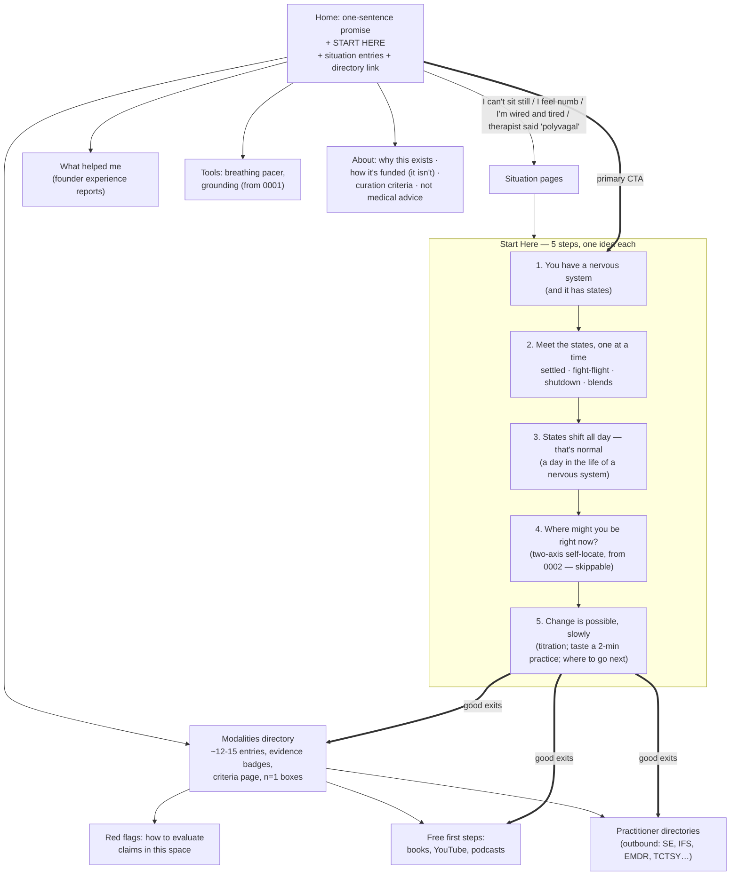
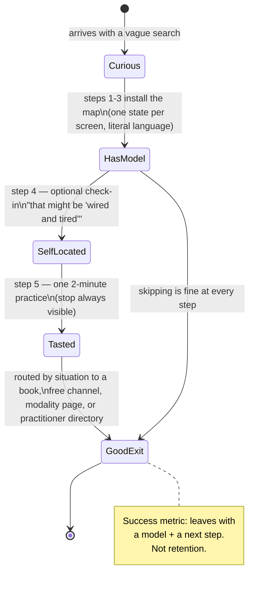
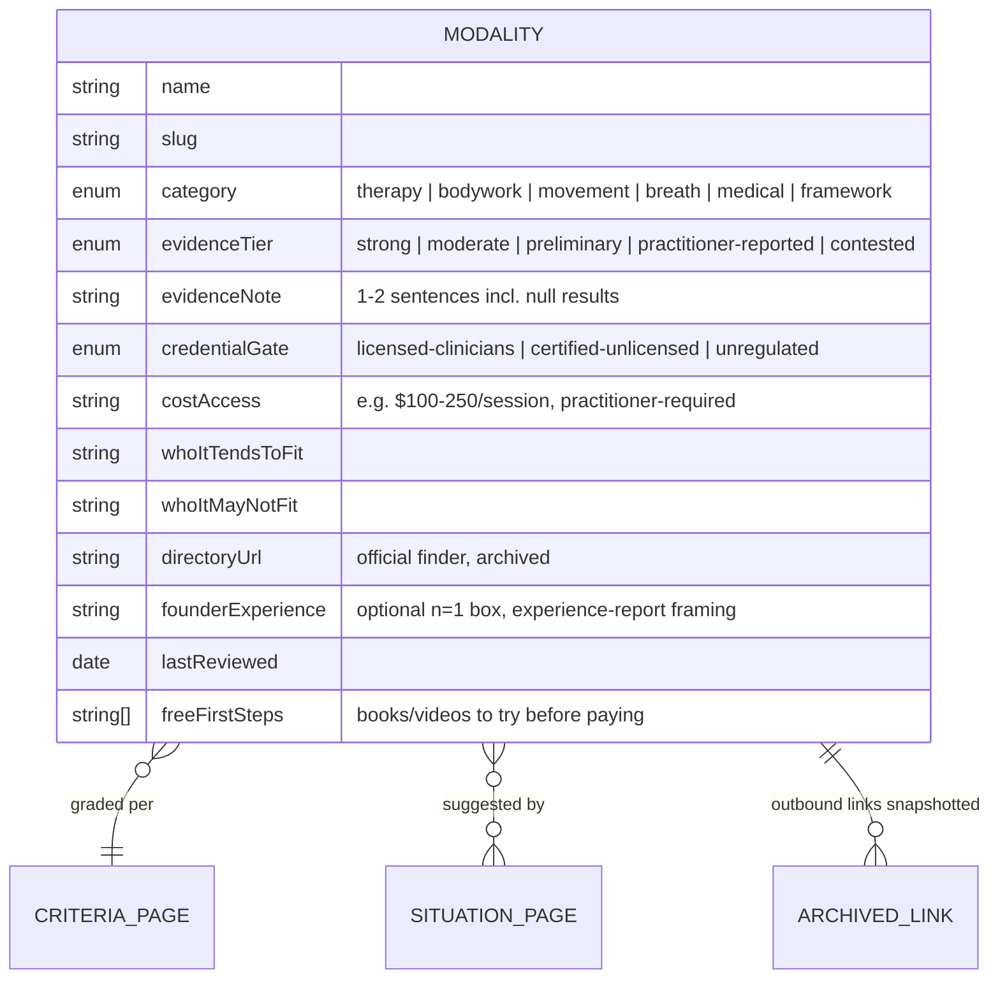

# Orientation Hub Pivot — A Starting Place, Not A Product

## Problem Statement

Explorations [0001](0001_%5B_%5D_NERVOUS_SYSTEM_HEALING_SITE.md) and
[0002](0002_%5B_%5D_NEURODIVERGENT_PERSONALIZATION.md) designed a
practice-app-shaped site. The founder has now clarified the actual mission:

> A place you go when you're curious about nervous system healing but don't
> know where to start. Not to make money — to be a resource: raise awareness
> that nervous system states (freeze, fight-flight) exist and arise naturally
> through the day, familiarize people with their own states, invite the
> possibility of slow, gradual change, share what helped me, and direct
> people onward to useful therapies.

That is an **orientation hub**, not an app. The unit of success changes from
"user does a practice" to "visitor leaves with a working mental model and a
good next step — usually somewhere else." This exploration redesigns the
information architecture, adds a modalities directory with honest evidence
grading, and defines the trust/ethos infrastructure a non-commercial health
hub needs.

## Executive Summary

- **Reposition**: the site's job is to (1) install a mental model — "you
  have a nervous system with states; they shift all day; they can change
  slowly over time" — and (2) route people outward: to free beginner
  resources, to modalities, to licensed practitioners. Practices from
  0001/0002 remain but demoted to "taste it now" moments inside the journey.
- **Lead with a sequenced path, not a taxonomy** (the ukpersonal.finance /
  EFF-SSD / MDN finding): homepage = one-sentence promise + a single
  **Start Here** path (5 short steps teaching one state at a time, explorable-
  explanation style) + 3–5 *situation-based* secondary entries ("I can't
  sit still", "I feel numb and flat", "a therapist mentioned polyvagal") —
  never identity-based ("I am a…") entries, which NN/g documents as a
  failure pattern.
- **Add a modalities directory** as a new content collection: ~20 entries,
  each with an **evidence-tier badge** (strong / moderate / preliminary /
  practitioner-reported / contested — Examine.com's model, separating
  evidence strength from the founder's experience), cost/access reality,
  whether the credential is licensure-gated, the official practitioner
  directory link, and a clearly boxed **"my experience (n=1)"** note where
  the founder has one.
- **Trust infrastructure is the product**: a published curation-criteria
  page (Privacy Guides' load-bearing move), a "how this site is funded:
  it isn't" ethos page, last-reviewed dates on every entry, archived
  outbound links + CI link checking, and — rare and differentiating — a
  **red-flags page** teaching newcomers how to spot overclaiming, unregulated
  titles, and guru dynamics in this exact space.
- **Intellectual honesty about our own framework**: polyvagal theory's
  neurophysiology is genuinely contested (Grossman 2023 vs Porges 2025). The
  site uses state language as an *experiential map*, and says so — "a useful
  map whose biology is debated" — which converts a liability into the
  site's strongest credibility signal.

## Current State In The Repository

- Two committed, unimplemented explorations:
  [`0001_[_]_NERVOUS_SYSTEM_HEALING_SITE.md`](0001_%5B_%5D_NERVOUS_SYSTEM_HEALING_SITE.md)
  (stack, base architecture, practices/learn collections, breathing pacer)
  and
  [`0002_[_]_NEURODIVERGENT_PERSONALIZATION.md`](0002_%5B_%5D_NEURODIVERGENT_PERSONALIZATION.md)
  (ND-first design, two-axis check-in, preferences, founding persona,
  privacy gate). No source tree yet.
- **What survives unchanged**: the Astro 7 + Tailwind 4 + Pages stack, ND-first
  design rules, two-axis check-in (it becomes Start Here step 4,
  "self-locate"), practice schema with `sequenceTier`, privacy gate.
- **What this exploration changes**: home page concept (was check-in-first,
  becomes path-first), site map (adds `/start/`, `/modalities/`,
  `/red-flags/`, `/about/ethos/`), content collections (adds `modalities`),
  and the learn section's framing (adds the polyvagal-honesty note).
- **What it removes from 0001's v2 list**: anything retention-shaped
  (practice journal, evening-mode ritual framing). A hub optimizes for good
  exits, not return visits.

## External Research

### Hub & wayfinding patterns

- **Sequence beats taxonomy for newcomers** — every successful hub studied
  leads with one blessed path: ukpersonal.finance's flowchart, EFF SSD's
  four-tier structure with curated "playlists", MDN's explicit finding that
  beginners "really want a robust pathway… rather than being expected to
  figure out what to learn and when." Taxonomy (the full directory) serves
  returners; both are offered, sequence leads.
- **Audience-based navigation fails** (NN/g): forced self-identification,
  ambiguous labels, pogo-sticking. Use situation/task entries instead.
- **Curation trust = published criteria** (Privacy Guides): a standalone
  page answering "how does something get on or off this list" — including
  *removal* criteria — converts "trust me" into "check my work." Examine.com
  adds the second key move: grade evidence per claim and separate evidence
  strength from effect size. MEpedia's principles: cite every fact, report
  negative and null results.
- **Non-commercial ethos signals**: a permanent footer-linked funding
  statement (no ads/affiliates/sponsors — say it explicitly even when the
  answer is "nothing"); "why this site exists" page; visible last-reviewed
  dates that distinguish "updated" from "reviewed"; archive outbound links
  at publish time (≈66% of links die within ~9 years) and run automated
  link checks.
- **Separating evidence from experience**: epistemic-status disclosure
  (Gwern → LessWrong → Maggie Appleton's "Epistemic Disclosure") — a
  one-line header stating how you know what you claim; visually distinct
  n=1 boxes for personal experience; "experience report" framing (what I
  tried, in what order, what changed, what didn't work) rather than
  recommendation framing.
- **Awareness-first education**: Nicky Case's explorable explanations
  (*Adventures with Anxiety*, *Neurotic Neurons*) are the proven genre for
  installing a mental model without selling anything. Design patterns: teach
  one mechanic at a time; let the learner generate the insight; withhold the
  explanation until they want it; the minimal interactive move is
  self-location ("which state might you be in right now?"). The Polyvagal
  Institute gives away the model before any paid training but is org-shaped,
  not newcomer-shaped — exactly the gap this hub fills.

### The modality landscape (evidence tiers verified per-modality)

Full data in the research appendix; the shape of it:

| Tier | Modalities |
|---|---|
| Strong RCT base | EMDR (WHO/APA/VA-endorsed for PTSD) |
| Moderate | Trauma-sensitive yoga (TCTSY — VA RCT), Tai Chi/Qigong (anxiety/depression), Pilates (chronic low-back pain, not trauma-specific) |
| Preliminary→moderate | IFS (SAMHSA-listed; 2025 review: larger trials needed), SE (Brom 2017 RCT + scoping review; small samples), Feldenkrais (balance) |
| Preliminary / practitioner-reported | Sensorimotor, TRE, Brainspotting, NARM, Hakomi, coherent breathing (HRV yes, mental-health outcomes mixed), KAP (emerging; a 2025 study found no added benefit of therapy over ketamine alone) |
| Contested / caution | Craniosacral (Ernst 2012: pseudoscience concerns), Rolfing/MFR claims (2022 review: no good evidence), consumer tVNS devices (marketing outruns data), holotropic breathwork (destabilization risk), neurofeedback for PTSD (VA/DoD 2023: insufficient evidence), **polyvagal theory's neurophysiology itself** (Grossman 2023 vs Porges 2025 — framework useful, biology disputed) |
| Not available | MDMA-assisted therapy — FDA Complete Response Letter Aug 2024; still investigational as of 2026. The hub must say this plainly. |

Other load-bearing facts:

- **Credential reality**: "somatic practitioner", "nervous system coach",
  "polyvagal-informed" are unprotected titles. Directory listing ≠ licensure;
  most institutes explicitly disclaim vetting. EMDRIA gates on licensure;
  many others don't. **Irene Lyon's SBSM is a consumer education program,
  not a practitioner certification** — "trained by Irene Lyon" is a
  self-description. The hub should state this kindly and clearly, *while
  still recommending her free content* (which the founder found genuinely
  valuable) — that combination is exactly the honest n=1-vs-evidence
  separation.
- **What communities actually tell beginners** (r/CPTSD,
  r/SomaticExperiencing): Pete Walker's *Complex PTSD* near-universally;
  *The Body Keeps the Score* as a gateway **with criticisms noted** (LeDoux
  and others: overstated claims, triune-brain framing); Deb Dana's
  *Anchored* and Levine's *Healing Trauma* as practical intros; free
  regulation practices before paid programs; licensed trauma therapist over
  influencer programs.
- **Red flags communities warn about**: cure-all promises, no-refund
  high-pressure launches, discouraging conventional care, unregulated
  titles, proprietary "secret" techniques, testimonials-as-evidence,
  overstated neuroscience ("your primitive brain is betraying you"),
  $5–10k certifications with in-group dynamics.
- **Official practitioner directories** for the build: traumahealing.org
  (SE) · ifs-institute.com/practitioners · emdria.org/find-an-emdr-therapist
  · sensorimotorpsychotherapy.org/therapist-directory ·
  treglobal.org/tre-provider-list · traumasensitiveyoga.com/facilitators ·
  feldenkrais.com/practitioner-search · directory.narmtraining.com ·
  hakomiinstitute.com/find-a-practitioner · brainspotting.com/directory ·
  rolf.org.

## Key Findings

1. **The mission statement is an IA statement.** "Curious but don't know
   where to start" → a sequenced Start Here path is the homepage's single
   job. "Direct people to therapies" → a curated directory with published
   criteria. "Share what helped me" → n=1 experience reports typographically
   separated from evidence grades. "Familiarize people with states" → the
   learn section becomes a step-at-a-time explorable, not an article pile.
2. **Honesty is the moat.** Nobody in this niche publishes evidence tiers,
   null results, credential caveats, and a red-flags guide. The hub can be
   the *only* place that recommends Irene Lyon's free content while noting
   SBSM isn't a certification, praises *The Body Keeps the Score* while
   linking its critics, and uses polyvagal language while flagging the
   debate. That's what "just a resource, not a product" uniquely permits —
   no revenue depends on any modality looking good.
3. **A hub optimizes for good exits.** Success = visitor leaves for a
   practitioner directory, a library book, or a free YouTube channel with a
   model in their head. This kills retention features (streaks were already
   dead; the journal and anything engagement-shaped go too) and elevates
   outbound-link integrity (archiving, link checks, last-verified dates) to
   core infrastructure.
4. **"States arise naturally all day" is the teachable insight.** Not
   "you are traumatized" but "everyone's system moves between states;
   here's what each feels like; stuck patterns can shift slowly." That
   framing is destigmatizing, matches the founder's language ("invite them
   into the possibility"), and is the explorable's script: normal day →
   state shifts → self-locate → what gentle change looks like →
   where to go deeper.
5. **The 0002 work slots in cleanly**: the two-axis check-in becomes Start
   Here step 4 (self-locate); ND-first design rules govern the path (one
   idea per step, literal language, visible progress "step 2 of 5", no
   autoplay); the four content pillars from 0002 become the "go deeper"
   layer behind the path.

## Options And Tradeoffs

### A. Homepage / entry model

| Option | Pros | Cons |
|---|---|---|
| A1. Check-in-first home (0001/0002 design) | Immediate tool | Assumes visitor already has the model; wrong for the "curious, don't know where to start" persona |
| **A2. Path-first home: promise + Start Here CTA + situation entries + directory link** (recommended) | Matches mission; proven hub pattern; check-in still reachable in one tap | The path must be genuinely short (5 steps) or it becomes a course |
| A3. Directory-first (link hub / awesome-list) | Cheap to build | Overwhelming unordered menu — the exact failure the founder describes; awesome-lists rot |

### B. Start Here format

| Option | Pros | Cons |
|---|---|---|
| B1. Single long "start here" article | Cheapest | Wall of text; anti-ADHD; model install rate low |
| **B2. 5-step sequenced path, one idea per page, minimal interactivity (self-locate step + optional 60-second taste of a practice)** (recommended) | Explorable-explanation pedagogy at static-site cost; ND-first compliant; each step ends with one clear "next" | More design work than an article |
| B3. Full Nicky-Case-style interactive explorable | Highest model-install rate; distinctive | Weeks of bespoke work; risks becoming the product; can be v2 for the states step |

### C. Directory depth

| Option | Pros | Cons |
|---|---|---|
| C1. Comprehensive (all ~21 researched) | Complete | Maintenance burden; choice paralysis; stale entries erode trust |
| **C2. Curated ~12–15 with published criteria, "if you only try one thing" defaults per situation, and a stated omissions policy** (recommended) | Privacy-Guides pattern; maintainable; honest | Someone's favorite modality will be missing — the criteria page absorbs that |
| C3. Only founder-tried modalities | Maximum authenticity | Too narrow to orient; conflates n=1 with curation |

### D. Handling contested modalities the founder personally values

The founder found myofascial release and bodywork genuinely helpful; the
evidence review grades structural-bodywork *claims* as contested. Options:

| Option | Pros | Cons |
|---|---|---|
| D1. Omit contested modalities | "Safe" | Dishonest by omission; loses the founder's actual story; visitors will encounter them anyway, unarmed |
| **D2. Include with dual display: evidence badge (honest) + n=1 box (honest) + "what we can/can't say" line** (recommended) | The site's whole thesis in miniature: experience and evidence can diverge, and that's sayable | Requires careful copy per entry |
| D3. Include without grading | Avoids awkwardness | Becomes every other wellness site |

## Recommendation

Adopt **A2 + B2 + C2 + D2**. The product statement finalizes as:

> **A free orientation hub for nervous system healing.** Learn what nervous
> system states are and how they move through your day, locate yourself
> gently, taste a two-minute practice, and get honestly-graded directions to
> the therapies, books, and practitioners that can take you further. Built
> by one person who needed this page to exist; funded by nobody.

### Information architecture



### The Start Here path as a state journey



### Modality entry schema



### Trust infrastructure (all footer-linked, all standalone pages)

1. **Why this site exists** — founder story (per 0002's privacy gate).
2. **How this site is funded** — "It isn't. No ads, affiliates, sponsors,
   or paid placements; nothing here earns money. If that ever changes, this
   page will say so first."
3. **Curation criteria** — inclusion, grading legend, *removal* criteria,
   omissions policy, "evidence tier ≠ my experience" explanation.
4. **Red flags** — unregulated titles, cure-all promises, pressure launches,
   testimonials-as-evidence, overstated neuroscience; framed as skills, not
   accusations.
5. **Not medical advice + crisis resources** (from 0001).
6. **Polyvagal honesty note** — linked from every learn page that uses state
   language: "we use these states as an experiential map; the underlying
   neurophysiology is scientifically debated (sources); the map is useful
   even while the biology is argued about."

## Example Code

`src/content.config.ts` — the `modalities` collection:

```ts
const modalities = defineCollection({
  loader: glob({ pattern: "**/*.md", base: "./src/content/modalities" }),
  schema: z.object({
    name: z.string(),
    category: z.enum(["therapy", "bodywork", "movement", "breath", "medical", "framework"]),
    evidenceTier: z.enum(["strong", "moderate", "preliminary", "practitioner-reported", "contested"]),
    evidenceNote: z.string(),           // must cite; null results welcome
    credentialGate: z.enum(["licensed-clinicians", "certified-unlicensed", "unregulated"]),
    costAccess: z.string(),
    whoItTendsToFit: z.string(),
    whoItMayNotFit: z.string(),
    directoryUrl: z.string().url().optional(),
    archivedDirectoryUrl: z.string().url().optional(), // Wayback snapshot
    founderExperience: z.string().optional(),          // renders as n=1 box
    lastReviewed: z.date(),
    freeFirstSteps: z.array(z.string()).default([]),
  }),
});
```

Example entry (`src/content/modalities/somatic-experiencing.md`):

```yaml
name: "Somatic Experiencing (SE)"
category: "therapy"
evidenceTier: "preliminary"
evidenceNote: >
  A small number of controlled trials (Brom 2017) and a 2021 scoping review
  show positive PTSD-symptom signals; samples are small and replication is
  limited. Promising, not proven.
credentialGate: "certified-unlicensed"   # SEP ≠ therapy license; check both
costAccess: "$100–250/session; 3-year practitioner training"
whoItTendsToFit: "People who feel talk therapy 'understood but didn't reach' the body"
whoItMayNotFit: "Anyone needing acute psychiatric care; those who want a structured protocol"
directoryUrl: "https://directory.traumahealing.org"
lastReviewed: 2026-07-04
freeFirstSteps:
  - "Peter Levine, 'Healing Trauma' (short, has exercises)"
  - "Irene Lyon's free YouTube intro playlists"
founderExperience: >
  Bodywork and co-regulation with an SE-informed practitioner is one of the
  few things that reached what years of talk therapy couldn't. One person's
  experience, not a study — and it matches where the evidence is thinnest,
  which is exactly why both lines are on this page.
```

n=1 box rendering convention:

```html
<aside class="border-l-4 border-clay-300 bg-clay-100/50 p-4 rounded-r"
       aria-label="Personal experience, not evidence">
  <p class="text-sm font-semibold">My experience — one person, not a study</p>
  <p>…</p>
</aside>
```

CI link integrity (append to deploy workflow):

```yaml
  linkcheck:
    runs-on: ubuntu-latest
    steps:
      - uses: actions/checkout@v6
      - run: npx linkinator ./dist --recurse --markdown
        # weekly cron variant opens an issue on failures
```

## Risks And Open Questions

- **Maintenance is the real cost.** Evidence grades and directory links
  decay; `lastReviewed` dates make staleness visible (good) and embarrassing
  (motivating). Mitigation: small directory (C2), quarterly review ritual,
  CI link checks. Open question: is a quarterly 2-hour review sustainable
  for the founder?
- **Grading modalities invites pushback** — from practitioners of contested
  modalities and from communities that love them. The criteria page and
  "experience vs evidence" separation are the shield; tone must grade
  *claims*, never *people*. The red-flags page especially must read as
  consumer skills, not a hit list.
- **The polyvagal honesty note could confuse beginners** ("wait, is this
  real?"). Handle with map-vs-territory framing at the *end* of the path,
  not step 1 — teach the map first, then note its status honestly.
- **Legal posture**: grading is opinion-with-citations (safer than health
  claims), but the disclaimer pages should be reviewed once by someone with
  relevant expertise. n=1 boxes about ketamine stay refer-out only (0002
  rule).
- **Scope discipline inverted**: previous risk was app-creep; new risk is
  *encyclopedia*-creep. The directory caps at ~15; the criteria page's
  omissions policy handles the rest.
- **Does "no retention features" go too far?** An RSS feed and a "review
  ritual" changelog page are hub-appropriate (returners who *chose* to
  return); anything push-shaped stays out.

## Implementation Checklist

- [ ] Reframe (amends 0001 Milestone 1)
  - [ ] Rewrite home page: promise sentence, Start Here CTA, 4 situation
        entries, directory + about links; check-in demoted from home to
        path step 4 and `/tools/`
  - [ ] Add trust pages: ethos/funding, curation criteria (with grading
        legend + removal + omissions policy), red flags, polyvagal honesty
        note; footer-link all of them
- [ ] Start Here path
  - [ ] 5 step pages (`/start/1-you-have-a-nervous-system/` …), one idea
        each, "step N of 5" visible, literal language, each ends with one
        next-button
  - [ ] Step 4 embeds the 0002 two-axis self-locate island (skippable)
  - [ ] Step 5 embeds one 2-minute practice + routes to free-first-steps,
        modalities, and practitioner directories by situation
  - [ ] 4 situation pages that enter the path with tailored framing
- [ ] Modalities directory
  - [ ] `modalities` collection schema (as above) in `src/content.config.ts`
  - [ ] Seed 12–15 entries from the research: SE, IFS, EMDR, TCTSY,
        sensorimotor, TRE, Feldenkrais, tai chi/qigong, coherent breathing,
        bodywork/MFR (contested, D2 dual display), craniosacral (contested),
        KAP (refer-out), neurofeedback (insufficient), polyvagal-informed
        (framework note), MDMA status note (not available)
  - [ ] Directory index: filter by category + evidence tier; "if you only
        try one thing" default per situation; legend link
  - [ ] Free-first-steps page: Pete Walker, Deb Dana *Anchored*, Levine
        *Healing Trauma*, van der Kolk (with criticisms note), Menakem,
        Irene Lyon free content (with SBSM-is-not-a-certification note),
        Therapy in a Nutshell, Crappy Childhood Fairy
  - [ ] n=1 experience-report boxes on founder-tried entries; "What helped
        me" index page collecting them
- [ ] Link integrity
  - [ ] Wayback-archive every outbound URL at authoring time; store
        `archivedDirectoryUrl`
  - [ ] `linkinator` job in CI + weekly cron that opens an issue on breakage
  - [ ] `lastReviewed` rendered on every modality + learn page
- [ ] Content guidelines additions
  - [ ] Grade claims not people; evidence line and experience line never
        merge; cite every factual sentence; null results reported;
        map-vs-territory rule for state language
- [ ] Housekeeping
  - [ ] Update 0001/0002 checklists: strike retention-shaped v2 items,
        note home-page supersession (commit: `docs(exploration): reconcile
        0001/0002 with hub pivot`)

## Validation Checklist

- [ ] A first-time visitor can go from home to completing the path in under
      10 minutes with no dead ends; every step has exactly one primary next
      action (walkthrough test)
- [ ] The founder reads the path and confirms it says what he wished
      someone had told him at the start
- [ ] Every modality entry shows: badge, evidence note with citation, cost,
      credential gate, lastReviewed, and (where present) a visually
      distinct n=1 box — verified by template test over all entries
- [ ] The SE entry demonstrates D2: preliminary badge AND positive n=1 box
      coexisting with the "both lines on this page" copy
- [ ] MDMA entry states plainly it is not currently an available legal
      therapy; KAP entry contains no dosing/sourcing content
- [ ] Criteria, funding, red-flags, and polyvagal-note pages exist, are
      footer-reachable from every page, and the criteria page includes
      removal + omissions policies
- [ ] CI fails on broken outbound links; every `directoryUrl` has a working
      archive snapshot
- [ ] Situation entries are phrased as situations ("I can't sit still"),
      zero identity-based ("I am a…") entries anywhere
- [ ] No streaks, no push notifications, no email-capture modals anywhere;
      RSS present
- [ ] Copy review: evidence sentences and experience sentences never occur
      in the same paragraph on modality pages

## References

Hub & trust patterns:
- ukpersonal.finance flowchart — https://ukpersonal.finance/flowchart/
- EFF Surveillance Self-Defense (structure + playlists) — https://ssd.eff.org/
- MDN curriculum rationale — https://developer.mozilla.org/en-US/blog/curriculum-learn-web-development/
- NN/g on audience-based navigation — https://www.nngroup.com/articles/audience-based-navigation/ · progressive disclosure — https://www.nngroup.com/articles/progressive-disclosure/
- Privacy Guides criteria — https://www.privacyguides.org/en/about/criteria/ · about/funding — https://www.privacyguides.org/en/about/
- Examine.com evidence grading — https://examine.com/how-to-use/
- MEpedia principles — https://me-pedia.org/wiki/MEpedia
- Epistemic disclosure — https://maggieappleton.com/epistemic-disclosure · Gwern's confidence tags — https://gwern.net/about
- Link rot — https://en.wikipedia.org/wiki/Wikipedia:Link_rot · https://www.tryanalyze.ai/blog/link-rot-study
- Explorable explanations — https://blog.ncase.me/explorable-explanations/ · https://ncase.itch.io/anxiety · https://worrydream.com/ExplorableExplanations/ · https://explorabl.es/
- Health-content review dating — https://medlineplus.gov/evaluatinghealthinformation.html

Modality evidence & directories:
- SE — Brom 2017 RCT & 2021 scoping review context via https://traumahealing.org/ · directory https://directory.traumahealing.org
- IFS — https://ifs-institute.com/practitioners (SAMHSA listing; 2025 scoping review caveats)
- EMDR — https://www.emdria.org/find-an-emdr-therapist/ (WHO/APA/VA endorsements)
- TCTSY — https://www.traumasensitiveyoga.com/ (RCT base incl. VA trial)
- TRE — https://treglobal.org/tre-provider-list/
- Sensorimotor — https://sensorimotorpsychotherapy.org/therapist-directory/
- Feldenkrais — https://feldenkrais.com/practitioner-search/ (2015 systematic review: balance)
- NARM — https://directory.narmtraining.com · Hakomi — https://hakomiinstitute.com/find-a-practitioner/ · Brainspotting — https://brainspotting.com/directory
- Craniosacral evidence critique — Ernst 2012; McGill OSS coverage · Rolfing claims — 2022 systematic review
- Polyvagal debate — Grossman 2023 critique; Porges 2025 rebuttal; framework-vs-biology distinction
- Neurofeedback — VA/DoD 2023 PTSD guideline (insufficient evidence)
- KAP — https://www.journeyclinical.com/resources/ketamine-assisted-psychotherapy-kap-for-ptsd-and-trauma-evidence-outcomes-and-safety (+ 2025 no-added-benefit study)
- MDMA regulatory status — FDA CRL to Lykos, Aug 2024 (full CRL released Sept 2025)
- tVNS device caution — Nurosym/Pulsetto marketing vs evidence coverage
- Beginner canon & community advice — Pete Walker *Complex PTSD*; Deb Dana *Anchored*; Levine *Healing Trauma*; van der Kolk criticisms (LeDoux; *Research on Social Work Practice* 2023 editorial); Menakem *My Grandmother's Hands*; r/CPTSD & r/SomaticExperiencing community threads
- Irene Lyon / SBSM program structure — https://irenelyon.com/programs/ · https://21daytuneup.com/
