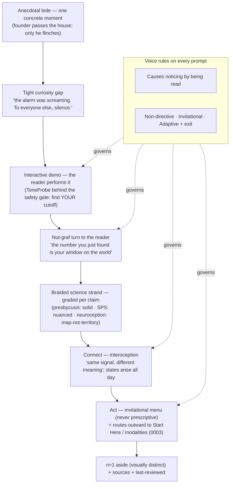
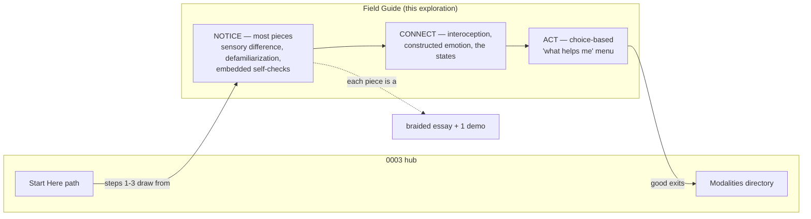
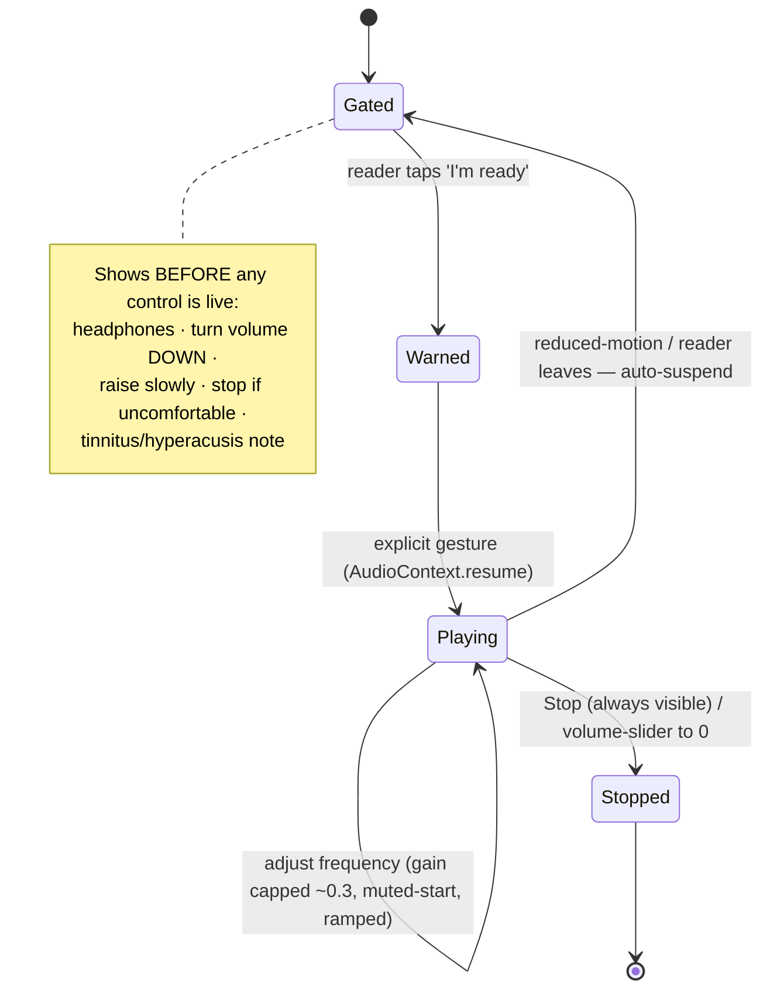

# The Sensory Awareness Editorial Heart — "Field Guide To Your Nervous System"

## Problem Statement

The founder has named the site's **heart**: bringing awareness to how large a
role the nervous system plays in everyday life, and how little most of us
notice it. The doorway is *sensory difference* — the observation, from his own
life, that he hears a high-pitched dog-deterrent alarm his parents cannot
hear, smells car exhaust on the highway they don't register. If people receive
*different sensory data* from the same world, then everyone's baseline level
of activation differs too — and noticing your own sensory environment becomes
a form of nervous-system literacy. The teachable arc: states like
vigilance, hypervigilance, reactivity, ease, and relaxation arise naturally
all day; the goal is to spend most time in ease with the *flexibility* to
shift, not to get stuck in freeze or fight-flight — and "I didn't even know I
might be stuck until recently."

The design question: **what content genre, structure, and interactive form
carry this awareness mission** — credibly (the science is a minefield of
pop-psych), safely (audio/motion demos can harm), and movingly (it must
create the "aha," not lecture)?

## Executive Summary

- **Define the site's signature content genre**: short "noticing" pieces —
  a **Field Guide to Your Nervous System** — each one a *braided essay* that
  fuses three strands on a single page: **(1)** a first-person anecdote
  (the founder's, clearly marked n=1), **(2)** an interactive demo the reader
  *performs* (e.g. a live tone generator that finds their own hearing
  cutoff), and **(3)** honestly-graded science. The braid is wrapped in
  trauma-informed, invitational voice.
- **The founder's dog-alarm story is the flagship piece** and the proof of
  concept. It is scientifically sound (age-related high-frequency hearing
  loss is real, universal, and mechanistically understood) and it pairs
  perfectly with a "can you hear this?" tone demo. Two accuracy nuances must
  be honored in the copy (below).
- **The unifying pedagogical insight**: an interactive sensory demo is an
  *anecdote the reader lives* — the one form of n=1 evidence immune to the
  "that's just your experience" objection. Telling someone "everyone's
  sensory world differs" is a claim to believe; letting them hit their own
  hearing cutoff, or disagree with a friend about The Dress, is proof they
  generated themselves.
- **Voice engineering**: every self-noticing prompt should *cause* the
  noticing by being read (the "you are now breathing manually" mechanism),
  not merely instruct it; be built on a *tight, specific* curiosity gap
  (Loewenstein); and be **Non-directive, Invitational, Adaptive** with a
  visible exit (the trauma-informed N.I.A. model).
- **Content architecture: Notice → Connect → Act** (Kelly Mahler's
  interoception curriculum), which slots directly under the Start Here path
  from [0003](0003_%5B_%5D_ORIENTATION_HUB_PIVOT.md): most pieces live in
  Notice; Connect introduces interoception and "same body signal, different
  emotion"; Act is a choice-based, never-prescriptive menu.
- **Non-negotiable safety layer** for any audio or motion demo: start muted,
  headphone/volume warning gate, capped gain, `prefers-reduced-motion`
  honored, WCAG flash thresholds, one-click exit.
- **Honesty is preserved as code**: each factual claim carries an
  `evidenceStatus`, extending 0003's grading discipline down to the sentence
  level, with the polyvagal caveat from prior explorations applied to state
  language.

## Current State In The Repository

- Three committed, unimplemented explorations. This one defines the
  *editorial core* that the [0003](0003_%5B_%5D_ORIENTATION_HUB_PIVOT.md) hub
  is built to house: the "noticing" pieces are the substance behind Start
  Here steps 1–3 ("you have a nervous system", "meet the states", "states
  shift all day") and the learn layer.
- **Reuses**: 0001's Astro islands + MDX; 0002's ND-first rules, invitational
  microcopy, `prefers-reduced-motion`-first stance, and interoception
  research; 0003's evidence-grading discipline, epistemic-status separation,
  and polyvagal-honesty note.
- **Adds**: a new content collection `field-guide` (essays), a component
  library for interactive demos (`ToneProbe`, `PerceptPoll`,
  `IllusionFrame`) and hermit-crab "shells" (`FieldGuideEntry`,
  `NoticeAside`, `EvidenceTag`), and an audio/motion **safety-gate**
  component all sensory demos must sit behind.
- **In 0001/0002/0003's proposed layout**, files touched:
  `src/content.config.ts` (add `field-guide` collection),
  `src/components/demos/*`, `src/components/field-guide/*`,
  `src/content/field-guide/*.mdx`, and the Start Here step pages.

## External Research

### The science — an honesty ledger

Research produced a clear tiering, which the site should mirror per claim:

**Solid, uncontestable (lead with these):**
- **Age-related high-frequency hearing loss (presbycusis)** is universal,
  irreversible, and high-frequency-first (mechanism: stria vascularis
  decline + outer-hair-cell loss). Typical upper limit: teens ~19–20 kHz;
  20s–30s ~16–17 kHz; 40s ~14 kHz; 60s–70s ~8–12 kHz. This is *exactly* why
  a 38-year-old can hear a high-pitched alarm his parents in their 60s–70s
  cannot. The "Mosquito" anti-loitering device (~17.4 kHz) and "teen buzz"
  ringtone weaponize this same audiogram gap.
- **Genetic olfactory variation**: ~400 OR genes, one of the most variable
  gene families in the genome. Cilantro-as-soap (OR6A2, binds aldehydes —
  present as *a* contributing factor, heritability is partial),
  androstenone smelled as foul/sweet/odorless by OR7D4 genotype, asparagus
  "anosmia" (~60% can't smell the metabolites). People inhabit different
  smell worlds.
- **Taste**: supertasters via TAS2R38 (PAV/AVI haplotypes) *plus* fungiform
  papillae density — real but multi-causal, not a single gene.
- **Vision**: ~8% of males have red-green color deficiency; The Dress
  (~57% blue-black / ~30% white-gold, an illuminant-assumption difference)
  and Yanny/Laurel (frequency-weighting difference) are clean "same input,
  different percept" artifacts.
- **Autism sensory over-responsivity (SOR)**: a DSM-5 criterion since 2013;
  >50% in autism vs ~5–15% general; linked to reduced thalamocortical GABA
  filtering and to atypical autonomic responses.
- **Allostatic load** (McEwen & Stellar 1993) and **sensory gating /
  prepulse inhibition** are mainstream: chronic threat-scanning has a
  cumulative physiological cost, and how much raw signal a nervous system
  filters varies between people.
- **Hypervigilance** is a well-defined clinical state (core to PTSD/C-PTSD).

**Real but nuanced — a continuum, not a category:**
- **Sensory Processing Sensitivity / "Highly Sensitive Person"** (Aron):
  a legitimate temperament trait with a real literature, BUT the popular
  "15–20% of people are HSPs" is soft — sensitivity is a roughly normal
  *spectrum*. **Differential susceptibility** (Belsky/Pluess) is the most
  defensible framing: high-sensitivity people respond more strongly to
  *both* adverse and supportive environments — "for better and for worse,"
  not "fragile." One neuroimaging line (Acevedo 2014) exists; treat as
  suggestive.

**Well-motivated but partly theoretical:**
- The full "sensory load → interoceptive burden → allostatic overload →
  burnout" chain in autism is scientifically motivated and physiologically
  supported, but the complete causal model is a hypothesis under study.

**Contested — flag explicitly (carries the standing polyvagal caveat):**
- **Neuroception** (Porges) — the nervous system scanning for safety/threat
  below awareness — is a *useful clinical metaphor*, and the *general
  phenomenon* of subconscious autonomic response to safety cues is
  well-supported. But it sits inside **polyvagal theory, whose specific
  evolutionary/anatomical claims are contested** (Grossman 2023 refutation;
  Porges 2025 rebuttal). The "ventral-vagal-most-of-the-time, flexibly
  shifting" ideal is compatible with mainstream autonomic-flexibility /
  HRV research, but present the *three-state architecture* as a helpful
  **map, not settled neuroscience**.

**Two accuracy flags for the flagship anecdote** (must shape the copy):
1. A *genuinely* ultrasonic tone (≥22 kHz) would be inaudible even to a
   38-year-old. If he reliably hears the alarm, its dominant energy is more
   likely ~15–20 kHz (Mosquito-band) or has audible lower components — frame
   it that way, don't claim he hears true ultrasound.
2. Cilantro-soap is real but only weakly heritable via common SNPs
   (~0.087) — OR6A2 is "a contributing factor," not "the gene that decides."

### The content craft

- **Defamiliarization / *ostranenie*** (Shklovsky, 1917) is the theoretical
  spine: habit "devours" perception; the writer's job is to *deautomatize* —
  slow and lengthen perception so the reader *experiences* rather than
  recognizes. The site's subject (breath, jaw tension, edge-of-hearing
  sound) is the most automatized content in a person's life, so this isn't
  style, it's the mechanism.
- **The "you are now breathing manually" device** is defamiliarization
  compressed to one line with a near-100% hit rate: the sentence *performs*
  the noticing. Template for every prompt: not "notice your jaw" (an
  instruction, skippable) but "your jaw is doing something right now, and
  you weren't aware of it until this sentence" (already happened by the time
  it's read).
- **Anecdotal lede → nut graf**: open in-scene on one concrete moment,
  withhold the concept for 2–4 paragraphs, then pivot to the reader ("you
  are probably doing a version of this right now").
- **Master explainers to model**: Oliver Sacks (an extreme case as a
  doorway to the ordinary faculty the reader takes for granted); Tim Urban
  (give states/sensations sticky *named characters* — "the shoulder brace,"
  "the held breath" — reusable later); Nicky Case (*content gating* —
  withhold the explanation until the reader acts; "Do & Show & Tell" — text
  for concepts, interactives for processes, don't make everything
  interactive); Bret Victor (reactive documents — draggable values inside a
  sentence, used sparingly).
- **Loewenstein's curiosity gap**: complete ignorance produces no curiosity;
  a *specific, bounded* gap does. Precede every self-check with a tight gap
  ("one of your shoulders is higher than the other right now"), not a broad
  one ("let's explore your hidden tensions").
- **Interoception as the payoff concept** (Barrett's constructed emotion):
  the *same* racing heart is "excitement" before a date and "anxiety" before
  a test — identical body signal, different interpretation. This reframes
  noticing as a skill that changes your emotional life, and interoceptive
  accuracy is *trainable*.
- **Trauma-informed voice — the N.I.A. model**: every prompt is
  **N**on-directive ("perhaps you'd like to…"), **I**nvitational ("I invite
  you to notice, *if that feels okay*"), **A**daptive ("focus on your breath
  *or* on sounds — whichever works"). Trauma removes choice; restoring
  agency with a visible exit is what keeps a self-check safe *and* defeats
  preachiness (an invitation can't nag). HCI research adds: short
  *questions* beat statements; never fire a prompt during high cognitive
  load — place them at natural pauses.
- **Interactive demos that teach perception by self-demonstration**: live
  Web Audio tone generators (Szynalski, AudioCheck's 17.4 kHz mosquito
  test — *generate tones live, never ship an audio file*, since lossy
  compression strips the exact high frequencies); The Dress as an
  `` + two-button poll revealing a live tally; Michael Bach's 154
  interactive illusions (motion-induced blindness: "your brain edits your
  reality"); sensory-overload simulators (Auti-Sim) behind a warning gate.
- **Essay forms that hold memoir + science together**: the **braided essay**
  (interweave personal / scientific / outside-voice strands, stitched by
  recurring images — e.g. Brian Doyle's "Joyas Voladoras"); the
  **hermit-crab essay** (pour vulnerable content into a borrowed neutral
  form — a field guide, FAQ, glossary, pain scale, audiogram). The site's
  clinical subject is *full* of borrowable shells, and MDX lets a demo the
  reader performs become one of the braid's threads.
- **The n=1 credibility fix**: separate the *voice channels visually* —
  personal narrative in a distinct treatment, sourced claims in body text
  with citations — so the reader always knows which register they're in;
  signpost epistemic status ("my experience, not a study") and link out to
  the evidence. Readers value honesty over certainty.

### Safety (non-negotiable)

- **Audio**: start muted (gain 0), sound only on explicit gesture, never
  autoplay; a headphone + "turn volume DOWN first, raise slowly, stop if
  uncomfortable" gate *before* the control is active; cap gain (~0.3), sine
  waves, gentle ramps to avoid startling clicks; name the real risks
  (hearing damage, tinnitus, hyperacusis) and warn *against* cranking volume
  to chase an inaudible tone. Web Audio caveat: absolute loudness can't be
  calibrated (depends on the user's hardware), so any "hearing age" result
  is indicative, not diagnostic — say so; true high-freq tests need
  headphones.
- **Motion/visual**: `prefers-reduced-motion` default-off with static
  fallback; WCAG 2.3.1 (nothing flashing >3×/sec); overload/aura sims gated
  behind an explicit warning + one-click exit, never auto-start; run
  animations through PEAT.

## Key Findings

1. **Sensory difference is the perfect on-ramp to nervous-system awareness.**
   It's the site's most *scientifically solid* ground (Area-1 claims are
   near-uncontestable), it's inherently *self-demonstrating* (you can prove
   it in the reader's own ears), and it's *destigmatizing* — it starts with
   neutral biological variation, not "you're traumatized."
2. **The braided-essay-with-a-live-demo is a genuinely novel format for this
   niche.** No nervous-system site fuses memoir + a demo the reader performs
   + graded science on one page. It resolves the n=1 problem structurally:
   the demo *is* a lived anecdote no reader can dismiss as "just yours."
3. **Voice is a mechanism, not a mood.** The difference between a page that
   creates the "aha" and one that lectures is whether the prompt *causes* the
   noticing (breathing-manually device) on a *tight* curiosity gap, in
   *invitational* language with an exit. This is specifiable and testable.
4. **The dog-alarm essay should be built first** as the reference
   implementation — it exercises every part of the system (anecdote strand,
   tone-probe demo, presbycusis science, safety gate, evidence tags, n=1
   aside) in one page, and it's the founder's own true story.
5. **Honesty scales down to the sentence.** Extending 0003's evidence grading
   to a per-claim `evidenceStatus` tag lets the site say, in the same essay,
   "presbycusis is settled" (solid) and "HSP is a real spectrum, not a 20%
   club" (nuanced) and "we use state language as a map whose biology is
   debated" (contested) — which is the whole brand.

## Options And Tradeoffs

### A. Core content genre

| Option | Pros | Cons |
|---|---|---|
| A1. Straight explainer articles | Familiar; fast to write | Doesn't create the "aha"; competes with every wellness blog |
| **A2. Braided "noticing" essays fusing anecdote + live demo + graded science** (recommended) | Novel; self-demonstrating; solves n=1; embodies the brand | Highest craft + build effort per piece |
| A3. Pure interactive explorables (Nicky Case style) | Highest engagement | Weeks per piece; risks becoming the product; less room for the founder's voice |

### B. How interactive to make each piece

| Option | Pros | Cons |
|---|---|---|
| B1. All prose, no demos | Cheapest, safest | Loses the strongest evidence (self-experience) |
| **B2. Prose-first, one hydrated island where the idea is a *process* (Case's "Do & Show & Tell")** (recommended) | Fast static pages; interactivity earns its place; safety scoped to few components | Discipline required to not over-build widgets |
| B3. Reactive-document-heavy (Bret Victor) | Dazzling | Fragile; heavy; accessibility burden |

### C. The flagship first piece

| Option | Pros | Cons |
|---|---|---|
| **C1. The dog-alarm / "can you hear this?" essay** (recommended) | True founder story; solid science; the tone demo is the canonical self-demonstration; exercises the whole system | Audio is the highest-safety-risk demo — must build the gate first |
| C2. The Dress / perception poll | No audio risk; viral | Not the founder's story; less tied to *activation* |
| C3. A no-demo interoception essay | Safest; deep | Weakest "aha"; saves the novel format for later |

### D. Handling the science honestly without deflating wonder

| Option | Pros | Cons |
|---|---|---|
| D1. Omit caveats, keep it magical | Smooth read | Betrays the site's honesty brand; the polyvagal/HSP overclaims are exactly what the red-flags page warns against |
| **D2. Per-claim `evidenceStatus` tags + map-vs-territory note placed *after* the felt experience** (recommended) | Wonder first, honesty kept; teaches epistemics by example | Requires careful placement so caveats don't interrupt the aha |
| D3. Heavy caveats up front | Maximally rigorous | Kills the anecdotal-lede spell; reads like a disclaimer |

## Recommendation

Adopt **A2 + B2 + C1 + D2**. The editorial heart is a growing **Field Guide
to Your Nervous System**: short braided "noticing" pieces, prose-first with
one interactive island where the concept is a process, each proving a bit of
sensory/nervous-system reality in the reader's own body, graded honestly at
the sentence level, in invitational trauma-informed voice. Ship the dog-alarm
essay first as the reference implementation, which forces the audio safety
gate to exist on day one.

### Anatomy of a Field Guide piece



### Notice → Connect → Act, nested under the hub



### The audio safety gate (a state machine every audio demo sits behind)



## Example Code

`src/content.config.ts` — the `field-guide` collection with per-piece
epistemic metadata:

```ts
const fieldGuide = defineCollection({
  loader: glob({ pattern: "**/*.mdx", base: "./src/content/field-guide" }),
  schema: z.object({
    title: z.string(),
    stage: z.enum(["notice", "connect", "act"]),
    hook: z.string(),                       // the anecdotal-lede seed
    demo: z.enum(["tone-probe", "percept-poll", "illusion", "none"]).default("none"),
    senses: z.array(z.enum(["hearing", "smell", "taste", "vision", "touch", "interoception"])),
    sources: z.array(z.object({ label: z.string(), url: z.string().url() })).min(1),
    lastReviewed: z.date(),
    reducedMotionSafe: z.boolean().default(true),
  }),
});
```

Inline evidence tagging in MDX (honesty at the sentence level):

```mdx
High-frequency hearing fades with age, from the top down.
<EvidenceTag level="solid">presbycusis — well-established mechanism</EvidenceTag>

Some people are simply more sensitive to input — a real trait, but a
spectrum, not a tidy category.
<EvidenceTag level="nuanced">
  Sensory Processing Sensitivity is real; the "20% of people are HSPs" figure
  is soft. <a href="...">why</a>
</EvidenceTag>

We'll talk about nervous-system "states" as a map. It's a useful map — and
the biology underneath it is genuinely debated.
<EvidenceTag level="contested" href="/learn/is-this-real/">map, not territory</EvidenceTag>
```

A prompt that *causes* the noticing (voice rule), not one that instructs:

```mdx
<NoticeAside>
  There's a sound in the room with you right now that you'd stopped hearing —
  a fan, the fridge, traffic, the hum of the screen. It didn't get louder.
  Your attention just landed on it, because this sentence sent it there.
  If you'd like, you can let it fade back. You're not doing anything wrong
  either way.
</NoticeAside>
```

The tone-probe demo, behind the gate, Astro-island, Web Audio (abbreviated):

```astro
---
// src/components/demos/ToneProbe.astro — hydrated with client:visible
---
<audio-safety-gate>
  <tone-probe data-max-gain="0.3"></tone-probe>
</audio-safety-gate>

<script>
  class ToneProbe extends HTMLElement {
    connectedCallback() {
      this.ctx = null; // created on first user gesture (autoplay policy)
      // start muted; frequency slider 20–20000 Hz; gain ramps, never instant;
      // Stop always visible; copy states: "headphones; this is indicative,
      // not a medical test; don't raise volume to chase a tone you can't hear."
    }
    play(freq) {
      if (!this.ctx) this.ctx = new AudioContext();
      this.ctx.resume();
      const osc = this.ctx.createOscillator();
      const gain = this.ctx.createGain();
      osc.type = "sine";
      osc.frequency.setValueAtTime(freq, this.ctx.currentTime);
      gain.gain.setValueAtTime(0, this.ctx.currentTime);            // muted start
      gain.gain.exponentialRampToValueAtTime(0.2, this.ctx.currentTime + 0.05);
      osc.connect(gain).connect(this.ctx.destination);
      osc.start();
      this._stop = () => gain.gain.exponentialRampToValueAtTime(0.0001, this.ctx.currentTime + 0.05);
    }
  }
  customElements.define("tone-probe", ToneProbe);
</script>
```

Dog-alarm essay frontmatter (`src/content/field-guide/the-alarm-only-i-could-hear.mdx`):

```yaml
title: "The alarm only I could hear"
stage: "notice"
hook: "Walking past a house with my mom; I flinched, she felt nothing."
demo: "tone-probe"
senses: ["hearing"]
sources:
  - { label: "Presbycusis (NIH StatPearls)", url: "https://www.ncbi.nlm.nih.gov/books/NBK559220/" }
  - { label: "The Mosquito device", url: "https://en.wikipedia.org/wiki/The_Mosquito" }
lastReviewed: 2026-07-04
```

## Risks And Open Questions

- **Audio harm is the headline risk.** The safety gate must ship *before* the
  first tone demo, be impossible to bypass, cap gain in code, and be reviewed
  by someone who understands hearing risk. Non-negotiable.
- **Wonder-vs-honesty placement.** Caveats that interrupt the anecdotal lede
  kill the aha; caveats omitted betray the brand. The D2 rule (felt
  experience first, `EvidenceTag` and map-vs-territory *after*) needs
  user-testing to confirm it lands.
- **Founder disclosure.** These essays are personal (the 0002 privacy gate
  applies). Each piece's n=1 content needs the same approval pass.
- **Two accuracy nuances** (true-ultrasound inaudibility; OR6A2 as partial)
  must survive editing — easy to "simplify" back into an overclaim.
- **Scope discipline.** The braided-essay-with-demo is expensive; cap the
  interactive islands to the few ideas that are genuinely *processes* (B2),
  and let most pieces be prose with a single embedded self-check.
- **Compression eats the demo.** Tones must be *generated live* in Web Audio;
  shipping an MP3 would strip the exact high frequencies the piece is about.
- **HSP framing.** Present sensitivity via *differential susceptibility*
  ("for better and for worse"), never "you're fragile/broken" — the
  non-pathologizing rule from 0002 governs here.

## Implementation Checklist

- [ ] Safety infrastructure (first)
  - [ ] `AudioSafetyGate` component: pre-control warning (headphones, volume
        down/raise slowly/stop, tinnitus & hyperacusis note), explicit
        gesture to proceed, always-visible Stop, auto-suspend on leave
  - [ ] Global rule: audio demos start muted, gain capped ~0.3, sine, ramped;
        motion demos honor `prefers-reduced-motion` + WCAG 2.3.1; PEAT-check
        any animation
- [ ] Component library
  - [ ] `ToneProbe` (Web Audio island, `client:visible`), `PerceptPoll`
        (image + two-button live tally, e.g. The Dress), `IllusionFrame`
        (reduced-motion-gated)
  - [ ] `NoticeAside` (invitational prompt block), `EvidenceTag`
        (solid/nuanced/contested), `NOfOneAside` (n=1, auto-appends
        "my experience — see sources"), `FieldGuideEntry` hermit-crab shell
- [ ] Content collection + architecture
  - [ ] `field-guide` collection schema (as above); Notice/Connect/Act stage
        field; wire Start Here steps 1–3 to pull from Notice pieces
- [ ] Flagship piece
  - [ ] Write "The alarm only I could hear": anecdotal lede → tight gap →
        ToneProbe → nut-graf turn → presbycusis science (graded) → Connect
        (interoception, states arise all day) → Act (invitational menu) →
        n=1 aside + sources; honor both accuracy nuances
- [ ] Voice guidelines (append to `CONTENT_GUIDELINES.md`)
  - [ ] Every prompt causes-not-instructs; N.I.A. + visible exit; tight
        specific curiosity gaps; short questions; place prompts at pauses;
        differential-susceptibility framing; map-not-territory for states
- [ ] Follow-on pieces (backlog, one demo max each)
  - [ ] "The dress in your own house" (PerceptPoll, vision) ·
        "The smell they couldn't smell" (no demo, smell/OR genes) ·
        "Your brain is editing this room" (Michael Bach illusion, vision) ·
        "Same heartbeat, two feelings" (Connect: constructed emotion)

## Validation Checklist

- [ ] No audio demo can produce sound without passing the safety gate; gain
      is code-capped; Stop is reachable at every moment; leaving the page
      suspends audio (manual + automated test)
- [ ] With `prefers-reduced-motion: reduce`, every illusion/motion demo shows
      a static fallback; no element flashes >3×/sec (PEAT pass)
- [ ] The dog-alarm essay creates the "aha" for a first-time reader who did
      not previously know their hearing had an upper cutoff (user test), and
      the founder confirms it tells his story truthfully
- [ ] Both accuracy nuances survive in the published copy (no claim of
      hearing true ultrasound; OR6A2 stated as partial) — copy review
- [ ] Every factual sentence in a Field Guide piece is either self-evident,
      cited, or `EvidenceTag`-graded; contested claims link the
      map-vs-territory note
- [ ] Personal (n=1) passages are visually distinct from sourced claims on
      every page; no reader can confuse the two registers
- [ ] No prompt in any piece merely instructs ("notice your…"); each is
      phrased to cause the noticing and carries an explicit opt-out
- [ ] Tones are generated live via Web Audio (no shipped audio files);
      verified in the network panel
- [ ] Every piece shows `lastReviewed`; sources resolve (CI link check from
      0003 covers outbound URLs)

## References

Science:
- Presbycusis mechanism/thresholds — https://www.ncbi.nlm.nih.gov/books/NBK559220/ · https://pmc.ncbi.nlm.nih.gov/articles/PMC7019248/ · hearing range https://en.wikipedia.org/wiki/Hearing_range
- The Mosquito / teen buzz — https://en.wikipedia.org/wiki/The_Mosquito · mosquito tone test https://www.audiocheck.net/audiotests_mosquito.php
- Yanny/Laurel — https://en.wikipedia.org/wiki/Yanny_or_Laurel · The Dress — https://pmc.ncbi.nlm.nih.gov/articles/PMC4921196/
- Olfactory variation — PNAS 2019 https://www.pnas.org/doi/10.1073/pnas.1804106115 · OR6A2/cilantro https://link.springer.com/article/10.1186/2044-7248-1-22 · OR7D4/androstenone https://pmc.ncbi.nlm.nih.gov/articles/PMC3342276/ · asparagus anosmia https://pmc.ncbi.nlm.nih.gov/articles/PMC3002398/
- Supertasters/TAS2R38 — https://www.ncbi.nlm.nih.gov/pmc/articles/PMC4853779/
- SPS/HSP — Aron & Aron 1997 https://www.hsperson.com/pdf/JPSP_Aron_and_Aron_97_Sensitivity_vs_I_and_N.pdf · fMRI (Acevedo 2014) https://pmc.ncbi.nlm.nih.gov/articles/PMC4086365/ · overview https://en.wikipedia.org/wiki/Sensory_processing_sensitivity
- Autism SOR — DSM-5 https://www.autismspeaks.org/autism-diagnostic-criteria-dsm-5 · thalamocortical GABA https://www.ncbi.nlm.nih.gov/pmc/articles/PMC7804323/ · interoception review https://pmc.ncbi.nlm.nih.gov/articles/PMC11075678/
- Sensory gating/PPI — https://pmc.ncbi.nlm.nih.gov/articles/PMC8061122/ · allostatic load & PTSD https://www.ncbi.nlm.nih.gov/pmc/articles/PMC7710442/
- Neuroception & polyvagal debate — Grossman 2023 https://www.sciencedirect.com/science/article/pii/S0301051123001060 · critique summary https://en.wikipedia.org/wiki/Polyvagal_theory

Craft:
- Defamiliarization/ostranenie — https://en.wikipedia.org/wiki/Defamiliarization
- "Breathing manually" device — https://knowyourmeme.com/memes/you-are-now-breathing-manually
- Anecdotal lede/nut graf — https://ajh.rodrigozamith.com/creating-journalistic-content/leads-and-nut-grafs/
- Tim Urban method — https://review.firstround.com/wait-but-whys-tim-urban-on-parsing-and-transmitting-complex-ideas/ · Nicky Case — https://blog.ncase.me/explorable-explanations/ · Bret Victor — https://worrydream.com/ExplorableExplanations/
- Curiosity gap (Loewenstein) — https://www.cmu.edu/dietrich/sds/docs/golman/golman_loewenstein_curiosity.pdf
- Interoception/constructed emotion — https://www.psychologicalscience.org/observer/interoception-how-we-understand-our-bodys-inner-sensations · https://pmc.ncbi.nlm.nih.gov/articles/PMC8493823/
- Kelly Mahler Notice→Connect→Act — https://www.kelly-mahler.com/what-is-interoception/ · 5-4-3-2-1 https://www.calm.com/blog/5-4-3-2-1-a-simple-exercise-to-calm-the-mind · MBSR body scan https://ggia.berkeley.edu/practice/body_scan_meditation
- Trauma-informed N.I.A. language — https://mindfulnessnow.org.uk/trauma-sensitive-language-model-nia-mindfulness/ · reflective-prompt HCI https://arxiv.org/pdf/2501.13258
- Braided essay — https://writers.com/braided-essays · "Joyas Voladoras" https://theamericanscholar.org/joyas-volardores/ · hermit-crab essay — https://www.writersdigest.com/write-better-nonfiction/what-is-a-hermit-crab-essay-in-writing

Interactive & safety:
- Tone generators — https://www.szynalski.com/tone-generator/ · Web Audio postmortem https://blog.szynalski.com/2014/04/web-audio-api/ · MDN OscillatorNode https://developer.mozilla.org/en-US/docs/Web/API/OscillatorNode
- Michael Bach illusions — https://michaelbach.de/ot/ · web-illusions paper https://michaelbach.de/sci/pubs/Bach2014Perception_webillus.pdf
- Sensory-overload sims — Auti-Sim https://bigthink.com/articles/auti-sim-an-attempt-to-simulate-sensory-overload-in-autism/
- Reduced motion — https://web.dev/learn/accessibility/motion · seizures/WCAG 2.3.1 — https://developer.mozilla.org/en-US/docs/Web/Accessibility/Guides/Seizure_disorders · https://webaim.org/articles/seizure/
- Astro asides/islands — https://starlight.astro.build/components/asides/ · https://www.freecodecamp.org/news/how-to-build-a-callout-component-for-your-astro-blog/
