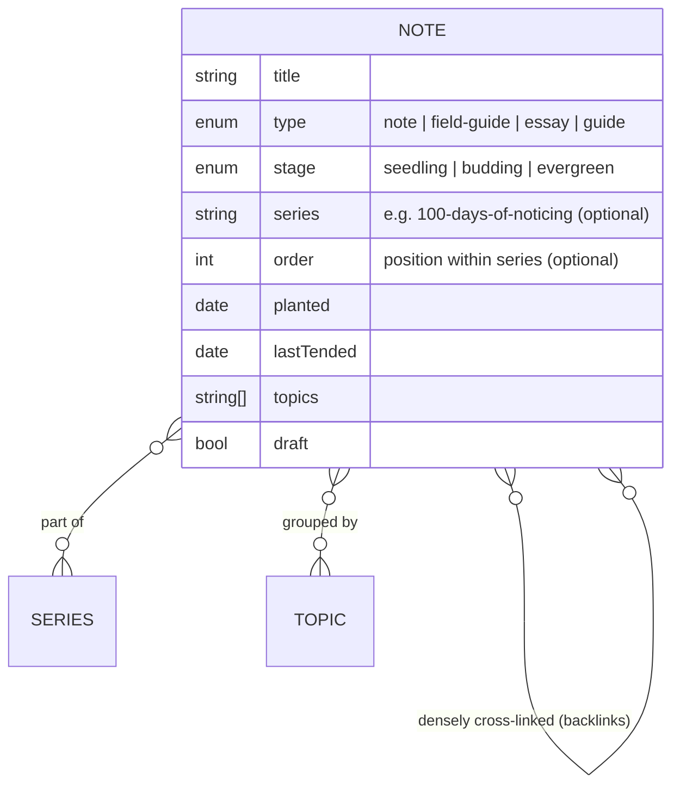
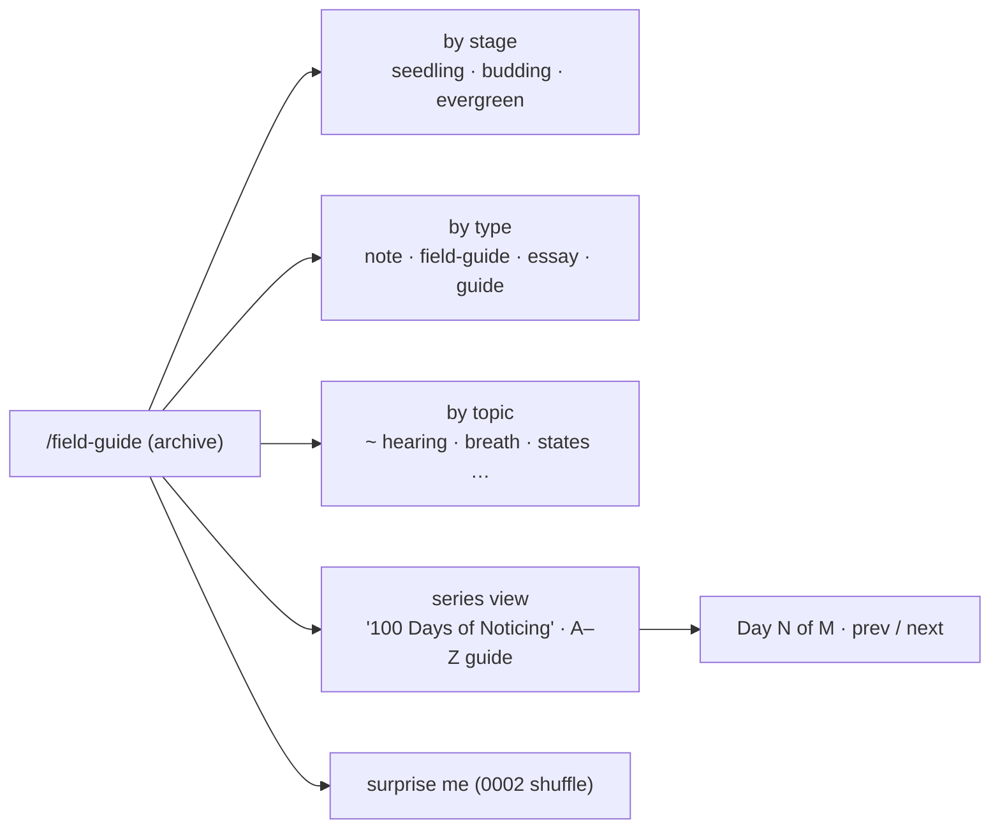
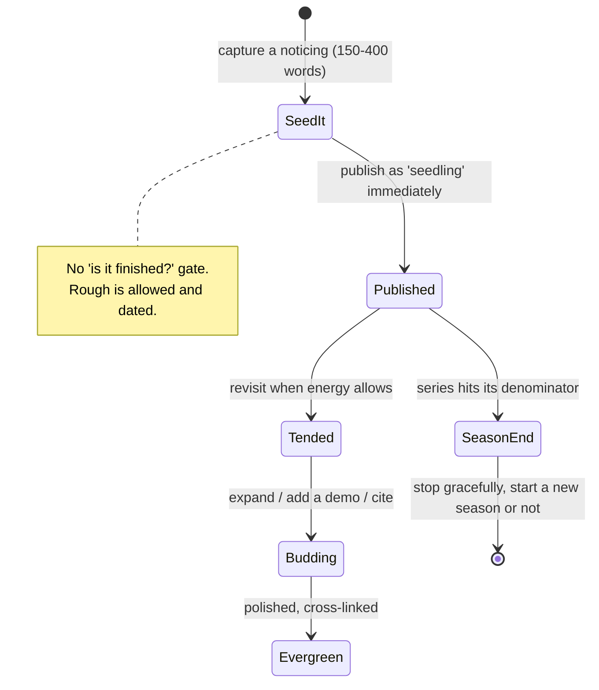

# Editorial System & Affirming-Language Style Guide

## Problem Statement

[0004](0004_%5B_%5D_SENSORY_AWARENESS_EDITORIAL_HEART.md) defined *what* the
site's heart is (braided "noticing" pieces fusing anecdote + live demo +
graded science). Two operational questions it deferred are decision-shaping
for the build and deserve their own home:

1. **How does one neurodivergent person sustain an ongoing awareness
   publication** without burning out — what content structure, cadence, and
   frontmatter model make a growing "Field Guide to Your Nervous System"
   maintainable and browsable rather than an abandoned blog?
2. **What exact language rules** keep the writing neurodiversity-affirming and
   trauma-informed — the concrete word-swaps and framing that turn "differences
   not deficits" from a slogan into an enforceable style guide?

Both were surfaced by the 0004 research wave; capturing them here keeps 0004
focused on the sensory-awareness thesis and gives the publishing model and
voice guide a place the implementation can cite.

## Executive Summary

- **Adopt a digital-garden content model, not a blog.** Every piece carries a
  **growth stage** (`seedling → budding → evergreen`, Maggie Appleton) and a
  **type**, with visible `planted` / `lastTended` dates. This lets the founder
  publish rough notes now and tend them later — the single most important
  anti-burnout mechanism for a solo, neurodivergent author (removes "is it
  finished?" as a blocker).
- **Run content as finite named series, not an infinite feed.** A visible
  denominator ("Day 34 of 100") is a motivating progress bar and — crucially —
  gives *permission to stop gracefully* (Robin Sloan's "seasons"). Flagship
  series: **"100 Days of Noticing"** (tiny 150–400-word daily-ish vignettes)
  and an **A–Z "Field Guide to Your Nervous System"** naming subtle states
  (the *Dictionary of Obscure Sorrows* model).
- **Fix a slot + a container, not a topic.** Austin Kleon's "10 things every
  Friday" and Ask Polly's "letter → reply" survive a decade because the *form*
  is pre-decided; only the content is new. Decide the container once.
- **Type content like Psyche.** A small, stable taxonomy (`note` / `field-guide`
  / `essay` / `guide`) with type-in-the-URL routing sets reader expectations
  and keeps the archive legible as it grows.
- **Ship an enforceable affirming-language style guide**: do/don't word-swap
  tables ("differences" not "deficits", "traits" not "symptoms", "your nervous
  system is doing its job" not "broken/overreacting"), identity-first-by-default
  (ask, don't impose), no inspiration porn, no euphemism that hides real
  barriers (social model of disability), and the two standing accuracy hedges
  (HSP and polyvagal are *empowering framings*, not settled science).

## Current State In The Repository

- Four committed, unimplemented explorations. This one operationalizes the
  content layer of [0003](0003_%5B_%5D_ORIENTATION_HUB_PIVOT.md)'s hub and
  [0004](0004_%5B_%5D_SENSORY_AWARENESS_EDITORIAL_HEART.md)'s Field Guide.
- **Reuses**: 0004's `field-guide` collection (extended here with garden
  frontmatter), 0002's ND-first rules and interoception research, 0003's
  evidence-grading and `lastReviewed` discipline, and the standing polyvagal
  caveat from all prior docs.
- **Adds**: garden frontmatter fields (`stage`, `series`, `order`, `planted`,
  `lastTended`), three browse indexes (by stage / type / topic), series
  navigation (prev/next + "Day N of M"), and a
  `CONTENT_GUIDELINES.md` language section with the tables below.

## External Research

### Sustainable one-author publishing models

- **The Marginalian** (Maria Popova, solo since 2006): proof a one-person,
  ad-free essay collection sustains long-term via deep internal cross-linking.
  Steal her **evergreen filter** — before publishing, ask: (1) does it leave a
  thought/question afterward? (2) is it still interesting in a year? (3) can I
  add enough context to build a pattern around it?
- **Psyche / Aeon**: an explicit **named format taxonomy** — Ideas
  (~1,000–1,800w, one insight), Guides (~2,000w, practical how-to with a
  signature step structure), First Person / Turning Points (personal essays).
  Type appears as a URL path segment. Free, no ads, reader/grant funded.
- **Austin Kleon** (weekly "10 things" since 2013) and **Ask Polly** (weekly
  letter→reply, 12 years): a *fixed slot + repeatable container* is what makes
  a decade sustainable — the constraint removes the recurring "what should this
  be?" decision.
- **Robin Sloan — newsletter "seasons"**: run content in finite bounded runs
  with a visible denominator ("Week 7 of 52"). Seasons give a progress feeling,
  permission to stop, and freedom to change format between runs — the biggest
  antidote to solo burnout.
- **The 100 Day Project** (Michael Bierut, via Yale): one small operation
  (5–15 min) repeated daily; process over product. A "100 Days of Noticing" is
  a finite, shareable, built-to-end series.

### Digital gardens (the frontmatter model)

- **Maggie Appleton**: growth stages `seedling` (rough/fleeting) → `budding`
  (developing) → `evergreen` (polished); content types (Essays, Notes,
  Patterns, Smidgeons); ~30 topics; every card shows planted + last-tended
  dates. Directly portable to Astro frontmatter.
- **Andy Matuschak — evergreen notes**: atomic (one concept), concept-oriented,
  densely bidirectionally linked; backlinks let you link to a stub before
  writing it — perfect for an A–Z field guide where each state is one note.
- **Gwern**: per-page metadata for progress/certainty/importance — maps to a
  `stage` + `confidence` field and reinforces 0003/0004's honesty posture.

### Editorial formats that fit content collections

- **A–Z / glossary** — *The Dictionary of Obscure Sorrows* (John Koenig):
  invented names for unnamed feelings, each an atomic entry (definition +
  etymology + short essay). The ideal template for naming subtle interoceptive
  states ("the edge of hearing", "the startle you didn't notice").
- **Numbered vignette series** — Kleon's "10 things"; a "Noticing No. 001…"
  run gives a progress counter and removes titling friction.
- **Field-guide format** — uniform catalog entries (name · what it feels like ·
  when it shows up · a noticing prompt) → trivial collection + auto index. Also
  doubles as a *hermit-crab shell* (0004) that safely holds personal content.

### Affirming / trauma-informed language guides

Multiple published guides converge on **"differences, not deficits"**
(Neurodiverse Connection UK, Reframing Autism AU, Therapist Neurodiversity
Collective, NeuroNav). Identity-first language is preferred by a majority of
autistic people (Kenny et al. 2016, N=3,470: ~60% "autistic person" vs ~13%
"person with autism") — but **not unanimous (~40% didn't endorse), so ask
individual preference**. Disability-justice framing (Stella Young's
"inspiration porn"; Scope UK's social vs medical model; the NCDJ style guide)
rejects both pity language ("suffers from") and euphemism ("differently-abled",
"special needs") that obscures real barriers. Two standing accuracy flags:
**HSP/SPS** (real, growing research, but a *spectrum not a diagnosis*, with an
autism-masking-overlap caveat) and **polyvagal theory** (a validating *framing*,
contested as neuroanatomy) are the two places affirming language runs ahead of
settled science — present both as empowering framings, explicitly.

## Key Findings

1. **Publishing model is a burnout-prevention decision, not an aesthetic one.**
   For a solo neurodivergent author, `seedling` stages + finite seasons + a
   fixed container directly counter the three things that kill solo
   publications: perfectionism ("not finished"), open-ended dread ("infinite
   feed"), and the recurring blank-page decision. Choose all three.
2. **The A–Z field guide and "100 Days of Noticing" are the same content
   engine at two cadences.** Both are atomic, template-driven, low-per-piece
   effort, browsable as a set, and finite-feeling — ideal for content
   collections and for an ADHD-friendly "shuffle/surprise me" surface (0002).
3. **Affirming language must be enforceable, not aspirational.** A word-swap
   table in `CONTENT_GUIDELINES.md` that a copy-review checklist checks against
   is the difference between a value and a practice. It also protects the
   founder's own n=1 writing from accidental self-pathologizing.
4. **The honesty brand and the affirming brand can collide** — exactly at HSP
   and polyvagal. The resolution is the same map-vs-territory move from 0004:
   use the empowering framing *and* name its status. This is a feature (it
   models epistemic honesty), not a compromise.
5. **This is a style guide, not a new product surface.** It adds frontmatter
   and a guidelines doc; it does not add pages beyond three browse indexes.
   Scope stays small.

## Options And Tradeoffs

### A. Content organization model

| Option | Pros | Cons |
|---|---|---|
| A1. Chronological blog | Familiar | Dated posts decay; pressure to keep posting; no maturity signal |
| **A2. Digital garden (stage + type + topic, non-chronological)** (recommended) | Publish rough & tend later; browsable many ways; matches evergreen intent | Navigation needs 3 indexes; less "new post" dopamine |
| A3. Pure A–Z glossary only | Simplest schema | Too rigid for essays/demos; no room for the braided pieces |

### B. Cadence / series structure

| Option | Pros | Cons |
|---|---|---|
| B1. Publish when inspired | No pressure | Stalls; no momentum or progress signal |
| **B2. Finite named series with visible denominator ("Day N of M") + growth stages** (recommended) | Progress bar; permission to stop; sustainable | Requires deciding series scope up front |
| B3. Fixed weekly slot only | Strong habit | Rigid; hard for a variable-energy ND author to hit every week |

### C. Language-guide enforcement

| Option | Pros | Cons |
|---|---|---|
| C1. Values statement only | Low effort | Not actionable; drifts |
| **C2. Word-swap tables + copy-review checklist item** (recommended) | Enforceable; teachable; protects n=1 writing | Must be maintained as language evolves |
| C3. Automated linter for banned words | Scales | False positives on quoted/contested terms; over-engineered for one author |

### D. Identity-first vs person-first

| Option | Pros | Cons |
|---|---|---|
| **D1. Identity-first default, note it's not unanimous, honor stated preference** (recommended) | Matches majority community preference + evidence | Requires a one-line explainer so readers understand the choice |
| D2. Person-first default | Clinical convention | Against autistic-community majority; reads as distancing |
| D3. Mix freely | Flexible | Inconsistent; reads as unconsidered |

## Recommendation

Adopt **A2 + B2 + C2 + D1**. Build the Field Guide as a digital garden run in
finite named series, governed by an enforceable affirming-language style guide.

### Content model



### Browsing surfaces



### Sustainable cadence loop



## Example Code

Extended `field-guide` frontmatter (adds garden fields to 0004's schema):

```ts
const fieldGuide = defineCollection({
  loader: glob({ pattern: "**/*.mdx", base: "./src/content/field-guide" }),
  schema: z.object({
    title: z.string(),
    type: z.enum(["note", "field-guide", "essay", "guide"]).default("note"),
    stage: z.enum(["seedling", "budding", "evergreen"]).default("seedling"),
    series: z.string().optional(),          // "100-days-of-noticing"
    order: z.number().optional(),           // position within the series
    planted: z.coerce.date(),
    lastTended: z.coerce.date().optional(),
    topics: z.array(z.string()).default([]),
    // carried from 0004:
    stageOfPractice: z.enum(["notice", "connect", "act"]).default("notice"),
    demo: z.enum(["tone-probe", "percept-poll", "illusion", "none"]).default("none"),
    sources: z.array(z.object({ label: z.string(), url: z.string().url() })).default([]),
    lastReviewed: z.coerce.date(),
    draft: z.boolean().default(false),
  }),
});
```

Series navigation query:

```ts
const all = await getCollection("field-guide", (e) => !e.data.draft);
const season = all
  .filter((e) => e.data.series === "100-days-of-noticing")
  .sort((a, b) => (a.data.order ?? 0) - (b.data.order ?? 0));
// render "Day {order} of {season.length}" + prev/next from neighbors
```

Affirming-language style guide (excerpt for `CONTENT_GUIDELINES.md`):

```markdown
## Affirming & trauma-informed language

Default to identity-first ("autistic person"); it's the community majority,
but not unanimous — honor a person's stated preference. Frame variation as
difference, describe behavior by its cause/function, and never write toward
"normalizing" anyone.

| Don't (defect / pity / euphemism)        | Do (neutral / affirming)                                  |
|------------------------------------------|-----------------------------------------------------------|
| symptoms                                 | traits                                                    |
| disorder / deficit / impairment          | difference / variation                                   |
| high/low functioning                     | high/low support needs                                   |
| suffers from / afflicted with            | has / experiences                                        |
| oversensitive / too sensitive            | highly responsive; registers this more intensely         |
| sensory processing disorder              | sensory processing differences / your sensory profile    |
| overreacting / dramatic                  | your nervous system is accurately reporting real input   |
| broken / wired wrong / malfunction       | your nervous system is doing its job — protecting you    |
| fix / cure / normalize                   | support / accommodate / regulate                         |
| challenging behaviour                    | name the cause (sensory overload, pain, anxiety)         |
| differently-abled / special needs        | disabled / specific support needs                        |

**Two standing hedges (honesty > affirmation):**
- HSP / Sensory Processing Sensitivity: present as an *empowering framing of a
  common trait on a spectrum*, not a diagnosis; note the autism-masking overlap.
- Polyvagal "your nervous system is protecting you": use the felt-sense reframe,
  but "a helpful way to think about it is…", never "science proves…".

**Avoid inspiration porn** (praising disabled people merely for existing) and
**avoid implying a norm** to measure against. The message is *variation, not
verdict.*
```

## Risks And Open Questions

- **Garden navigation can fail newcomers** (gardens are great for wanderers,
  bad for first-timers — 0003's finding). Mitigation: the Start Here path
  (0003) remains the front door; the garden is the *depth* behind it, never
  the entry.
- **Series scoping.** "100 Days" is a real commitment; a variable-energy author
  may prefer "100 pieces, no deadline." Open question: bind the series to a
  count, not a calendar, to protect the no-punitive-cadence rule (0002)?
- **Affirming vs honest collision** at HSP/polyvagal must be handled every time
  those terms appear; the hedge belongs in the reusable `EvidenceTag`
  (0004), not retyped per piece.
- **Language guides evolve.** The word-swap table needs a `lastReviewed` too and
  should credit its community sources rather than freeze them.
- **Scope discipline.** This doc must not grow the surface beyond frontmatter +
  three indexes + a guidelines section. Anything more is 0004/0003 territory.

## Implementation Checklist

- [ ] Content model
  - [ ] Extend `field-guide` schema with `type`, `stage`, `series`, `order`,
        `planted`, `lastTended`, `topics` (as above)
  - [ ] Build three browse indexes (by stage, by type, by topic) + a series
        view with "Day N of M" and prev/next
  - [ ] Show stage badge + planted/last-tended dates on every card and page
  - [ ] Backlink support (link to a stub before it exists)
- [ ] Cadence scaffolding
  - [ ] Create the "100 Days of Noticing" series container (count-bound, not
        calendar-bound) and an A–Z "Field Guide to Your Nervous System" series
  - [ ] Seed 3–5 `seedling` entries to prove the publish-rough-then-tend loop
- [ ] Language style guide
  - [ ] Add the affirming/trauma-informed section + word-swap table to
        `CONTENT_GUIDELINES.md`; include identity-first default + ask rule,
        inspiration-porn/euphemism bans, and the two standing hedges
  - [ ] Wire the HSP/polyvagal hedge into the reusable `EvidenceTag`
  - [ ] Add a copy-review checklist item that checks drafts against the table
- [ ] Reconcile
  - [ ] Note supersession/extension of 0004's schema (commit:
        `docs(exploration): reconcile field-guide schema across 0004/0005`)

## Validation Checklist

- [ ] A `seedling` note can be published without any polish gate and later
      promoted to `budding`/`evergreen`; stage + dates render correctly
- [ ] The archive is browsable by stage, type, and topic; the series view
      shows an accurate "Day N of M" and working prev/next
- [ ] No calendar deadline is hard-coded into a series (count-bound), honoring
      the no-punitive-cadence rule
- [ ] `CONTENT_GUIDELINES.md` contains the word-swap table; a copy review of
      one real piece catches at least one banned term and swaps it
- [ ] Identity-first is the default in shipped copy, with a one-line reader
      explainer that it's a preference, not a rule
- [ ] Every appearance of HSP or polyvagal state language carries the
      map-vs-territory hedge via `EvidenceTag`
- [ ] No inspiration-porn framing and no norm-implying language in shipped
      pieces (copy review)
- [ ] The Start Here path (0003) remains the front door; the garden is reachable
      as depth, not as the first-time entry point

## References

Publishing & garden models:
- The Marginalian (about + evergreen filter) — https://www.themarginalian.org/about/
- Psyche/Aeon format taxonomy — https://psyche.co/ · https://aeon.co/
- Austin Kleon "10 things" method — https://austinkleon.com/2018/06/05/how-i-put-a-newsletter-together/
- Robin Sloan, newsletter seasons — https://www.robinsloan.com/notes/newsletter-seasons/
- The 100 Day Project — https://www.the100dayproject.org/
- Maggie Appleton, digital garden (stages/types) — https://maggieappleton.com/garden-history · evergreens — https://maggieappleton.com/evergreens
- Andy Matuschak, evergreen notes — https://notes.andymatuschak.org/Evergreen_notes
- Gwern (per-page confidence metadata) — https://gwern.net/about
- The Dictionary of Obscure Sorrows — https://www.thedictionaryofobscuresorrows.com/
- Astro Content Collections — https://docs.astro.build/en/guides/content-collections/

Affirming / trauma-informed language:
- Neurodiverse Connection ND-affirming guide — https://ndconnection.co.uk/resources/p/nd-affirming-language-guide
- Reframing Autism glossary — https://reframingautism.org.au/service/glossary-terms/
- Therapist Neurodiversity Collective — https://therapistndc.org/neurodiversity-affirming-therapy/
- ASAN, identity-first language — https://autisticadvocacy.org/about-asan/identity-first-language/
- Kenny et al. 2016 (terms survey, N=3,470) — https://journals.sagepub.com/doi/abs/10.1177/1362361315588200 · global replication (Taboas 2023) — https://pmc.ncbi.nlm.nih.gov/articles/PMC10946540/
- Stella Young, "inspiration porn" (TED) — https://www.ted.com/talks/stella_young_i_m_not_your_inspiration_thank_you_very_much
- Scope UK, social model of disability — https://www.scope.org.uk/social-model-of-disability
- NCDJ Disability Language Style Guide — https://ncdj.org/style-guide/
- HSP critique (autism-overlap caveat) — https://www.psychologytoday.com/us/blog/thinking-about-becoming-a-psychologist/202412/a-critical-analysis-of-the-highly-sensitive · SPS overview — https://en.wikipedia.org/wiki/Sensory_processing_sensitivity
- Polyvagal contested-status — https://www.sciencedirect.com/science/article/pii/S0301051123001060
