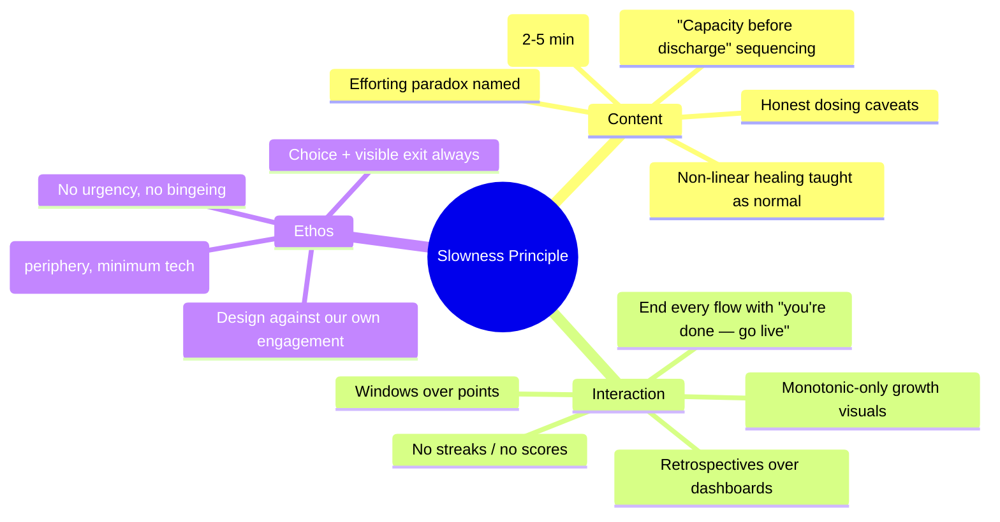
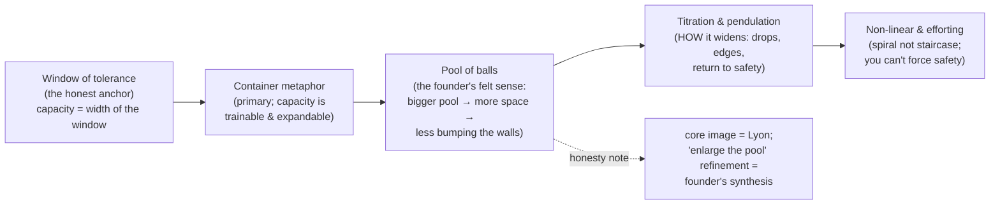

# Pacing, Titration, And Capacity — The Slowness Principle

## Problem Statement

The founder wants the site to never lose sight of **pacing and titration** —
that nervous-system healing is slow, daily, regular work — anchored in Irene
Lyon's **swimming-pool-full-of-balls** image: capacity is the size of the
pool; as capacity grows there is more space between the balls, so they aren't
constantly colliding with each other and the walls.

This is not a feature request; it's a *governing principle* that has surfaced
as a safety constraint in every prior exploration (titration in
[0002](0002_%5B_%5D_NEURODIVERGENT_PERSONALIZATION.md),
[0003](0003_%5B_%5D_ORIENTATION_HUB_PIVOT.md),
[0004](0004_%5B_%5D_SENSORY_AWARENESS_EDITORIAL_HEART.md); no-punitive-cadence
in [0005](0005_%5B_%5D_EDITORIAL_SYSTEM_AND_AFFIRMING_LANGUAGE.md)). This
exploration promotes **slowness itself to a first-class, load-bearing design
principle** and answers: how do we *teach* capacity and pacing honestly, and
how do we build a site whose every interaction embodies "less is more, slower
is better" — including whether to build the pool-of-balls visualization.

## Executive Summary

- **Elevate a Slowness Principle** that governs content and interaction site-
  wide: short doses by default, no urgency, no bingeing, encourage the user
  to *leave*, and represent progress only over long windows. This is the
  synthesis of titration (domain) and calm technology (design).
- **Teach capacity honestly by anchoring it to the window of tolerance**
  (Siegel) — the most scientifically defensible bridge for the pop term
  "capacity" (capacity ≈ the *width* of the window). Explain pacing through
  **titration/pendulation** (Levine/SE), whose chemistry origin ("add the
  reagent drop by drop or you get an explosion") is the single most airtight
  analogy in the whole space.
- **Handle the pool-of-balls metaphor with an honesty note.** The core
  pool/beach-ball image is genuinely Lyon's; but the specific "*enlarge the
  pool → more space between the balls → less bumping the walls*" refinement is
  the founder's own (excellent) synthesis, closer to the general **container**
  metaphor than to Lyon's sourced words (where she emphasizes *removing*
  balls/boulders). Attribute the core to Lyon, present the refinement as "how
  I think about it," and — per the site's honesty brand — don't fabricate a
  verbatim quote.
- **Build the pool-of-balls as an optional, ambient, capacity-driven
  visualization**: container size = capacity; fixed ball count; as capacity
  grows the walls expand and the same balls settle with more space and fewer
  collisions. Calm, not a game (low bounce, slow, muted); lazy-loaded
  matter.js island; **mandatory static reduced-motion fallback** that loses no
  information (a still frame conveys "more room now" completely).
- **Encode gentleness as structural guarantees**: any progress/capacity visual
  must be *monotonic* (structurally incapable of shrinking on a bad day);
  replace streaks with cumulative "times you showed up" or a soft rolling %;
  prefer **retrospectives over dashboards** (same data, opposite emotional
  effect); default all progress views to weeks/months, never today.
- **Name the efforting paradox** as core content: forcing calm is itself a
  vigilance (sympathetic) state, so treating healing as a productivity project
  backfires — especially for driven/ADHD/perfectionist people (the founder's
  own profile, per 0002). The site must model non-doing, not optimize the
  user.

## Current State In The Repository

- Five committed, unimplemented explorations. This one is a **cross-cutting
  principle** that amends all of them rather than adding a new section of the
  site. It hardens constraints already present:
  - 0002's `sequenceTier` (resource → explore → discharge) and two-axis
    check-in gain a capacity/window framing.
  - 0003's "no retention features" and 0005's "no punitive cadence" get a
    positive articulation (calm technology) and a shared mechanism
    (monotonic, windowed, retrospective).
  - 0004's `prefers-reduced-motion`-first stance now governs a motion-heavy
    optional visualization.
- **Adds** in the proposed layout: `src/components/capacity/PoolOfBalls.astro`
  (island), a `capacity`/`showUpDates`/`states` localStorage model,
  reflection components (`WeeklyReflection`, `LookHowFar`), and a Slowness
  Principle section in `CONTENT_GUIDELINES.md`.

## External Research

### Domain — capacity, titration, pacing (with honesty flags)

- **Lyon's capacity teaching**: "capacity before discharge" — build the
  ability to *be with* what you feel before going after stored trauma;
  forcing it is "like forcing an infant to walk before they're ready." She
  teaches slow, daily, titrated work and warns "the fast track… is usually
  based on the survival patterns we want to avoid," sharing that intensive SE
  work done *before* she had capacity sent her system "berserk" for three
  years — an iatrogenic-harm cautionary tale. **Flag**: Lyon is an
  influential educator (Feldenkrais + Kain/SE lineage), not a research
  scientist; present as practitioner wisdom, not proven law.
- **The pool/beach-ball metaphor**: sourced to Lyon in the "removing
  balls/boulders frees space" form; the founder's "bigger pool / space
  between balls / not bumping the walls" version is a coherent synthesis
  closer to the container metaphor. Attribute core to Lyon, mark the
  refinement as paraphrase.
- **Titration & pendulation** (Levine/SE): titration = approach activation in
  tiny drops (1–5%), touch the edge for seconds, return to safety;
  pendulation = oscillate activation ↔ resource; resourcing = felt safety
  first. The **chemistry origin is exact** (drop-by-drop to avoid an
  "explosion"/retraumatization) — the most defensible metaphor available.
  "The slower you go, the faster you get there" is a real SE maxim.
- **Window of tolerance** (Siegel): the arousal band where you can feel and
  think; above = hyperarousal (flooding), below = hypoarousal (shutdown).
  **Capacity ≈ the width of the window**; healing widens it by repeatedly
  *touching* (not blowing past) the edges. This is the cleanest science-
  adjacent anchor for "capacity." **Flag**: a clinical heuristic, not a
  lab-measurable quantity.
- **Neuroscience of slow (honest version)**: neuroplasticity is real and
  *repetition-dependent* (Hebbian); interoception is *trainable* with
  measurable insula changes over ~8 sessions — genuinely supportive of
  "capacity to feel is buildable, slowly." One study found *longer* daily
  training gave *smaller* plasticity gains — an actual-science echo of "less
  is more." But there is **no study proving a specific "years of capacity
  first" dosing law**; that's clinical extrapolation. Say so.
- **Non-linear healing**: recovery comes in waves; the **spiral** (revisit
  the same themes from a higher vantage) beats the **staircase**. Setbacks
  can mean deeper material surfacing *because* capacity grew ("your body now
  trusts you enough to bring it forward"). Day-to-day measurement misleads;
  zoom to months. **Flag**: compassionate clinical consensus, descriptive not
  quantified; soften the "van der Kolk/Siegel spiral model" attribution.
- **Capacity metaphors ranked**: most accurate = **container/vessel**
  (maps ~1:1 to window of tolerance; capacity is trainable/expandable) and
  the **cup that can grow**; **bandwidth** good for "why nothing's left
  over." Weaker: **rubber band** (returns to same shape — undersells growth),
  **battery** (implies fixed size). Most misleading: **fuse/circuit breaker**
  (a fuse is destroyed; a breaker resets unchanged — both imply
  fixed/destroyable thresholds; use only for the *protective-shutdown* idea
  with an explicit "humans re-grow, unlike a fuse" caveat).
- **The efforting paradox**: the parasympathetic branch needed for healing
  engages on a felt sense of *safety and no-pressure*; trying hard, over-
  monitoring, and treating healing as an optimization project is itself a
  vigilance (sympathetic) state — so forcing calm signals "not safe." Hits
  perfectionist/driven/ADHD people hardest (regulation ≠ being calm 100% of
  the time; that expectation *is* hypervigilance). Antidote: non-doing,
  allowing, self-compassion as mechanism. **Flag**: physiology sound;
  application to perfectionism is clinical framing.

### Design — gentle, anti-engagement UX

- **Anti-streak**: streaks train "the number going up," and one miss wipes
  accumulated motivation though UCL habit research shows a single missed day
  is immaterial. Replace with **cumulative "times you showed up"**
  (monotonic — a miss literally can't subtract) or a soft **rolling %**
  ("22 of the last 30 days"). Finch is the reference: no penalties, "the bird
  waited," asks *how you feel* not *what you accomplished*, warm return.
- **Gentle non-linear progress viz**: Gentler Streak (targets move with your
  energy; rest counts as success). Apple Health **Trends** (compares 90-day
  vs 365-day windows; *withholds* the trend until 180 days of data so it
  won't lie from too little). Show the **squiggle, not the line**; plot a
  moving-average **band, not points**; show **range** so a low day reads as
  "within your normal range." Organic growth metaphor (plant) that never
  un-grows.
- **Pool-of-balls tech**: matter.js (small, dependency-free) in a vanilla
  island; tune for calm (restitution ~0.2–0.4, `frictionAir`, slow
  velocities, 12–30 balls, ~30fps, muted palette) — "lava lamp, not arcade."
  Capacity → container size; growing capacity animates walls outward (a rare
  reward, not per-session). **Reduced motion is mandatory**: WCAG C39 / 2.3.3
  and 2.2.2 (persistent motion needs a pause control beyond the media query);
  a static frame conveys the full meaning, so lazy-load matter.js only when
  in-view AND reduced-motion is off, else draw one still SVG frame.
- **Pacing / preventing overdoing**: "Time Well Spent" / Center for Humane
  Technology — design so users *leave*. End every flow with a warm "you're
  done, go live your life" stop cue; no feed, no "up next"; "come back
  tomorrow" via a `lastSessionAt` timestamp; soft friction against bingeing
  ("It's okay to stop here. This will keep.").
- **Retrospectives over dashboards**: a dashboard invites judgment
  (anxiety); a reflection integrates (calm) — same data, opposite effect.
  Boundary-triggered weekly/monthly "notice what's changed" prompts; "look
  how far" recaps that resurface old logged states so the *user* draws the
  growth conclusion. Computable client-side at week/month boundaries.
- **Calm technology** (Weiser/Brown 1996; Amber Case 2015): smallest
  possible attention; inform *and* create calm; use the periphery;
  communicate without words; still work when it fails; minimum tech; respect
  social norms (no dark patterns). Astro static + localStorage +
  IntersectionObserver-gated, reduced-motion-respecting islands is an
  unusually clean fit.

## Key Findings

1. **Slowness is the site's spine, not a feature.** Every prior exploration
   leaned on titration as a constraint; naming it a Slowness Principle turns
   scattered rules (short doses, no streaks, no bingeing, windowed progress,
   leave-and-live) into one coherent, testable stance that also *is the
   teaching* — the medium embodies the message.
2. **Window of tolerance is the honest anchor for "capacity."** It gives the
   founder's pool metaphor a scientific-adjacent home (capacity = window
   width) without overclaiming, and it connects cleanly to 0002's
   `sequenceTier` and check-in.
3. **The pool-of-balls is worth building — as ambient calm-tech, not a
   game.** It communicates "more capacity = more space = less collision"
   wordlessly (a calm-tech ideal), and its honest caveat (Lyon core +
   founder refinement) is itself a small lesson in the site's epistemic
   style. But it must be optional, monotonic, and fully degraded under
   reduced motion.
4. **Gentleness must be structural, not tonal.** The one rule that prevents
   progress-anxiety is *monotonic visuals*: capacity/growth can never shrink
   on a bad day. Combined with windows-over-points and
   retrospectives-over-dashboards, this makes the gentle path the *only*
   path the code can express.
5. **The efforting paradox makes the founder the archetypal at-risk user.**
   A driven, AuDHD person can turn this very site into another optimization
   project — which would be dysregulating. The site must therefore refuse to
   gamify, refuse to score, and actively encourage leaving. Designing against
   its own engagement is the ethical requirement.
6. **Honesty about dosing protects credibility.** The site can say slow-and-
   steady is well-motivated (plasticity + interoception are repetition-driven
   and trainable) while conceding the "years first" specifics are clinical
   judgment — consistent with 0003/0004's evidence grading.

## Options And Tradeoffs

### A. How strongly to encode slowness

| Option | Pros | Cons |
|---|---|---|
| A1. A content topic on pacing only | Cheap | Message contradicted by an engagement-shaped UI |
| **A2. A cross-cutting Slowness Principle governing content *and* interaction** (recommended) | Medium is the message; coherent; testable | Requires auditing every surface against it |
| A3. Hard technical limits (lockouts/timers) | Strongly enforces pacing | Paternalistic; removes agency — anti-trauma-informed (choice) |

### B. Teaching "capacity"

| Option | Pros | Cons |
|---|---|---|
| B1. Lyon's pool metaphor alone | Vivid; founder's anchor | Not independently grounded; attribution issue |
| **B2. Window of tolerance as the anchor + container as primary metaphor + pool-of-balls as the founder's felt-sense illustration** (recommended) | Honest, grounded, and personal at once | Three concepts to introduce in sequence |
| B3. Pile on all metaphors | Something for everyone | Confusing; some (fuse) are misleading |

### C. The pool-of-balls visualization

| Option | Pros | Cons |
|---|---|---|
| C1. Don't build it | Zero motion-risk/effort | Loses the founder's signature image and a genuine calm-tech asset |
| **C2. Optional ambient island, capacity-driven, monotonic, static reduced-motion fallback** (recommended) | Wordless teaching; calm; safe; degrades cleanly | matter.js weight; must be tuned hard for calm |
| C3. Interactive "grow your pool" game | Engaging | Gamifies the one thing that must not be gamified; efforting trap |

### D. Representing a user's own progress

| Option | Pros | Cons |
|---|---|---|
| D1. Streaks / daily score | Familiar | Shame spirals; contradicts everything above |
| **D2. Monotonic cumulative "times you showed up" + windowed moving-average band + boundary retrospectives** (recommended) | Structurally gentle; honest about non-linearity | Users conditioned to streaks may miss the "hit" (that's the point) |
| D3. No progress representation at all | Safest | Loses the "look how far" encouragement that keeps people going through plateaus |

## Recommendation

Adopt **A2 + B2 + C2 + D2**. Name a **Slowness Principle** that governs the
whole site; teach capacity via the window of tolerance with the container as
primary metaphor and the pool-of-balls as the founder's felt-sense
illustration; build the pool as an optional, monotonic, reduced-motion-safe
ambient island; and represent any personal progress only through monotonic
cumulative counts, windowed bands, and boundary retrospectives.

### The Slowness Principle (site-wide invariants)



### Capacity taught in sequence



### Pool-of-balls: capacity drives the container

```mermaid
stateDiagram-v2
    [*] --> CheckMotion
    CheckMotion --> Static: prefers-reduced-motion OR JS off
    CheckMotion --> Ambient: motion allowed AND in view
    state Ambient {
        [*] --> Settled
        Settled --> Settled: slow drift, soft low-bounce collisions
        Settled --> Expanding: capacity value increased
        Expanding --> Settled: walls eased outward; balls now have more space
    }
    note right of Ambient
        Fixed ball count. Capacity = container size.
        Growth is RARE (only on real change),
        never a per-session reward. Never shrinks.
    end note
    Static --> [*]: one still frame — container at current size,
    Static --> [*]: balls at rest and well-spaced (full meaning, no motion)
```



## Example Code

localStorage model — raw logs only, everything derived (never store a score):

```ts
// nsh:practice:v1
{
  showUpDates: string[],     // ISO dates; cumulative count + rolling % derived
  states: { ts: string, energy: number, ease: number }[], // from 0002 check-in
  capacity: number,          // 0..1, monotonic-by-policy; drives pool size
  lastSessionAt: string,     // for gentle "come back tomorrow" pacing
}
```

Monotonic, gentle metrics (no resets, no red zeros):

```ts
const showedUp = log.showUpDates.length;                 // only ever grows
const rolling = log.showUpDates
  .filter(d => withinDays(d, 30)).length;                // "N of the last 30"
// NEVER compute a "current streak"; NEVER surface "you missed X days".
// On return after a gap: render "Welcome back." — nothing about the gap.
```

Pool-of-balls island, reduced-motion-safe (abbreviated):

```astro
---
// src/components/capacity/PoolOfBalls.astro  (client:visible)
---
<figure class="pool" role="img"
  aria-label="A pool holding a fixed number of balls; the more capacity you
              build, the larger the pool and the more space between them.">
  <canvas data-pool></canvas>
</figure>

<script>
  const reduce = matchMedia("(prefers-reduced-motion: reduce)").matches;
  const capacity = JSON.parse(localStorage.getItem("nsh:practice:v1") ?? "{}").capacity ?? 0.25;
  const size = 240 + capacity * 320;          // capacity → container size
  if (reduce) {
    drawStillFrame(size, /*balls at rest, well-spaced*/);   // no engine, full meaning
  } else {
    // lazy-import matter.js ONLY here; low restitution, slow, ~30fps, muted;
    // provide a visible pause toggle (WCAG 2.2.2 persistent-motion rule).
  }
</script>
```

Retrospective over dashboard (computed at a week boundary, shown on arrival):

```mdx
<LookHowFar>
  A month ago, your lower days sat around **{monthAgoLow}**.
  In the last week they've sat around **{recentLow}**.
  Nothing to do with this — just something you might notice.
</LookHowFar>
```

Slowness copy conventions (append to `CONTENT_GUIDELINES.md`):

> End states, not next states: "That's a good place to stop. This will be
> here tomorrow." Never "Keep your streak going." · Progress is a spiral:
> "If an old feeling came back, it's often because you have more room to meet
> it now — not because you went backwards." · Name the paradox: "You can't
> force your way into feeling safe. Going slower isn't falling behind — with
> a nervous system, slower usually *is* the fast way."

## Risks And Open Questions

- **The pool-of-balls could become a toy.** Any "grow your pool" affordance
  reintroduces the efforting/gamification trap. It must be ambient and
  capacity-*reflecting*, never capacity-*earning*. Open question: how is
  `capacity` even set — self-rated occasionally? derived from showing-up over
  months? It must move *slowly* and monotonically, or it becomes a score.
- **Attribution honesty.** Do not present the "enlarge the pool / space
  between balls" phrasing as a Lyon quote. Credit the core to her, the
  refinement to the founder. A copy-review must catch any fabricated quote.
- **Motion accessibility.** A persistent physics loop is exactly the kind of
  motion that harms some users; the static fallback + pause toggle are
  non-negotiable, and the still frame must genuinely carry the full meaning.
- **Monotonic capacity vs honest non-linearity.** A never-shrinking pool is
  gentle but could feel dishonest on a hard day ("I feel worse, why is my
  pool the same size?"). Resolution: capacity represents *cumulative
  structural growth* (window width), not *today's state* — and the copy must
  make that distinction, pairing the steady pool with a state check-in that
  *can* move.
- **Doing-less is hard to make engaging without engaging.** The site
  deliberately forgoes retention mechanics; the only "pull" is genuine
  usefulness. That's the correct trade for this audience but means the site
  won't show engagement-style metrics of success (0003's "good exits" stands).
- **Perfectionist capture.** Even retrospectives can be over-monitored.
  Keep them boundary-triggered and sparse; never a persistent dashboard.

## Implementation Checklist

- [ ] Principle & guidelines
  - [ ] Write the Slowness Principle section in `CONTENT_GUIDELINES.md`
        (short doses, spiral/non-linear, efforting paradox, end-states,
        honest dosing caveats, no fabricated quotes)
  - [ ] Add slowness invariants to the design review checklist: no streaks,
        monotonic-only growth visuals, windows-over-points,
        retrospectives-over-dashboards, every flow ends with a leave cue
- [ ] Capacity teaching content
  - [ ] Learn piece: "Capacity, and the window of tolerance" (anchor +
        container metaphor + titration/pendulation with the chemistry analogy)
  - [ ] Learn piece: "Healing isn't a straight line" (spiral, setbacks-as-
        growth, why day-to-day measuring misleads)
  - [ ] Learn piece: "You can't force safety" (the efforting paradox; non-
        doing; ties to the AuDHD/perfectionist profile from 0002)
  - [ ] Pool-of-balls explainer with the Lyon-core / founder-refinement
        honesty note and an `EvidenceTag` (clinical-framework level)
- [ ] Pool-of-balls visualization
  - [ ] `PoolOfBalls.astro` island: capacity → container size; fixed balls;
        calm tuning (low restitution, slow, ~30fps, muted); rare expand-on-
        growth transition; never shrinks
  - [ ] Static SVG still-frame fallback for reduced-motion / no-JS; visible
        pause toggle; `IntersectionObserver` + lazy matter.js import
  - [ ] Decide and document how `capacity` is set (slow, monotonic, non-
        scoring)
- [ ] Gentle progress model
  - [ ] `nsh:practice:v1` localStorage (raw logs only); derive cumulative
        "times you showed up" and rolling %; never compute a streak
  - [ ] Warm-return copy on gaps; no "missed days" anywhere
  - [ ] `WeeklyReflection` / `LookHowFar` boundary retrospectives (client-
        side, shown on arrival at a week/month boundary, sparse)
  - [ ] Moving-average state band (range, not points); withhold trend
        language until enough data (Apple-Trends lesson)
- [ ] Pacing / leave-and-live
  - [ ] Every practice flow ends with a warm stop cue; no feed / no "up next"
  - [ ] `lastSessionAt`-based "come back tomorrow" and soft anti-binge
        interstitial ("It's okay to stop here. This will keep.")

## Validation Checklist

- [ ] No surface anywhere shows a streak, a daily score, a red zero, or a
      "you missed N days" message (site-wide audit)
- [ ] Every capacity/progress visual is monotonic — a simulated bad-day /
      gap cannot make any number or the pool shrink (test with backdated logs)
- [ ] The pool-of-balls renders a meaningful still frame under
      `prefers-reduced-motion: reduce` and with JS disabled; matter.js is not
      loaded in those cases; a pause toggle is present when it does animate
- [ ] The pool never shrinks; the expand transition fires only on a real
      capacity increase, not per session
- [ ] Capacity is documented as cumulative structural growth (window width),
      and the UI pairs it with a state check-in that *can* move, so a hard day
      doesn't read as contradicted by a steady pool
- [ ] No text presents the "enlarge the pool / space between balls" wording as
      a direct Lyon quote; the honesty note is present (copy review)
- [ ] Dosing claims are hedged (slow-and-steady well-motivated; "years first"
      = clinical judgment) via `EvidenceTag`
- [ ] Every practice/flow terminates in a leave-and-live stop cue; there is no
      infinite feed or "up next" anywhere
- [ ] Retrospectives appear only at week/month boundaries and are sparse; there
      is no persistent metrics dashboard
- [ ] A first-time reader can articulate, after the capacity content, that
      "slower is usually the fast way" and that setbacks can signal growth
      (comprehension check)

## References

Domain:
- Lyon — capacity before discharge https://irenelyon.com/2024/06/02/when-you-try-to-heal-your-trauma-before-building-nervous-system-capacity/ · building capacity https://irenelyon.com/2022/01/16/how-to-build-somatic-and-nervous-system-capacity/ · "a simple analogy" (pool) https://irenelyon.com/2020/01/09/a-simple-analogy-for-nervous-system-healing/
- Titration/pendulation — https://anniewright.com/titration-trauma-therapy-explained/ · Levine on titration (video) https://www.psychalive.org/video-dr-peter-levine-somatic-experiencing-approach-titration/ · resourcing/pendulation https://sarahrossphd.com/resourcing-pendulation-titration-practices-somatic-experiencing/
- Window of tolerance — https://www.psychologytools.com/resource/window-of-tolerance · https://positivepsychology.com/window-of-tolerance/
- Neuroplasticity — https://www.ncbi.nlm.nih.gov/books/NBK557811/ · interoceptive training & insula https://www.nature.com/articles/s41398-024-02933-9 · training → less anxiety https://www.ncbi.nlm.nih.gov/pmc/articles/PMC7079488/ · intensity-dependence https://www.ncbi.nlm.nih.gov/pmc/articles/PMC7644474/
- Non-linear healing — https://tidaltrauma.com/blog/nonlinear-trauma-recovery · https://anniewright.com/the-stages-of-trauma-recovery-a-realistic-map-for-the-journey-ahead/
- Efforting/perfectionism — https://www.sarahherstichlcsw.com/blog/5-ways-perfectionism-is-getting-in-the-way-of-healing-and-what-to-do-instead

Design:
- Streak psychology — https://www.cohorty.app/blog/the-psychology-of-streaks-why-they-work-and-when-they-backfire · Finch https://calmevo.com/finch-app-review/ · alternatives https://habi.app/insights/streaks-alternatives/
- Gentler Streak — https://gentler.app/ · Apple "Behind the Design" https://developer.apple.com/news/?id=3m0ht22s
- Apple Activity Trends (windows-over-points) — https://www.macstories.net/stories/activity-trends-in-ios-13/
- Progress isn't linear — https://www.artofmanliness.com/character/habits/progress-isnt-linear/
- matter.js — https://brm.io/matter-js/ · https://github.com/liabru/matter-js
- Reduced motion — WCAG C39 https://www.w3.org/WAI/WCAG22/Techniques/css/C39 · animation from interactions https://www.w3.org/WAI/WCAG21/Understanding/animation-from-interactions.html
- Time Well Spent / Humane Tech — https://www.humanetech.com/impact-and-story
- Retrospective tools — https://www.reflection.app/ · mood charts https://positivepsychology.com/mood-charts-track-your-mood/
- Calm technology — Amber Case principles https://www.caseorganic.com/post/principles-of-calm-technology · Calm Tech Institute https://www.calmtech.institute/calm-tech-principles
