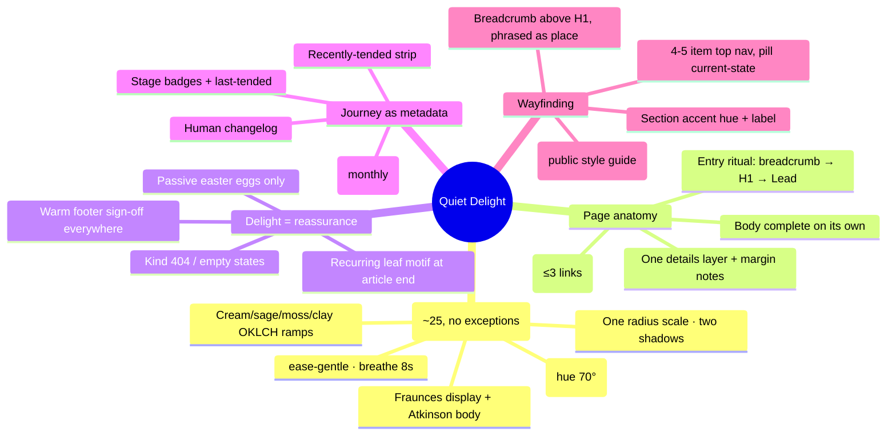
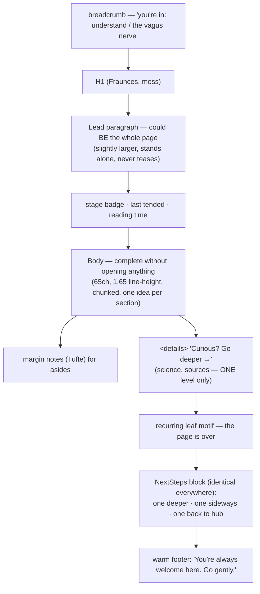

# A Warm, Coherent Design System — "Quiet Delight"

## Problem Statement

The founder wants the site to feel **welcoming, friendly, warm, and
intuitive** — especially for neurodivergent people and anyone in a
dysregulated state — while carrying **real depth** of information. Honest,
"just there to help," of service; a place that also catalogs what he finds
along his own journey. And it should feel **coherent, cohesive, and
delightful**.

Explorations 0001–0006 decided many pieces (stack, ND-first rules, hub IA,
editorial voice, slowness) but left the *unifying design language* undefined:
the palette and type as a committed system rather than a sketch, the page
anatomy that layers depth without overwhelm, what "delight" means for an
easily-overwhelmed audience, and the mechanism that makes one person's site
feel like one *place*. This exploration is that design system.

## Executive Summary

- **Design thesis: warmth is structural, delight is reassurance.** For this
  audience, delight isn't surprise (surprise startles) — it's the site
  behaving gently and predictably every single time, plus a small set of
  recurring friendly motifs. Coherence isn't a big-team process — it's a
  *small token set strictly applied* plus one template per content type.
- **Visual language committed**: cream/sage/moss/clay OKLCH earth palette
  (warm hues, low chroma, no pure black or white anywhere — the Headspace
  rule); **Fraunces** (soft variable serif with literal `SOFT`/`WONK`
  warmth axes) for display + **Atkinson Hyperlegible Next** for body
  (settling 0002's typography decision); rounded-everything with one radius
  scale; soft warm-tinted shadows; optional 2–5% grain; botanical line-art
  motifs; warm dark mode (hold hue ~70°, drop lightness, trim chroma).
- **Page anatomy: the Wikipedia-lead + gwern-iceberg at ~zero JS.** Every
  page opens with an entry ritual (breadcrumb → H1 → a *lead paragraph that
  could be the whole page*) and closes with an exit ritual (the same gentle
  "where to go from here" block, ≤3 links). Depth lives in `<details>`
  "go deeper" blocks and Tufte-style margin notes — available, never
  obligatory, maximum one nesting level.
- **Coherence mechanism**: ~25 design tokens in `@theme`, four content-type
  templates with fixed section order, one link style, one divider motif,
  and a public **`/style` page** that doubles as the enforcement tool.
  In Astro, coherence is structural: each motif is one component.
- **The personal layer without blog-feel**: the founder's journey appears as
  *metadata on a structure* — garden stage badges and "last tended" dates
  (from 0005), a **`/now` page** ("what I'm trying/reading/healing right
  now," updated monthly), and a small "recently tended" strip on the home
  page. The IA stays topical; the journey stays visible.
- **Homepage anatomy**: one-sentence plain promise → "Hi, I'm Chris — I'm
  walking this road too" (two sentences, real photo optional) → 3–4 labeled
  doors (Start here / Understand / Practices / What I'm finding) → recently
  tended strip. First-visit vs returning states via pre-paint localStorage.

## Current State In The Repository

- Six committed, unimplemented explorations. This one **settles and
  supersedes** scattered visual decisions:
  - [0001](0001_%5B_%5D_NERVOUS_SYSTEM_HEALING_SITE.md) sketched a
    sage/clay/night palette and Source Serif body; 0007 commits the full
    OKLCH ramp and (per [0002](0002_%5B_%5D_NEURODIVERGENT_PERSONALIZATION.md)'s
    BDA finding) the Atkinson body + Fraunces display pairing.
  - [0003](0003_%5B_%5D_ORIENTATION_HUB_PIVOT.md) defined the IA; 0007 gives
    it the experiential layer (entry/exit rituals, section accents,
    homepage anatomy).
  - [0004](0004_%5B_%5D_SENSORY_AWARENESS_EDITORIAL_HEART.md)/[0005](0005_%5B_%5D_EDITORIAL_SYSTEM_AND_AFFIRMING_LANGUAGE.md)
    defined voice and garden metadata; 0007 surfaces them visually (lead
    style, stage badges, `/now`).
  - [0006](0006_%5B_%5D_PACING_TITRATION_AND_CAPACITY.md)'s calm-technology
    stance becomes concrete motion/sound/density rules.
- **Files in the proposed layout this touches**: `src/styles/global.css`
  (the token system), `src/layouts/*` (entry/exit rituals, per-type
  templates), `src/components/` (`Lead`, `GoDeeper`, `MarginNote`,
  `NextSteps`, `StageBadge`, `RecentlyTended`), `src/pages/now.astro`,
  `src/pages/style.astro`, and `astro.config.mjs` (Fonts API).

## External Research

### Visual language (concrete, verified values)

- **Palette**: warmth = hue temperature (yellow-shifted neutrals, clay
  accents); calm = low chroma (≤ ~0.12 OKLCH) + moderate surface-to-surface
  contrast. Cream base `oklch(0.97 0.008 85)` (never `#FFF`), sage panels,
  deep moss as near-black for headings, terracotta/clay **reserved for
  primary actions only** ("avoid visual heat overload"), dusty rose as
  illustration tint. **Accessibility nuance**: low-arousal applies to
  *surfaces and saturation*; text still needs WCAG AA — raw terracotta/sage
  fail on cream, so links/buttons use darkened variants (clay-600
  `oklch(0.50 0.11 35)`, moss-800). Tailwind v4 is OKLCH-native; fixed
  lightness stops across hues keep a multi-hue palette visually level.
  Autism guidance (Scope, NAS-derived): creams/muted pastels are
  low-arousal; bright saturated yellow/red high-arousal; same color = same
  meaning everywhere; texture must never read as *pattern*.
- **Warm dark mode**: base `oklch(0.22 0.01 70)` (brown-olive, not
  blue-black), text `oklch(0.91 0.01 85)` (warm off-white, not `#FFF`),
  accents desaturated 20–30%. Systematic in OKLCH: hold hue, drop L, trim C.
- **Type**: Fraunces (free, variable; `SOFT`/`WONK` axes — engineered
  warmth) for headings; Atkinson Hyperlegible Next (Braille Institute;
  7 weights; disambiguated letterforms) for body; optional Nunito for UI
  labels. 18px base, line-height ~1.65 (Atkinson's large x-height), 65ch
  measure, modest 1.2–1.25 scale (dramatic scales read as energetic), 2–3×
  more space above headings than below (chunking = COGA pattern). Astro's
  Fonts API self-hosts with size-matched fallbacks (no CLS, no Google
  requests — a privacy win consistent with the ethos page).
- **Shape/texture**: consistent modest radius (8–16px cards, full pills);
  occasional organic blob masks; soft large-blur warm-tinted shadows
  (`0 2px 8px oklch(0.35 0.02 70 / 0.08)`); optional `feTurbulence` grain at
  2–5% opacity; single-weight botanical line-art (leaves, river lines,
  stones — apt motifs for nervous-system content); hand-drawn wavy SVG
  dividers instead of hard `<hr>`. Failure modes on both sides:
  sterile-minimal (white + grotesque + no texture) and cluttered-cottagecore
  (>3 motifs per view, texture behind text, script fonts).
- **Motion**: micro-interactions 200–500ms with long decelerating ease-outs;
  ambient/decorative motion only at **breathing tempo** (a hero blob scaling
  1.00→1.03 over ~8s is warmth; anything looping faster than breath is
  noise); no autoplay/loops in the reading column, no parallax, no
  scroll-hijack; `prefers-reduced-motion` swaps movement for opacity fades
  (feedback preserved, motion removed).

### Coherence, depth, and warmth in structure

- **Depth without overwhelm — the proven stack (≈0 JS)**: Wikipedia's
  lead-section convention (the lead *stands alone*; never teases) + gwern's
  iceberg hierarchy (abstract → body → collapsible sections → appendices)
  implemented with native `<details>/<summary>` (keyboard/screen-reader
  support free; never hide *essential* content) + Tufte-CSS margin notes
  (compile-time, checkbox-hack on mobile; gwern's own survey endorses this
  approach) + an end-of-page "go deeper" trail. **Research warning: more
  than two disclosure levels hurts usability** — lead → body → one optional
  layer, no deeper. Matuschak's stacked notes: borrow the *principle* (never
  yank readers out of context), not the machinery.
- **Coherence for a one-person site**: GOV.UK's documented insight —
  identical page anatomy per content type is what lets users predict "what
  information they can expect to find"; USWDS's token insight — tokens work
  like a *musical scale*: a small set of discrete choices produces harmony.
  Practically: ~2 typefaces, 4–6 type steps, one spacing scale, ≤8 colors,
  one radius, two shadows, one link style, one divider — in `:root`, no
  exceptions. Exemplars: Maggie Appleton (one illustration style + garden
  metadata = one hand drew it), Craig Mod (coherence via restraint and
  repetition), Robin Rendle (typographic rules as identity).
- **Josh Comeau translated**: what transfers — friendly first-person voice;
  one reusable quiet widget shell; soft brief transitions; persisted
  dark-mode preference; passive easter eggs (a hidden kind sentence). What
  doesn't — sound (opt-in only, off by default), confetti/fireworks,
  surprise-as-goal (unexpected motion is exactly what ND guidance warns
  against). His own warning does transfer: *"a charming effect becomes
  mundane and annoying surprisingly quickly."* The deep lesson: delight
  lives in one consistent well-crafted component system plus voice — and
  user control + persistence of sensory preferences is non-negotiable.
- **Wayfinding**: breadcrumbs directly above the H1 (that placement gets
  ~82% of breadcrumb clicks), phrased as place; COGA Objective 2 patterns
  (clear hierarchy, chunked media, search) and its advice to use *familiar
  conventions* — underlined links, standard patterns — which doubles as a
  coherence rule. Subtle per-section accent hue-shifts are fine but must be
  paired with labels (never color alone).
- **Personal layer**: garden stage badges + planted/last-tended dates (0005)
  make the journey visible as *metadata on structure*; a Sivers-style
  **`/now` page** (dated, first-person, updated ~monthly) holds "what I'm
  currently trying/reading/healing"; a human-voiced changelog frames
  maintenance as *tending, not posting*; a "recently tended" strip gives the
  homepage aliveness without a reverse-chron feed.
- **Homepage**: warm personal/indie sites outperform "converting" heroes for
  trust via a plain-language promise + a real human introduction + a few
  clearly-labeled doors. First-visit vs returning states via localStorage
  with a pre-paint inline script (no flicker); the no-JS default is the
  first-visit version.

## Key Findings

1. **"Delight" for this audience means reassurance, not surprise.** The site
   is delightful when it behaves gently and identically every time — same
   entry ritual, same exit ritual, same warm sign-off, one recurring leaf
   motif. Predictability *is* the whimsy. This resolves the apparent tension
   between "delightful" and "not overwhelming."
2. **Warmth and clinical-credibility are compatible** — warmth lives in
   hue temperature, rounded shape, soft shadow, human voice, and kind
   microcopy; credibility lives in evidence tags, sources, and restraint.
   The palette research shows exactly where the line is: warm surfaces,
   AA-dark text; clay for one primary action, not everywhere.
3. **Depth-on-demand solves "not overwhelming but deep."** A page whose lead
   could be the whole page, whose body is complete without opening anything,
   and whose depth sits behind invitational `<details>` ("Curious? Go
   deeper →") and margin notes serves both the overwhelmed skimmer and the
   deep reader — with essentially no JavaScript.
4. **Coherence is a token budget plus templates, enforced by components.**
   ~25 tokens, four content-type templates with fixed anatomy, and a public
   `/style` page. In Astro every motif is a component, so coherence is
   structural rather than disciplinary — the right architecture for one
   person maintaining it long-term.
5. **The founder's journey belongs in the metadata, not the structure.**
   Stage badges, last-tended dates, `/now`, and a recently-tended strip make
   "cataloging what I find along the way" visible while the IA stays
   topical — service-shaped, not blog-shaped.
6. **Every design decision above already has a home in 0001–0006.** This
   system doesn't add scope; it settles conflicts (body font), concretizes
   principles (calm tech → motion/sound/density rules), and names the one
   new artifact families: rituals, tokens, `/style`, `/now`.

## Options And Tradeoffs

### A. Overall aesthetic direction

| Option | Pros | Cons |
|---|---|---|
| A1. Sterile-minimal (white, grotesque, flat) | "Trustworthy" in tech circles | Reads clinical/cold — the exact opposite of the brief |
| **A2. Warm-organic restraint: earth OKLCH + soft serif display + humanist body + botanical line-art, strictly token-budgeted** (recommended) | Warm AND credible; low-arousal; ND-friendly | Requires discipline to not drift cottagecore |
| A3. Illustrated-playful (Headspace-full) | Maximum friendliness | Needs illustration capacity one person lacks; risks infantilizing a trauma-adjacent audience |

### B. Depth mechanism

| Option | Pros | Cons |
|---|---|---|
| B1. Long complete articles | Simple | Walls of text — anti-ADHD, anti-overwhelm |
| **B2. Lead-first anatomy + one `<details>` layer + margin notes + end-of-page trail** (recommended) | Serves skimmer and scholar; ~0 JS; ≤2 disclosure levels per research | Authors must write the lead as a standalone (a craft skill) |
| B3. Popup/hover annotations (gwern machinery) | Richest | Heavy custom JS; hover-hostile on touch; over-stimulating |

### C. Delight posture

| Option | Pros | Cons |
|---|---|---|
| C1. No delight — pure utility | Zero risk | Misses "delightful" brief; forgettable; cold |
| **C2. Quiet delight: recurring motifs, kind microcopy in rare states, breathing-tempo ambience, passive easter eggs** (recommended) | Warmth that never startles; whimsy in 404/end-of-article where repetition can't wear | Restraint is harder than either extreme |
| C3. Comeau-style whimsy (sound, boops, surprises) | Memorable | Startling for this audience; violates sound-off and predictability rules |

### D. Personal-journey surface

| Option | Pros | Cons |
|---|---|---|
| D1. A blog section | Familiar | Reverse-chron feed makes the site read as *about the founder*, not for the visitor |
| **D2. Metadata layer (stage badges, last-tended) + `/now` + recently-tended strip + human changelog** (recommended) | Journey visible, IA stays service-shaped; already fits 0005's garden model | `/now` needs an update rhythm (monthly is enough) |
| D3. No personal layer | Purest resource | Loses the trust engine and the founder's stated motivation |

## Recommendation

Adopt **A2 + B2 + C2 + D2** — a design system named **Quiet Delight**:
warm-organic restraint, lead-first iceberg pages, delight-as-reassurance,
and the journey as metadata.

### The system at a glance



### Page anatomy (every content page, fixed)



### Homepage anatomy

```mermaid
flowchart TD
    P["One-sentence promise (plain language,\nno marketing): 'A calm place to understand\nand work with your nervous system.'"] --> HI["'Hi, I'm Chris — I'm walking this road too.'\n(two sentences max)"]
    HI --> DOORS["3–4 doors: Start here · Understand ·\nPractices · What I'm finding"]
    DOORS --> RT["Recently tended strip (aliveness,\nnot a feed)"]
    RT --> F["warm footer"]
    LS{"localStorage:\nvisited before?"} -.->|first visit (and no-JS default)| P
    LS -.->|returning| RET["intro collapses to one line;\nrecently-tended lifts"]
```

## Example Code

`src/styles/global.css` — the committed token system (Tailwind v4):

```css
@import "tailwindcss";
@plugin "@tailwindcss/typography";
@custom-variant dark (&:where(.dark, .dark *));

@theme {
  /* Earth palette — fixed OKLCH lightness stops; no pure black/white anywhere */
  --color-cream-50:  oklch(0.97 0.008 85);   /* page bg */
  --color-cream-100: oklch(0.945 0.012 85);  /* raised surface */
  --color-sage-100:  oklch(0.90 0.02 135);   /* panels */
  --color-sage-600:  oklch(0.45 0.05 140);   /* AA on cream */
  --color-moss-800:  oklch(0.38 0.04 140);   /* headings / near-black */
  --color-clay-400:  oklch(0.68 0.10 35);    /* decorative only */
  --color-clay-600:  oklch(0.50 0.11 35);    /* links & primary action — AA */
  --color-rose-300:  oklch(0.77 0.05 30);    /* illustration tint */
  --color-ink:       oklch(0.35 0.02 70);    /* warm charcoal body text */
  --color-ink-muted: oklch(0.52 0.02 70);

  --font-display: "Fraunces Variable", Georgia, serif;
  --font-body: "Atkinson Hyperlegible Next", system-ui, sans-serif;

  --ease-gentle: cubic-bezier(0.25, 0.1, 0.25, 1);
  --animate-breathe: breathe 8s ease-in-out infinite alternate;

  --radius-soft: 0.75rem;
  --radius-card: 1rem;
  --shadow-soft: 0 2px 8px oklch(0.35 0.02 70 / 0.08);
  --shadow-lift: 0 6px 24px oklch(0.35 0.02 70 / 0.10);
}

/* Semantic roles — remapped for warm dark mode (hold hue, drop L, trim C) */
:root {
  --surface: var(--color-cream-50);
  --surface-raised: var(--color-cream-100);
  --text: var(--color-ink);
  --accent: var(--color-clay-600);
}
.dark {
  --surface: oklch(0.22 0.01 70);       /* brown-olive, not blue-black */
  --surface-raised: oklch(0.26 0.012 70);
  --text: oklch(0.91 0.01 85);          /* warm off-white */
  --accent: oklch(0.68 0.09 35);        /* desaturated clay */
}

@media (prefers-reduced-motion: reduce) {
  :root { --animate-breathe: none; }
  * { transition-property: opacity, color, background-color !important; }
}

@keyframes breathe { from { transform: scale(1); } to { transform: scale(1.03); } }
```

Entry/exit rituals as components (coherence is structural):

```astro
<!-- src/components/Lead.astro — the paragraph that could be the whole page -->
<p class="text-xl leading-relaxed text-ink max-w-[65ch]"><slot /></p>

<!-- src/components/GoDeeper.astro — one disclosure level, invitational -->
<details class="rounded-card bg-sage-100/60 p-4 open:shadow-soft">
  <summary class="cursor-pointer font-medium text-moss-800 list-none
                  marker:content-none">Curious? Go deeper →</summary>
  <div class="pt-3"><slot /></div>
</details>

<!-- src/components/NextSteps.astro — identical exit on every page -->
<nav aria-label="Where to go from here" class="mt-12 rounded-card
     bg-cream-100 p-6 shadow-soft">
  <p class="font-display text-moss-800">Where to go from here</p>
  <slot /> <!-- exactly: one deeper · one sideways · one back to hub -->
</nav>
```

Kind rare-state copy (whimsy lives only where repetition can't wear):

```text
404 — "This page seems to have wandered off. Take a breath — here's the
       way back home."
empty search — "Nothing here yet — try a different word, or browse the
       topics below."
footer, everywhere — "You're always welcome here. Go gently."
```

`astro.config.mjs` fonts (self-hosted, fallback-matched):

```js
experimental: {
  fonts: [
    { provider: fontProviders.fontsource(), name: "Fraunces",
      cssVariable: "--font-display", weights: ["100 900"] },
    { provider: fontProviders.fontsource(), name: "Atkinson Hyperlegible Next",
      cssVariable: "--font-body", weights: ["200 800"] },
  ],
}
```

## Risks And Open Questions

- **Cottagecore drift.** Warm-organic degrades into clutter one "nice touch"
  at a time. The guards: the token budget (~25, no exceptions), the ≤3
  decorative motifs per view rule, and the public `/style` page as the
  reference of record. Any new motif requires retiring one.
- **Lead-writing is a craft bottleneck.** The anatomy only works if every
  lead genuinely stands alone. Mitigation: add "lead could be the whole
  page" to the copy-review checklist; write the lead *last*.
- **Fraunces personality vs calm.** At high `SOFT`/`WONK` settings Fraunces
  gets quirky. Open question: settle exact axis values (suggest `SOFT` ~50,
  `WONK` 0 for headings; allow `WONK` 1 only in the wordmark).
- **Illustration capacity.** Botanical line-art needs a consistent hand. A
  small commissioned set (8–12 spot illustrations + 3 dividers) or a very
  restrained self-drawn set beats an inconsistent large one. Open question:
  budget/appetite for commissioning?
- **Grain and blobs on low-end devices / forced-colors mode.** Test
  `forced-colors: active` (Windows High Contrast) and ensure grain/blobs
  degrade to plain surfaces.
- **First-visit/returning homepage swap** must not flash (pre-paint inline
  script, no-JS default = first-visit) and must not become personalization
  creep — it only collapses the intro; nothing else changes.
- **The `/now` rhythm.** A stale `/now` (last updated 8 months ago) reads as
  abandonment — worse than none. Monthly is enough; add it to the quarterly
  review ritual from 0003.

## Implementation Checklist

- [ ] Token system
  - [ ] Commit the full `@theme` palette/type/motion/shape tokens (as above)
        to `src/styles/global.css`, replacing 0001's sketch
  - [ ] Warm dark mode via semantic role remap; verify AA for text in both
        modes (WebAIM/axe pass on cream and dark surfaces)
  - [ ] Fonts API config: Fraunces + Atkinson Hyperlegible Next, self-hosted;
        settle Fraunces axes (SOFT ~50, WONK 0)
- [ ] Page anatomy components
  - [ ] `Lead`, `GoDeeper` (one level, invitational), `MarginNote`
        (Tufte-style, checkbox-hack mobile), `NextSteps` (identical exit,
        ≤3 links), leaf end-motif, wavy SVG divider
  - [ ] Four content-type layouts (concept / practice / modality / field-guide
        note) with fixed section order; breadcrumb-above-H1 in all
  - [ ] Per-section accent hue via `[data-section]` custom property, always
        paired with a text label
- [ ] Warm surfaces
  - [ ] Homepage: promise → "Hi, I'm Chris" → 4 doors → recently-tended
        strip; pre-paint first-visit/returning swap (no-JS = first-visit)
  - [ ] `/now` page (dated, first-person); human-voiced changelog page;
        `RecentlyTended` component sorting by `lastTended` (0005 schema)
  - [ ] Kind rare-state copy: 404, empty search, footer sign-off site-wide
- [ ] Coherence infrastructure
  - [ ] Public `/style` page: all tokens rendered + one example of each
        component (the enforcement artifact)
  - [ ] Add to `CONTENT_GUIDELINES.md`: lead-stands-alone rule, ≤3 motifs
        per view, one-new-motif-retires-one, whimsy-only-in-rare-states
- [ ] Motion & sensory
  - [ ] Global reduced-motion layer (opacity-only fallbacks); breathing-tempo
        ambience only outside the reading column; no autoplay anywhere
  - [ ] Verify `forced-colors: active` degradation; grain ≤5% opacity and
        absent behind text

## Validation Checklist

- [ ] Every text/background pair passes WCAG AA in light and dark modes
      (automated axe/Lighthouse + manual spot-check of clay links on cream)
- [ ] No pure `#FFF` or `#000` renders anywhere (computed-style audit)
- [ ] Every content page shows the identical entry ritual (breadcrumb → H1 →
      lead) and exit ritual (NextSteps with ≤3 links) — template test
- [ ] Reading any page without opening a single `<details>` yields a complete,
      coherent piece (editorial spot-check on 5 pages)
- [ ] No page has more than one disclosure nesting level; no more than 3
      decorative motifs per viewport (design audit)
- [ ] With `prefers-reduced-motion: reduce`: zero transform/scale animation,
      feedback preserved as opacity; with JS off: homepage shows first-visit
      state and everything else fully works
- [ ] Dark mode preference persists across visits and applies pre-paint (no
      flash), matching the 0002 pattern
- [ ] A first-time visitor in a hurry can, from the homepage, reach a
      complete answer in ≤2 clicks and always knows where they are
      (breadcrumb present above every H1) — walkthrough test
- [ ] The founder reads the homepage and confirms it sounds like him and
      feels "of service" rather than salesy
- [ ] `/now` and changelog exist, are dated, and the quarterly review ritual
      includes refreshing them
- [ ] The `/style` page renders every token and component actually in use —
      and nothing that isn't (drift check)

## References

Visual language:
- Earthy palettes — https://rosebenedictdesign.com/2025/01/31/earthy-color-palettes/ · terracotta systems https://themeandcolor.com/blog/terracotta-color-palette
- Autism/low-arousal color — https://business.scope.org.uk/designing-for-people-on-the-autism-spectrum/ · https://www.design-a11y.com/colors-autism
- OKLCH + Tailwind v4 — https://evilmartians.com/chronicles/better-dynamic-themes-in-tailwind-with-oklch-color-magic · https://tailwindcss.com/docs/theme · ramp tools https://huetone.ardov.me/ · https://accessiblepalette.com/
- Contrast — https://webaim.org/articles/contrast/ · dark mode https://atmos.style/blog/dark-mode-ui-best-practices
- Type — Atkinson Hyperlegible Next https://www.brailleinstitute.org/freefont/ · Fraunces https://fraunces.undercase.xyz/ · pairing https://pimpmytype.com/atkinson-hyperlegible-font-pairs/ · line length https://www.uxpin.com/studio/blog/optimal-line-length-for-readability/
- Astro Fonts API — https://docs.astro.build/en/reference/experimental-flags/fonts/
- Headspace system — https://raw.studio/blog/how-headspace-designs-for-mindfulness/ · mymind "quiet software" https://mymind.com/why
- Grain — https://css-tricks.com/grainy-gradients/ · https://www.fffuel.co/nnnoise/
- Calm breathing tempo — https://support.calm.com/hc/en-us/articles/360000069973-Breathing-Exercises

Structure & coherence:
- gwern design/iceberg — https://gwern.net/design · sidenotes survey https://gwern.net/sidenote · graveyard https://gwern.net/design-graveyard
- Wikipedia lead/summary style — https://en.wikipedia.org/wiki/Wikipedia:Manual_of_Style/Lead_section · https://en.wikipedia.org/wiki/Wikipedia:Summary_style
- Tufte CSS — https://edwardtufte.github.io/tufte-css/ · Astro recipe https://keith.is/post/tufte-sidenotes-in-astro
- details/summary accessibility — https://hassellinclusion.com/blog/accessible-accordions-part-2-using-details-summary/ · https://adactio.com/journal/20083
- Progressive disclosure (≤2 levels) — https://www.uxpin.com/studio/blog/what-is-progressive-disclosure/
- GOV.UK pattern anatomy — https://design-system.service.gov.uk/patterns/ · USWDS tokens-as-scale https://designsystem.digital.gov/design-tokens/
- Josh Comeau — https://www.joshwcomeau.com/blog/whimsical-animations/ · dark mode https://www.joshwcomeau.com/react/dark-mode/
- Breadcrumbs — https://www.nngroup.com/articles/breadcrumbs/ · placement https://www.pencilandpaper.io/articles/breadcrumbs-ux
- COGA — https://www.w3.org/TR/coga-usable/
- Digital-garden metadata — https://maggieappleton.com/garden-history · /now pages https://sive.rs/now2 · https://nownownow.com/
- Coherent small sites — https://maggieappleton.com/ · https://craigmod.com/essays/ · https://www.robinrendle.com/essays/new-web-typography/
