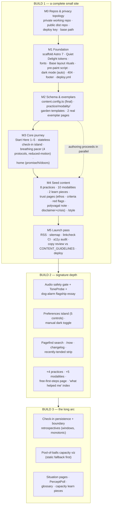
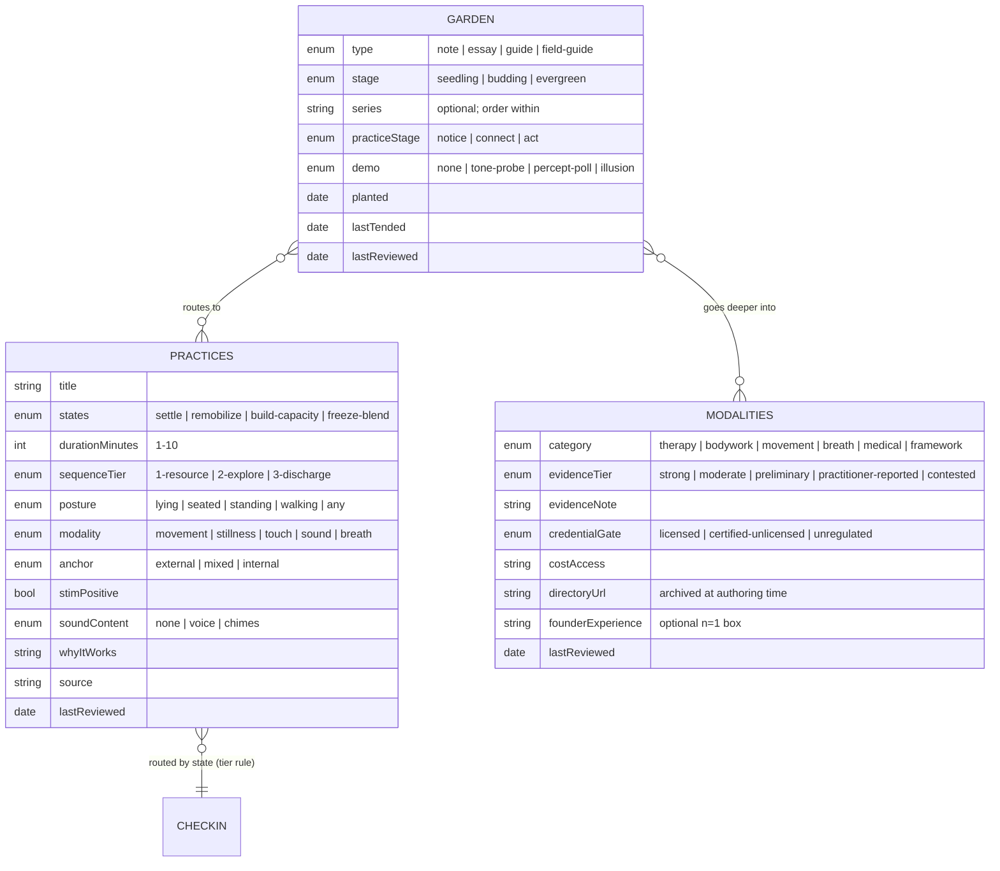
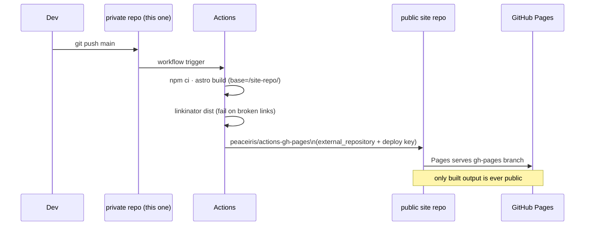

# First Build Plan — Synthesis Of 0001–0007

## Problem Statement

Seven explorations define the site: stack
([0001](0001_%5B_%5D_NERVOUS_SYSTEM_HEALING_SITE.md)), neurodivergent-first
personalization ([0002](0002_%5B_%5D_NEURODIVERGENT_PERSONALIZATION.md)),
orientation-hub mission ([0003](0003_%5B_%5D_ORIENTATION_HUB_PIVOT.md)),
sensory-awareness editorial heart
([0004](0004_%5B_%5D_SENSORY_AWARENESS_EDITORIAL_HEART.md)), editorial system
and affirming language
([0005](0005_%5B_%5D_EDITORIAL_SYSTEM_AND_AFFIRMING_LANGUAGE.md)), the
slowness principle ([0006](0006_%5B_%5D_PACING_TITRATION_AND_CAPACITY.md)),
and the Quiet Delight design system
([0007](0007_%5B_%5D_WARM_COHERENT_DESIGN_SYSTEM.md)). Together they specify
far more than a first build should attempt, and several early decisions were
superseded by later ones.

This exploration is the synthesis: **resolve the docs into one canonical
spec, cut a realistic Build 1, and sequence Builds 2–3** — so implementation
can start without re-deriving decisions or building the wrong (superseded)
thing.

## Executive Summary

- **Build 1 is a complete, small, honest site** — not a skeleton with
  placeholders: the Quiet Delight foundation (tokens, layouts, rituals,
  dark mode, deploy), the 5-step **Start Here** path with a simple check-in,
  the **breathing pacer**, **8 seed practices**, **10 modality entries**,
  **2 learn pieces**, all **trust pages**, home, 404, `/style`, RSS,
  sitemap, and CI link-checking. Everything on it follows the final rules
  (leads, rituals, evidence tags, affirming language, no streaks).
- **Build 2 adds the signature depth**: the dog-alarm field-guide essay with
  the audio safety gate + ToneProbe, the preferences island, Pagefind
  search, `/now` + changelog + recently-tended, the remaining practices and
  modalities, and the manual dark-mode toggle.
- **Build 3 adds the gentle long-arc layer**: check-in persistence +
  boundary retrospectives, the pool-of-balls capacity visualization,
  situation pages, PerceptPoll, and the glossary. (Deliberately last — the
  site practices its own titration.)
- **A supersession ledger** (below) resolves every cross-doc conflict; the
  most consequential: path-first home (0003) over check-in-first (0001),
  Atkinson+Fraunces (0007) over Source Serif (0001), unified `garden`
  collection (0005) absorbing 0001's `learn`/`articles`.
- **The privacy gate becomes a repo-topology decision**: this working repo
  contains the founder's personal history (0002's persona and these docs).
  Recommendation: **keep this repo private and deploy only built output to a
  separate public repo** — which unblocks building *and* deploying now,
  while the "how much story to publish" decision (0002/A2) gates only the
  *content* of the "why this site exists" page, not the launch.

## Current State In The Repository

- `docs/explorations/0001–0007` committed; **no source tree exists** — no
  `package.json`, no `src/`, no CI. Repo is local-only (no remote), with
  `.claude/skills/` tooling.
- Build 1 therefore starts from `npm create astro@latest` and creates the
  canonical layout the prior docs reference:

```
astro.config.mjs                     ← site/base, fonts, sitemap (0001, 0007)
.github/workflows/deploy.yml         ← build + linkcheck + deploy (0001, 0003)
CONTENT_GUIDELINES.md                ← voice, language, slowness rules (0002–0006)
src/
  content.config.ts                  ← practices · modalities · garden (final schema below)
  styles/global.css                  ← Quiet Delight tokens (0007)
  layouts/Base.astro                 ← rituals, pre-paint script, footer (0002, 0007)
  components/                        ← inventory below
  content/{practices,modalities,garden}/
  pages/                             ← site map below
public/                              ← favicon, og image, (CNAME later)
```

### Supersession ledger (canonical decisions)

| Topic | Superseded | Canonical |
|---|---|---|
| Homepage | 0001/0002 check-in-first | **0003 path-first** (promise → Start Here → doors), 0007 anatomy |
| Body font | 0001 Source Serif 4 | **0007 Atkinson Hyperlegible Next** (+ Fraunces display) |
| Palette | 0001 sketch | **0007 committed OKLCH ramps**, warm dark mode |
| Check-in | 0001 3 buttons | **0002 two-axis** with named blends; lives at Start Here step 4 |
| Learn/articles collection | 0001 `articles`, 0004 `field-guide` standalone | **0005 unified `garden`** (types: note · essay · guide · field-guide) |
| Retention features | 0001 v2 journal/evening mode | **0003/0006: killed**; only RSS + gentle retrospectives (Build 3) |
| Progress mechanics | (implicit streaks risk) | **0006: monotonic counts, windows, retrospectives; never streaks** |
| View transitions | 0001 "maybe ClientRouter" | **Native CSS only**; revisit ClientRouter only if persistent audio ships (v3+) |
| Astro version | 0001 "7 vs pin 6" | **Astro 7** (no remark-plugin investment to protect) |

## External Research

Research was completed in 0001–0007; no new research was needed. The one
new question — **how to deploy publicly while the working repo stays
private** — is settled prior art: build in the private repo's CI and push
`dist/` to a separate public repo via `peaceiris/actions-gh-pages` with
`external_repository` + a deploy key (documented pattern:
https://github.com/peaceiris/actions-gh-pages#%EF%B8%8F-deploy-to-external-repository-external_repository).
GitHub Pages on the free plan requires a public repo, which the built-output
repo satisfies; the explorations (and the founder's story) never leave the
private repo.

## Key Findings

1. **Later explorations quietly resolved most early conflicts** — the ledger
   above is short, and only the homepage and collection-unification changes
   materially alter what 0001's checklists would have built. Implementation
   must follow this doc's spec, not 0001's milestones verbatim.
2. **The privacy gate splits into two independent decisions.** (a) Repo
   topology — solved now by private-working-repo + public-dist-repo, which
   unblocks launch. (b) Founder-story depth on the "why" page — still the
   founder's call (0002/A2), but it only gates one page's *copy*, not the
   build. Build 1 ships a minimal two-sentence "Hi, I'm Chris" (0007) and
   the fuller story page waits for explicit approval.
3. **The natural Build 1 boundary is "no audio, no physics, no history."**
   The three riskiest components (ToneProbe + safety gate; pool-of-balls;
   check-in persistence/retrospectives) are exactly the three the prior
   docs wrapped in the most safety requirements. Deferring them gives a
   complete calm site now and lets each land with its full safety apparatus.
4. **Content is the long pole, not code.** Build 1 needs ~30 authored pages
   (8 practices, 10 modalities, 5 path steps, 2 learn pieces, ~6 trust/about
   pages) — each with a stands-alone lead, evidence grading, and
   affirming-language review. The build order below front-loads templates so
   authoring can proceed in parallel with component work.
5. **Every Build 1 surface already has its validation defined** in
   0002–0007's checklists; the Definition of Done below just selects the
   subset that applies (the deferred components' checks move to Builds 2–3).

## Options And Tradeoffs

### A. Repo topology & privacy

| Option | Pros | Cons |
|---|---|---|
| A1. Make this repo public (prune 0002) | Simplest deploy (withastro/action) | Explorations still narrate the founder's history throughout; pruning is lossy and error-prone |
| **A2. This repo private; CI pushes `dist/` to a public site repo** (recommended) | Docs stay fully private; launch unblocked; standard pattern | Two repos; deploy key setup; `base` = site-repo name |
| A3. Private repo + GitHub Pro Pages | One repo | Ongoing cost; docs still one visibility-toggle from exposure |

### B. Build 1 scope

| Option | Pros | Cons |
|---|---|---|
| B1. Walking skeleton only (foundation + home) | Fastest deploy | Ships an empty promise — "just there to help" with nothing that helps |
| **B2. Complete-small: foundation + path + pacer + seed content + trust pages** (recommended) | Every visitor need met minimally; honest at launch; ~30 pages is achievable | More authoring before first deploy |
| B3. Everything except Build-3 extras | Maximal launch | Audio safety gate + essay craft rushes the two highest-risk, highest-craft pieces |

### C. Check-in in Build 1

| Option | Pros | Cons |
|---|---|---|
| C1. Defer entirely | Less code | Step 4 of the path is the self-locate moment — a hole in the core journey |
| **C2. Stateless version: two sliders → named-blend reflection → routed practices; no persistence** (recommended) | Full journey works; zero data concerns; persistence lands later with retrospectives (0006) | Rework when history arrives (small: storage is additive) |
| C3. Full version with ring buffer | Done once | Pulls Build 3's gentle-progress model forward without its retrospective design |

### D. Authoring order

| Option | Pros | Cons |
|---|---|---|
| D1. Code first, content after | Clean phases | Templates finalized against lorem ipsum always rework |
| **D2. Templates + 2 real exemplar pages first (one practice, one modality), then parallel authoring** (recommended) | Real content pressure-tests schema/anatomy early | Requires the founder's review loop mid-build |

## Recommendation

Adopt **A2 + B2 + C2 + D2**. Three builds, each independently shippable,
each honoring the slowness principle — including in how the site itself
grows.

### Build sequence and dependencies



### Final content schema (merges 0002 + 0003 + 0004 + 0005)



### Component inventory by build

| Build 1 | Build 2 | Build 3 |
|---|---|---|
| `Base` layout (rituals, pre-paint) | `AudioSafetyGate` + `ToneProbe` | `PoolOfBalls` |
| `Lead` · `GoDeeper` · `NextSteps` | `Preferences` (5 controls) | `WeeklyReflection` / `LookHowFar` |
| `EvidenceTag` · `NOfOneAside` · `NoticeAside` | `MarginNote` (Tufte) | `PerceptPoll` |
| `BreathingPacer` (web component) | `RecentlyTended` · `StageBadge` | check-in ring buffer + export |
| `StateCheckIn` (stateless) | Pagefind UI | glossary pages |
| `PracticeCard` · `ModalityCard` | dark-mode toggle | situation pages |

### localStorage registry (all keys, even future ones, reserved now)

```
nsh:profile:v1    → prefs {instructions, modalityBias, pacing, soundDefault,
                    reduceMotionOverride}, seen {onboarding}   (Build 2)
                  → checkins ring buffer (≤90)                 (Build 3)
nsh:practice:v1   → showUpDates[], capacity, lastSessionAt     (Build 3)
```
Build 1 writes only `nsh:profile:v1.seen` (first-visit vs returning home).
Rules from 0006 apply from day one: raw logs only, derive everything, never
store a score, site fully functional with localStorage disabled.

### Deploy pipeline (private working repo → public site repo)



## Example Code

`astro.config.mjs` (Build 1, canonical):

```js
import { defineConfig, fontProviders } from "astro/config";
import tailwindcss from "@tailwindcss/vite";
import sitemap from "@astrojs/sitemap";

export default defineConfig({
  site: "https://crs.github.io",
  base: "/nervous-system",            // ← public site-repo name; settle in M0
  trailingSlash: "always",
  integrations: [sitemap()],
  vite: { plugins: [tailwindcss()] },
  experimental: {
    fonts: [
      { provider: fontProviders.fontsource(), name: "Fraunces",
        cssVariable: "--font-display", weights: ["100 900"] },
      { provider: fontProviders.fontsource(), name: "Atkinson Hyperlegible Next",
        cssVariable: "--font-body", weights: ["200 800"] },
    ],
  },
});
```

`.github/workflows/deploy.yml` (external-repo deploy):

```yaml
name: Build and deploy
on: { push: { branches: [main] }, workflow_dispatch: {} }
jobs:
  build-deploy:
    runs-on: ubuntu-latest
    steps:
      - uses: actions/checkout@v6
      - uses: actions/setup-node@v6
        with: { node-version: 22 }
      - run: npm ci && npx astro build
      - run: npx linkinator ./dist --recurse   # link integrity gate (0003)
      - uses: peaceiris/actions-gh-pages@v4
        with:
          deploy_key: ${{ secrets.SITE_DEPLOY_KEY }}
          external_repository: crs/nervous-system
          publish_dir: ./dist
```

Build 1 site map (every page listed — this is the whole launch surface):

```
/                     home: promise · hi · 4 doors
/start/1..5/          the path (step 4 embeds stateless check-in)
/practices/           index with state filter · 8 practice pages
/modalities/          index with tier badges + legend · 10 entries
/tools/breathing/     pacer (4 protocols)
/learn/               2 pieces: "Meet your states" · "Capacity & the window
                      of tolerance" (map-vs-territory note linked)
/about/why/           minimal founder intro (fuller story gated on 0002 approval)
/about/ethos/         how this is funded (it isn't)
/about/criteria/      curation criteria + grading legend + omissions
/about/red-flags/     consumer skills for this space
/about/disclaimer/    not-medical-advice + crisis resources (footer-linked)
/style/               public style guide (tokens + components)
/404                  kind wandering-off page
/rss.xml · /sitemap-index.xml
```

## Risks And Open Questions

- **Deploy-key setup is the only new operational surface** (create public
  repo, generate keypair, secret in private repo, deploy key in public
  repo). One-time, well-documented; do it in M0 so deployment is proven
  before content exists.
- **Public site-repo name fixes the URL.** `crs.github.io/<name>/` until a
  custom domain; pick the name in M0 (open question for the founder —
  suggestions: `nervous-system`, `go-gently`, `settle`). A custom domain
  later removes `base` (0003 noted this simplification).
- **~30 authored pages is the schedule risk.** Mitigation: D2 (exemplars
  first), practices/modalities are template-driven from research already in
  0003/0004, and the two learn pieces have full outlines in 0002/0006.
  The founder's review loop (voice + n=1 accuracy) is the real bottleneck —
  batch reviews per milestone.
- **Stateless check-in must not overpromise.** With no history in Build 1,
  the check-in reflects and routes only — its copy must not imply the site
  "remembers" anything (it doesn't, yet, and when it does it's device-only).
- **Scope creep at M4.** The seed lists (8 practices, 10 modalities) will
  tempt expansion; the caps are the point — Build 2 exists. Titration
  applies to the builder too.
- **Deferred safety apparatus must stay deferred together.** No tone demo
  without the full gate (0004); no pool without static fallback (0006); no
  history without retrospective design (0006). Partial pulls from Builds 2–3
  are the main integrity risk to this plan.

## Implementation Checklist

- [x] M0 — Repos & topology
  - [x] Founder picks public site-repo name (fixes URL/base) — **decision
        2026-07-04: founder chose "keep public as-is"; deploy Pages directly
        from this repo; URL = crs48.github.io/nervous-system-healing/**
  - [x] Repo topology settled — **founder explicitly approved this repo
        remaining public (including the exploration docs), so option A2's
        two-repo split is unnecessary; same-repo Pages deploy (0001 pattern)
        is canonical**
  - [x] Decide Build-1 "why" page copy — **privacy gate approved by founder;
        "why" page ships a warm moderate version (AuDHD, what helped),
        keeping the most clinical details out of the site copy itself**
- [ ] M1 — Foundation
  - [x] Scaffold Astro 7 (strict TS, empty template); add Tailwind v4 via
        `@tailwindcss/vite`; commit Quiet Delight `@theme` tokens (0007)
  - [x] Fonts API (Fraunces SOFT≈50/WONK 0 + Atkinson); `Base.astro` with
        entry/exit rituals, warm footer sign-off, pre-paint script
        (dark-mode auto + first-visit flag); 404; reduced-motion layer
  - [x] `deploy.yml` (build → linkinator → external-repo publish); verify
        live URL end-to-end with a placeholder page
- [ ] M2 — Schema & exemplars
  - [x] `content.config.ts` with final merged `practices` / `modalities` /
        `garden` schemas (as above); `CONTENT_GUIDELINES.md` consolidating
        0002–0006 rules (voice, language table, slowness invariants,
        lead-stands-alone, evidence/experience separation)
  - [x] Practice, modality, and garden templates with fixed anatomy
        (breadcrumb → H1 → Lead → meta → body → GoDeeper → leaf → NextSteps)
  - [x] Author 2 exemplars against real content (orienting practice; SE
        modality entry with n=1 box) → founder review → lock templates
- [ ] M3 — Core journey
  - [x] Start Here steps 1–5 (one idea each, "step N of 5", literal language,
        skippable everywhere)
  - [x] Stateless `StateCheckIn` (two sliders + body-sensation shortcuts →
        named blend reflection → tier-safe routed practice links)
  - [x] `BreathingPacer` web component (4 protocols; reduced-motion renderer;
        stop always visible; visibilitychange pause; no sound in Build 1)
  - [x] Home per 0007 anatomy (promise · hi · doors · no feed)
- [ ] M4 — Seed content (caps are hard)
  - [x] 8 practices (4 settle · 2 remobilize · 2 build-capacity; all tier-1/2)
  - [x] 10 modalities (SE · IFS · EMDR · TCTSY · TRE · Feldenkrais ·
        tai chi/qigong · coherent breathing · bodywork/MFR (contested, dual
        display) · polyvagal-informed (framework note)); index + legend
  - [x] 2 learn pieces ("Meet your states" with blends; "Capacity & the
        window of tolerance" with container metaphor + honesty notes)
  - [x] Trust pages: ethos · criteria (+removal/omissions) · red flags ·
        disclaimer+crisis (footer-linked from every page) · `/style`
- [ ] M5 — Launch pass
  - [x] RSS + sitemap; archive all outbound directory URLs (Wayback) and
        record `archivedDirectoryUrl`
  - [ ] Full copy review against `CONTENT_GUIDELINES.md` (leads stand alone;
        affirming-language table; no streak/urgency language; evidence vs
        experience never merged)
  - [ ] Lighthouse a11y ≥ 95 on all templates; axe pass both color modes;
        keyboard-only walkthrough; `prefers-reduced-motion` sweep
  - [ ] Deploy; verify Definition of Done below; only then announce
- [ ] Post-launch
  - [ ] Open Build 2 by checking off this doc and starting from its column
        in the component inventory (audio gate FIRST, then dog-alarm essay)

## Validation Checklist

- [ ] The public site repo contains only built output; this repo has no
      public remote; no exploration/persona text appears anywhere in `dist/`
      (automated grep for e.g. "NICU", "persona" in dist as a canary)
- [ ] Live site loads at the Pages URL with correct `base`-prefixed links,
      fonts self-hosted, styles and 404 working
- [ ] A first-time visitor can complete Start Here 1–5 in under 10 minutes,
      skip at every step, and reach a practice, a modality, and a
      practitioner directory link from step 5 (walkthrough)
- [ ] Check-in routes freeze-blend states to tier-1 practices only
      (frontmatter routing test); no copy implies stored history
- [ ] Pacer timings match spec per protocol; stop reachable at every moment;
      tab-hide pauses; zero audio anywhere in Build 1
- [ ] All 30 pages pass template conformance (breadcrumb, standalone lead,
      NextSteps ≤3 links, footer sign-off, `lastReviewed` where applicable)
- [ ] Modality pages: evidence badge + cited note + credential gate + cost on
      all 10; n=1 boxes visually distinct; contested entries show dual
      display; legend linked from every badge
- [ ] linkinator green in CI; every `directoryUrl` has a Wayback snapshot
- [ ] Lighthouse: a11y ≥ 95 and performance ≥ 95 on home, a practice, a
      modality, and the pacer page; axe clean in light and dark
- [ ] No streaks, scores, red zeros, autoplay, sound, email capture, or
      infinite feed anywhere (site-wide audit per 0006/0003)
- [ ] Founder sign-off: home sounds like him; exemplar n=1 content accurate;
      "why" page depth matches his privacy decision

## References

All primary references live in the source explorations:
- [0001 — stack & deployment](0001_%5B_%5D_NERVOUS_SYSTEM_HEALING_SITE.md)
- [0002 — ND-first personalization & privacy gate](0002_%5B_%5D_NEURODIVERGENT_PERSONALIZATION.md)
- [0003 — orientation hub, directory, trust infrastructure](0003_%5B_%5D_ORIENTATION_HUB_PIVOT.md)
- [0004 — field guide genre, demos, audio safety](0004_%5B_%5D_SENSORY_AWARENESS_EDITORIAL_HEART.md)
- [0005 — garden model, series, affirming language](0005_%5B_%5D_EDITORIAL_SYSTEM_AND_AFFIRMING_LANGUAGE.md)
- [0006 — slowness principle, gentle progress, pool-of-balls](0006_%5B_%5D_PACING_TITRATION_AND_CAPACITY.md)
- [0007 — Quiet Delight design system](0007_%5B_%5D_WARM_COHERENT_DESIGN_SYSTEM.md)

New to this doc:
- External-repo Pages deploy — https://github.com/peaceiris/actions-gh-pages#%EF%B8%8F-deploy-to-external-repository-external_repository
- linkinator — https://github.com/JustinBeckwith/linkinator
