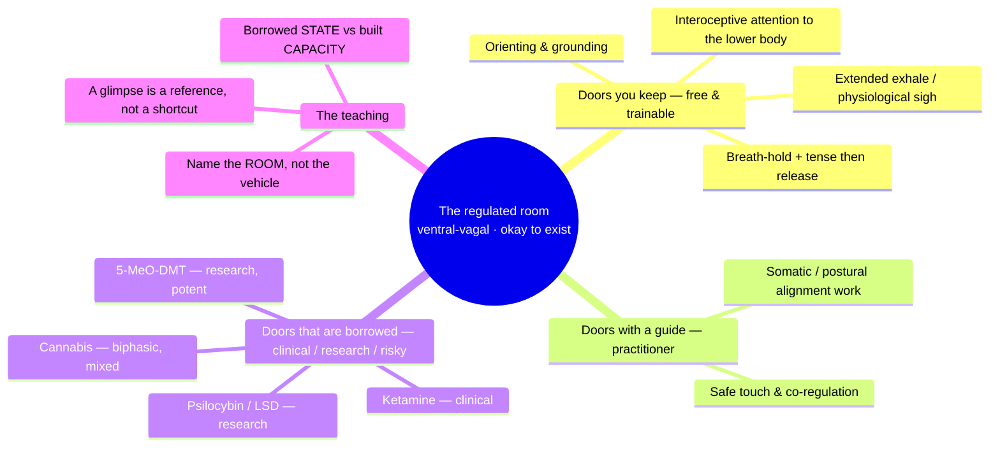
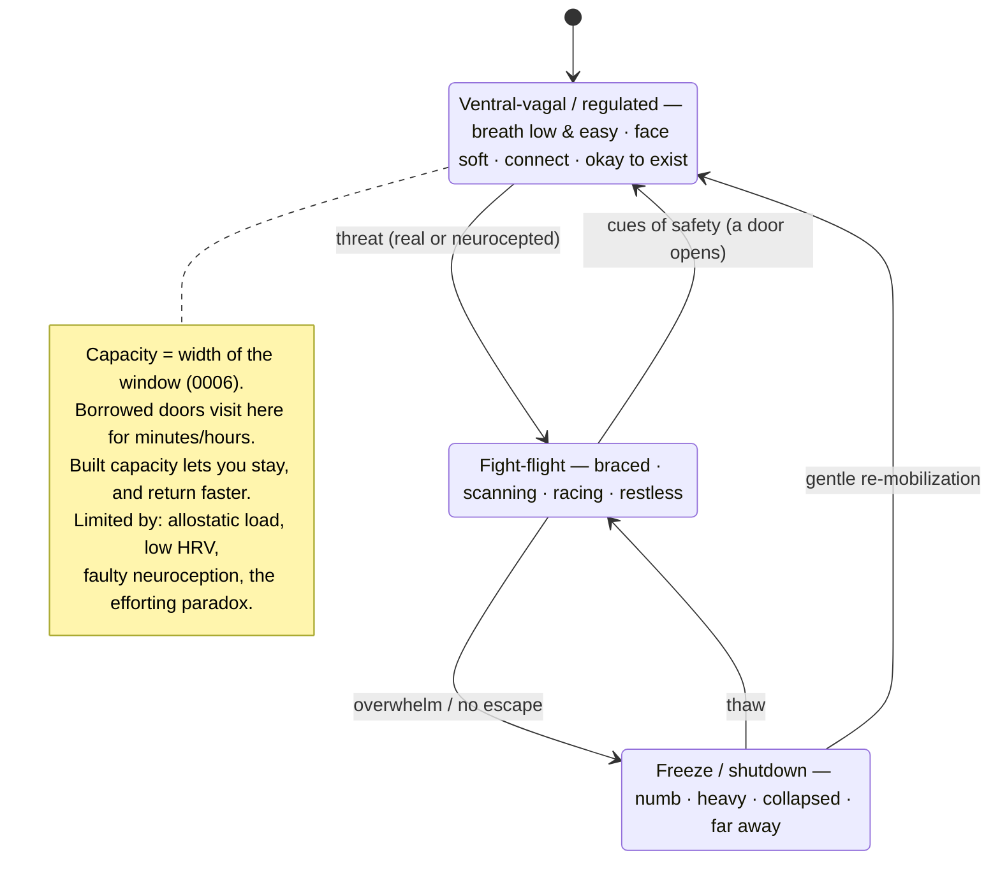
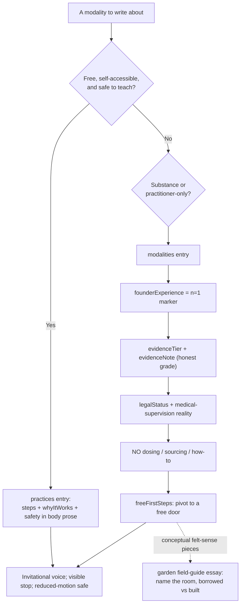

# Doors To The Regulated State — Modalities, The Ventral-Vagal Felt Sense, And Why Capacity Is Limited

## Problem Statement

The founder has mapped, from his own lived experience, a set of things that
have produced a real drop in **allostatic load** — the restless, braced,
freeze-or-fight-flight background hum quieting into something settled. They
span very different categories:

- **A breath-hold-and-tense release.** Hold the breath, tense the whole body
  — especially the rib cage and lungs — feel the pressure build everywhere,
  then release and exhale into a big wave of settling, slowing, relief.
- **Ketamine** (IV and oral/prescribed) — not a tense-and-release wave but a
  steadier "consistently relaxed, high-capacity, okay-to-exist" state.
- **5-MeO-DMT** — "incredibly relaxed, held by the universe," good in the body.
- **Cannabis** — mixed: sometimes embodying and heavy, sometimes mind-racing.
- **LSD** — embodying but jittery; "everything higher resolution."
- **Psilocybin mushrooms** — a little more relaxing than LSD, similar family.
- **Somatic/postural bodywork** — an hour of table alignment work (from a
  dancer/Pilates/energy practitioner, not massage) that left him able to
  breathe two-to-three times deeper, chest and pelvis released, awareness
  dropped into feet and legs.

He wants to explore all of these — plus others — and figure out how to
integrate them into the site to convey **what it feels like to *not* be in
freeze, and *not* be in fight-flight, but in a relaxed, regulated,
ventral-vagal state**, and **why some nervous systems struggle to stay there
— why the capacity is limited**.

The design question: what content genre, organizing frame, and interactive
form carry this — credibly (much of this is a pharmacological and pop-science
minefield), safely (some of these modalities are drugs, some are illegal,
one maneuver has real cardiovascular contraindications), and movingly (it must
give the reader a felt reference for regulation, not a lecture)?

## Executive Summary

- **The organizing insight is "many doors, one room."** Every item on the
  founder's list is a *different route to the same destination*: a nervous
  system that has, for a moment, stopped predicting threat and dropped into
  felt safety. The site's job is not to rank the doors — it's to name the
  **room** (the regulated/ventral-vagal state) so vividly that a reader can
  recognize it, and then to show which doors they can open themselves, for
  free, today.
- **Draw the load-bearing distinction: borrowed state vs. built capacity.**
  Substances and even a single bodywork session largely give you a *state* you
  *visit*; breath practices, interoceptive skill, and slow titrated work
  *build the trait capacity* to find that state from the inside and stay
  longer. This is the honest, non-glamorizing, genuinely useful spine of the
  whole pillar — and it plugs straight into
  [0006](0006_%5B_%5D_PACING_TITRATION_AND_CAPACITY.md)'s window-of-tolerance
  and Slowness Principle.
- **Reframe peak experiences as "reference experiences," not shortcuts.** A
  ketamine session or a 5-MeO glimpse of "held by the universe" is most useful
  as a *north star* — proof that the room exists and a felt target the reader
  can later learn to reach by slower, trainable means. The research on
  psychedelic **afterglow** and state→trait conversion supports exactly this:
  the glimpse only becomes lasting change through integration and practice.
- **Draw the acute-vs-post-acute distinction honestly** — this is the biggest
  accuracy correction the research surfaced. Ketamine and the classic
  psychedelics are **acutely *sympathomimetic*** (they raise heart rate and
  blood pressure); the acute state is better described as "activated but
  decoupled" than as a clean parasympathetic calm. The felt calm/"okay-ness" is
  largely a **post-acute, psychological** effect — relief from rumination, a
  loosened self-model, and (for ketamine) days of BDNF/mTOR-driven synaptic
  remodeling — not vagal upregulation during the session. The *somatic* doors
  (Valsalva release, long exhale, PMR) are the ones that are actually,
  measurably parasympathetic in the moment. Saying this plainly is what keeps
  the site honest and separates it from psychedelic-community overclaiming.
- **Adopt a strict substance editorial policy: phenomenology + mechanism,
  never protocol.** The site describes *what these states feel like* and
  *why* (receptor-level, honestly graded), marks every account as the
  founder's `n=1`, states legality and medical-supervision reality plainly,
  and **never** gives dosing, sourcing, or how-to. Every substance piece ends
  by pivoting to a free, trainable door to the same room. This keeps the site
  educational-not-medical and on-brand with its honesty posture.
- **Ship the one *safe*, free, trainable practice that's still missing.** The
  gentle extended-exhale door already exists as
  [`long-exhale.md`](src/content/practices/long-exhale.md); the founder's
  **breath-hold + full-body tension → release** (a Valsalva /
  progressive-muscle-relaxation / breath-hold hybrid) does not. Add it as a new
  `practices` entry — and because the schema has **no `contraindications`
  field**, put the safety block in **body prose** (repo convention, per
  `pushing-a-wall.md`): the Valsalva strain raises blood and intraocular
  pressure, so flag cardiovascular disease, uncontrolled hypertension,
  glaucoma/retinal issues, pregnancy, and never-in-water. This is the door the
  reader actually gets to keep.
- **Teach "why capacity is limited" honestly** via allostatic load (McEwen),
  low HRV as an index of self-regulatory capacity, faulty **neuroception**,
  developmental/complex trauma narrowing the window, and the **efforting
  paradox** (trying hard to relax is itself a vigilance state). Keep the
  polyvagal *language* as an accessible map while flagging that the theory's
  specific claims are scientifically contested.
- **Genre: the braided essay** from
  [0004](0004_%5B_%5D_SENSORY_AWARENESS_EDITORIAL_HEART.md) (first-person n=1 +
  a thing the reader can *do/feel* + honestly-graded science), carrying
  [`EvidenceTag`](src/components/EvidenceTag.astro) /
  [`NOfOneAside`](src/components/NOfOneAside.astro) — both of which now exist.
  If any essay adds an audio or motion demo, 0004's **safety-gate** must be
  built first (it is not yet).

## Current State In The Repository

**The site is now built** (Build 1 landed from `main`): an Astro 7 + Tailwind v4
static site with three real content collections in
[`src/content.config.ts`](src/content.config.ts) — `practices`, `modalities`,
and `garden` — plus a component library and `CONTENT_GUIDELINES.md`. Much of
what this exploration originally proposed already exists under different names;
the update below reconciles the plan with the code as it actually is.

- **`practices`** ([schema](src/content.config.ts)) — fields are `states`
  (`settle | remobilize | build-capacity | freeze-blend`), `durationMinutes`,
  `sequenceTier` (1–3), `posture`, `modality` (`movement | stillness | touch |
  sound | breath`), `anchor`, `stimPositive`, `soundContent`, `whyItWorks`,
  `source`, `lastReviewed`. **There is no `intensity` or `contraindications`
  field** — safety notes live in **body prose** at the end of the entry (see
  [`pushing-a-wall.md`](src/content/practices/pushing-a-wall.md): *"Go easy if
  you have any shoulder, wrist, or heart concerns…"*). This changes the plan:
  the hold-and-release safety block is prose, not a field.
  - [`long-exhale.md`](src/content/practices/long-exhale.md) **already exists**
    and is exactly this exploration's "extended-exhale" door — so that half is
    **done**.
  - [`pushing-a-wall.md`](src/content/practices/pushing-a-wall.md) is an
    isometric *discharge* practice but you **keep breathing** — it is *not* the
    founder's breath-hold + tense (a Valsalva strain), which is still absent and
    carries stronger cardiovascular caution.
- **`modalities`** ([schema](src/content.config.ts)) — this collection is the
  natural home for the substance and bodywork write-ups. It already has exactly
  the fields this exploration wanted: `evidenceTier` (`strong | moderate |
  preliminary | practitioner-reported | contested`), `evidenceNote`,
  `founderExperience` (the n=1 marker, designed to sit *next to* the evidence
  badge), `whoItTendsToFit` / `whoItMayNotFit`, `freeFirstSteps` (the
  built-in "pivot to a free door"), `credentialGate`, `costAccess`.
  - [`bodywork-myofascial.md`](src/content/modalities/bodywork-myofascial.md)
    **already exists**, graded `contested`, with a `founderExperience` note that
    matches the founder's alignment-work account — so the **bodywork door is
    largely done**.
  - **Gap:** `category` is `therapy | bodywork | movement | breath | medical |
    framework` — no value fits psychedelics/dissociatives (ketamine ≈ `medical`;
    5-MeO/LSD/psilocybin/cannabis have no home), and there is **no `legalStatus`
    field**. Adding substances needs a small schema extension (below).
- **`garden`** ([schema](src/content.config.ts)) — the braided-essay/field-guide
  collection (`type` includes `field-guide`, plus `series`, `practiceStage`
  `notice|connect|act`, and a `demo` enum). This is the home for the "name the
  room" felt-sense essay and the "Doors to the Regulated State" series.
  [`capacity-and-the-window-of-tolerance.md`](src/content/garden/capacity-and-the-window-of-tolerance.md)
  **already exists** and already teaches capacity, the window of tolerance, and
  the efforting paradox — so the "why capacity is limited" work **extends** it
  rather than starting fresh.
- **Components already present**:
  [`EvidenceTag`](src/components/EvidenceTag.astro),
  [`NOfOneAside`](src/components/NOfOneAside.astro) (the n=1 marker),
  [`NoticeAside`](src/components/NoticeAside.astro),
  [`GoDeeper`](src/components/GoDeeper.astro),
  [`NextSteps`](src/components/NextSteps.astro),
  [`BreathingPacer`](src/components/BreathingPacer.astro),
  [`StateCheckIn`](src/components/StateCheckIn.astro). The `demo` enum has no
  breath option, so an inline felt-demo would either link to the practice or add
  a `demo` value.
- **Reuses [0006](0006_%5B_%5D_PACING_TITRATION_AND_CAPACITY.md)**: window of
  tolerance as the honest anchor, titration/pendulation, and the efforting
  paradox — now partly *shipped* in the capacity garden essay.
- **Adds** (reconciled with the real repo): **one** new practice
  (`src/content/practices/hold-and-release.md`, safety in prose); the substance
  and (optional) somatic-bodywork write-ups as **`modalities`** entries; a
  small schema extension (a substance-suitable `category` value such as
  `substance`, plus an optional `legalStatus` field); a "Doors to the Regulated
  State" **`garden`** series and a "name the room" felt-sense essay; and copy
  conventions appended to `CONTENT_GUIDELINES.md`. Substances are entered as
  `modalities`, **never** as `practices`.

## External Research

### The somatic doors (highest evidence, most actionable)

- **Breath-hold + full-body tension → release** decomposes into three
  well-understood mechanisms that stack:
  - **Valsalva maneuver / baroreflex rebound.** Tensing against a closed
    airway raises intrathoracic pressure; on *release* (Phase IV) blood
    pressure overshoots baseline, baroreceptors fire, sympathetic outflow is
    restrained and a **transient vagal (parasympathetic) bradycardia** kicks
    in — a measurable "settling" wave. Baroreflex sensitivity is literally
    quantified from the Valsalva Phase II/IV slope. (StatPearls; PMC.) This is
    the crisp physiological correlate of the founder's "big wave of settling."
    **Safety flag:** the strain raises arterial and intraocular pressure, so it
    is genuinely contraindicated in cardiovascular disease, uncontrolled
    hypertension, glaucoma/retinal disease, and pregnancy.
  - **Progressive muscle relaxation (Jacobson).** Deliberately tensing a
    muscle group hard for 5–10 s then releasing and feeling the contrast is a
    ~90-year-old method with **solid meta-analytic support** (medium-to-large
    effect sizes for anxiety; recent 2026 review, 31 RCTs, n≈2,277). The
    tense-first step deepens the felt release.
  - **Extended exhale / breath-hold → vagal tone.** A longer exhale relative
    to inhale acutely raises vagally-mediated HRV (RMSSD, HF-HRV); vagal tone
    peaks in the post-inspiratory phase via brainstem gating (nucleus ambiguus)
    — this is mainstream cardiorespiratory physiology, *independent of*
    polyvagal theory. It's the same lever as the physiological sigh and
    slow-paced (~5.5/min) breathing, and it has one of the best direct RCTs in
    this whole space: **Balban et al. 2023 (Cell Reports Medicine, Stanford)**,
    where 5 min/day of cyclic sighing (double inhale + long exhale) beat box
    breathing, cyclic hyperventilation, and mindfulness for daily mood and for
    lowering resting respiratory rate. **Solid.**
  - **(Optional potentiator) cold water on the face** engages the mammalian
    diving reflex (trigeminal → vagal bradycardia). A *dry* breath-hold gives a
    weaker version; cold facial immersion is the real lever — a cheap, free
    add-on door, with the same cardiovascular cautions as the Valsalva strain.
- **Somatic/postural bodywork.** The plausible, honest mechanism for
  "breathing 2–3× deeper afterward": releasing chronic rib-cage, diaphragm,
  and pelvic-floor holding restores breathing mechanics, and directed
  attention re-populates **interoceptive** maps of under-felt regions (feet,
  legs, pelvis). The posture→breathing link is **strong** physiology (thoracic
  kyphosis / forward-head posture measurably reduce diaphragm excursion and
  vital capacity); the claim that *a single hour* of manual work durably
  realigns the ribcage/pelvis is **weak/anecdotal**. **Evidence grading matters
  for the named modalities:** Feldenkrais has weak-to-moderate (low-quality,
  heterogeneous) RCT support; **Rolfing/structural integration** has
  insufficient controlled evidence (a 2022 review found no good evidence of
  therapeutic effect, and some sources flag its proprietary theory as
  pseudoscience); **craniosacral therapy** has insufficient evidence; **"energy
  work"** has no plausible physical mechanism beyond placebo/relaxation-
  response. The honest move is to separate the *proprietary theory* (weak) from
  the **active ingredients present regardless of modality**: safe, attentive
  touch; co-regulation with a trusted practitioner; a slowed pace; interoceptive
  redirection into under-felt regions; and restored breathing mechanics.
  Present these as felt-sense/relationship experiences, not proven techniques.

### The pharmacological doors (mechanism + honest grade + safety)

- **Ketamine** — NMDA-receptor antagonism disinhibits glutamate, driving an
  AMPA→BDNF/TrkB→**mTOR**→**synaptogenesis** cascade; this rapid structural
  plasticity underlies its fast antidepressant effect. **Honest nuance:**
  acutely, ketamine is *sympathomimetic* — it raises heart rate and blood
  pressure (10–50%), and in one trial *greater* cardiovascular activation
  predicted *better* response. So the "consistently relaxed, high-capacity,
  okay-to-exist" quality is not acute vagal calm; it's a **post-acute**
  effect — dissociation uncoupling affect from the narrative self, NMDA-driven
  disruption of ruminative self-referential (DMN) circuitry, and days of
  synaptic remodeling. **Evidence: strong** for rapid antidepressant action;
  **preliminary** for ketamine-assisted *psychotherapy* specifically (few RCTs
  isolate the therapy's added value). **Safety:** prescription/clinical
  context, dissociation, blood-pressure effects, bladder toxicity and
  dependence with repeated non-clinical use.
- **5-MeO-DMT** — atypical: **5-HT1A affinity 300–1000× its 5-HT2A affinity**,
  which likely explains the non-visual, all-encompassing, ego-dissolving,
  "held by the universe" oceanic quality (5-HT1A is an inhibitory, calming
  receptor and suppresses the visual imagery 5-HT2A produces). The *subjective*
  "held" quality is real; acutely the compound still carries significant
  cardiovascular load, so "calm" here is psychological, not a gentle
  physiological state. **Evidence: early/anecdotal** (small trials, e.g. GH001;
  most human data is ceremonial). **Safety: highest on this list** — extremely
  potent, rapid, overwhelming; deaths reported, especially with **MAOI
  combination** (serotonin syndrome) and toad-derived material (cardioactive
  bufotoxins); demands screening, set/setting, a sitter. Largely
  illegal/research-stage.
- **Cannabis / THC** — CB1 agonism with a well-documented **biphasic**
  dose-response: low doses tend anxiolytic, higher doses anxiogenic
  (racing mind, heightened vigilance) — precisely the founder's "mixed"
  experience. **Evidence: solid** for the biphasic pattern; individual and
  strain variability is large.
- **LSD** — 5-HT2A agonism with sympathomimetic activation; "everything higher
  resolution" is increased sensory/cortical gain, and the jitteriness is the
  autonomic arousal riding alongside — embodying but not *calming* per se.
- **Psilocybin** — 5-HT2A agonism; associated with **default-mode-network**
  down-regulation and the "entropic brain." Shorter and "cleaner" (less
  off-target adrenergic/dopaminergic activity) than LSD, which plausibly
  explains the "somewhat more embodied/settling" report — though that
  comparison is **anecdotal**, not head-to-head. **Evidence: moderate** for
  depression (several positive but small RCTs with imperfect blinding); strong
  afterglow literature.

### The unifying threads

- **A common final pathway: out of threat-prediction, into felt safety.** The
  somatic doors reach it *bottom-up* (baroreflex/vagal afferents converging on
  the brainstem — NTS → nucleus ambiguus — plus interoceptive signals of
  safety; a thread that holds *without* polyvagal theory being true); the
  psychedelics/dissociatives reach it *top-down* by loosening the brain's grip
  on its predictions. The **REBUS** model (Carhart-Harris & Friston: relaxed
  beliefs under psychedelics) describes classic psychedelics as *reducing the
  precision-weighting of high-level priors* — the same "loosening of the braced
  self" the founder describes as "held," "okay to exist," "less restless."
- **Caveat that keeps this honest: the psychedelic acute state is not a
  parasympathetic one.** Acutely these compounds *raise* heart rate and show an
  unusual "activated but decoupled" autonomic signature (HF-HRV and arousal
  rising together). The plausible route from a peak to lower allostatic load is
  **post-acute** — sustained shifts in self-referential processing and threat
  appraisal — not direct vagal toning during the session. This connective
  tissue is currently *theoretical*, and the site should label it that way.
- **5-HT1A vs 5-HT2A as calm vs. activation.** The founder's own ranking falls
  out of the pharmacology: 5-MeO (1A-dominant) = deep calm/held; LSD
  (2A + sympathomimetic) = jittery/high-res; psilocybin (2A, DMN) = in between.
  A genuinely clarifying, honestly-caveated teaching point.
- **Surrender vs. efforting.** Every door works by *letting go*, not trying
  harder. This ties to 0006's efforting paradox and is the bridge to "why
  capacity is limited": a hypervigilant system finds *surrender itself* unsafe.

### The ventral-vagal felt sense (and the honesty caveat)

- **Phenomenology** (what "not freeze, not fight-flight" feels like): breath
  that moves low and easy; a warm/soft face and eyes; the impulse to connect
  rather than brace or withdraw; time feeling roomy; "I'm okay, and it's okay
  to exist"; curiosity available; the body heavy-but-light rather than
  braced (fight-flight) or collapsed/numb (freeze/dorsal). This is describable
  well enough to give a reader a recognizable target.
- **Honesty caveat:** **polyvagal theory** is a useful clinical *map* but its
  specific neuroanatomical/evolutionary claims are contested (Grossman et al.
  2023–2026 argue all five core premises are untenable; Porges rebuts that they
  attack a "reconstructed proxy" — the debate is live and pointed). A key
  concrete point: **RSA is not a clean, validated proxy for "vagal tone"** the
  way the theory assumes. The site should keep the accessible
  ventral/sympathetic/dorsal *language* while flagging it as a framework, and
  lean on the better-validated, theory-agnostic **window of tolerance**
  (Siegel) and **autonomic arousal** framing for anything load-bearing — the
  two describe the same hyperarousal/optimal/hypoarousal continuum without the
  contested anatomy.

### Why capacity for the state is limited

- **Allostatic load** (McEwen & Stellar): chronic stress is cumulative
  "wear and tear," biasing the system toward defense. **Low HRV** is a
  validated **index of self-regulatory / emotion-regulation capacity** and is
  reduced in PTSD and chronic stress. **Developmental/complex trauma** narrows
  the window of tolerance — a system that lived in threat during formative
  years never fully built the machinery to down-regulate. **Faulty
  neuroception** mislabels safe cues as dangerous (a compelling clinical
  narrative, though it inherits polyvagal theory's contested status — grade it
  as heuristic). And the **efforting paradox** closes the trap — and it's a
  *documented* phenomenon, not just an intuition: **relaxation-induced anxiety**
  (Heide & Borkovec) found ~31% of people grew *more* tense under progressive
  relaxation and ~54% under meditative relaxation, later linked to "negative
  contrast sensitivity" (a fear of feeling good because something bad may
  follow). For a braced system, *trying to relax* is another vigilance task and
  *surrender feels like danger* — which is why the state is reachable in flashes
  (a drug, a maneuver, a session) long before it's *sustainable*. Capacity is
  the trainable thing; that's the hopeful, honest through-line.

### State vs. trait — the reference-experience frame

- Psychedelic **afterglow** (elevated mood, openness, connectedness for days
  to weeks) is real but *subacute*; **peak experiences predict** long-term
  wellbeing gains **only when integrated** — states produce trait change
  through repeated re-instantiation and practice, not by the peak alone. This
  is the evidence base for treating any borrowed glimpse as a *reference*, and
  for insisting the durable work is the slow, free, trainable kind.

## Key Findings

1. **The founder's list is one phenomenon with many entrances.** Framing it as
   "many doors, one room" turns a grab-bag of modalities into a single,
   teachable idea and lets the site name the *destination* (regulation) rather
   than endorse any *vehicle* — especially the risky ones.
2. **Borrowed-state vs. built-capacity is the honest spine.** It explains why
   a peak helps *and* why it isn't enough, dignifies the founder's experiences
   without glamorizing drugs, and routes every reader back to the free,
   trainable doors — fully consistent with 0006's Slowness Principle.
3. **The breath-hold-tense wave has a real, nameable mechanism** (Valsalva
   baroreflex rebound + PMR contrast + long-exhale vagal tone) — and a real
   contraindication set. It is the single most *shippable* item on the list: a
   free practice the reader keeps, honestly explained.
4. **Substances are includable only as phenomenology + mechanism.** Presented
   as felt-sense reports (n=1) and receptor-level explanation, behind evidence
   tags and legality/medical framing, with no protocols and a pivot to a free
   door, they *teach the map* without becoming a how-to — and the 5-HT1A/2A
   contrast is genuinely illuminating.
5. **"Higher resolution but jittery" is pharmacology, not vibe.** The founder's
   felt ranking of the psychedelics maps cleanly onto 1A-vs-2A and
   sympathomimetic load — a small, delightful proof that felt experience and
   mechanism can be braided honestly.
6. **The ventral-vagal state is describable; polyvagal is a useful-but-
   contested map.** Keep the language, flag the theory, anchor load-bearing
   claims to window-of-tolerance and HRV.
7. **"Limited capacity" is explainable and hopeful.** Allostatic load, low
   HRV, neuroception, and the efforting paradox explain the ceiling; capacity
   as the *trainable* variable is the way out — the site's core promise.

## Options And Tradeoffs

### A. How to handle the substances editorially

| Option | Pros | Cons |
|---|---|---|
| A1. Exclude substances entirely | Zero legal/safety exposure; simplest | Abandons the founder's genuine data and a real part of the map; feels dishonest given the site's honesty brand |
| **A2. Phenomenology + mechanism, no protocols, n=1, pivot-to-free-door** (recommended) | Honest, educational, on-brand; teaches the map; the 1A/2A contrast is genuinely clarifying | Requires disciplined guardrails and copy review; some readers may still read endorsement |
| A3. Full harm-reduction protocols (dosing/sourcing/set-setting how-to) | Maximally practical for those who'll use anyway | Off-mission, "not-medical" line crossed, real liability, invites the site to become a drug guide |

### B. Where modality content lives

The built repo settles most of this: a **`modalities`** collection already
exists (with `evidenceTier`, `founderExperience`, `whoItMayNotFit`,
`freeFirstSteps`), a **`garden`** field-guide/essay collection exists, and
**`practices`** holds the trainable doors.

| Option | Pros | Cons |
|---|---|---|
| B1. All in the `practices` library | One place | Category error — 5-MeO-DMT is not a "practice"; safety/legality don't fit the practice schema |
| **B2. Substance & bodywork write-ups → existing `modalities` collection; the "name the room" + Doors essays → `garden`; the trainable doors → `practices`** (recommended) | Reuses fields built for exactly this (`founderExperience` = n=1, `freeFirstSteps` = pivot-to-free-door); [`bodywork-myofascial.md`](src/content/modalities/bodywork-myofascial.md) already proves the pattern | Needs a small `modalities` schema extension (substance `category` + `legalStatus`) |
| B3. A brand-new "modalities" collection | Tidy taxonomy | Redundant — the collection already exists |

### C. Adding the breath-hold-tense as a practice

| Option | Pros | Cons |
|---|---|---|
| **C1. Ship it as a `practices` entry with the safety block in body prose** (recommended) | Free, effective, the founder's signature door; matches the repo convention ([`pushing-a-wall.md`](src/content/practices/pushing-a-wall.md)) | The schema has no `contraindications` field, so the Valsalva flags must be prominent in prose — easy to under-weight |
| C2. Describe it only in a garden essay, not as a practice | Lower safety surface | Loses the most useful, shippable item; inconsistent with a practice library |
| C3. Omit it | Safest | Throws away the best door |

### D. How to convey the felt sense of the regulated state

| Option | Pros | Cons |
|---|---|---|
| D1. A prose description / checklist of ventral-vagal markers | Simple; skimmable | "Told," not felt; risks becoming a symptom checklist |
| **D2. Braided essay + a live, opt-in *felt* demo** (e.g. the extended-exhale settle or the hold-and-release, done right there) (recommended) | The reader *generates* the reference in their own body — the 0004 principle | Needs the safety-gate and reduced-motion care |
| D3. Interactive "state locator" quiz | Engaging | Risks self-diagnosis and the efforting/optimization trap 0006 warns against |

### E. The organizing metaphor

| Option | Pros | Cons |
|---|---|---|
| **E1. "Many doors, one room"** (recommended) | Names the destination not the vehicle; makes borrowed-vs-built visual; de-emphasizes any single (risky) door | Must avoid implying all doors are equal/safe |
| E2. "Toolbox" | Familiar | Implies interchangeable tools; flattens the state-vs-trait distinction |
| E3. No metaphor, just a list | Honest/plain | Loses the unifying teaching that is the whole point |

## Recommendation

Adopt **A2 + B2 + C1 + D2 + E1**: build a `garden` field-guide series,
**"Doors to the Regulated State,"** organized around *many doors, one room*.
Name the room (the ventral-vagal/regulated felt sense) with a braided garden
essay and an opt-in in-body demo; teach *borrowed state vs. built capacity* as
the spine; write each substance/bodywork modality as a `modalities` entry —
honestly-graded phenomenology + mechanism, reusing `founderExperience` (n=1),
`evidenceTier`, `whoItMayNotFit`, and `freeFirstSteps` (the pivot to a free
door), with a small schema extension for a substance `category` and a
`legalStatus`; add the missing **hold-and-release** practice (safety in prose;
`long-exhale` already exists); and *extend* the existing capacity garden essay
to explain *why capacity is limited* via allostatic load, HRV, neuroception,
and the efforting paradox — anchored to window-of-tolerance, polyvagal flagged.

### Many doors, one room



### The breath-hold-and-tense wave, mechanistically

```mermaid
sequenceDiagram
    participant You
    participant Chest as Intrathoracic pressure
    participant Baro as Baroreceptors
    participant Vagus as Vagus (parasympathetic)
    You->>Chest: Hold breath + tense whole body (Valsalva strain)
    Note over Chest: Pressure rises; venous return & BP shift<br/>(Phases I–III)
    You->>Chest: Release + long exhale
    Chest->>Baro: BP overshoots baseline (Phase IV)
    Baro->>Vagus: Baroreflex fires
    Vagus-->>You: Sympathetic restrained + vagal bradycardia<br/>= the "wave of settling"
    Note over You: PMR contrast (tension→release) +<br/>long-exhale vagal tone deepen the felt drop
```

### Three states, and capacity as the width of the window



### Editorial gate: how any modality gets presented



## Example Code

The one missing practice, using the **real** `practices` schema (no
`intensity`/`contraindications` fields exist — the safety block is body prose,
exactly as [`pushing-a-wall.md`](src/content/practices/pushing-a-wall.md) does):

```md
---
# src/content/practices/hold-and-release.md
title: "Hold, tense, and release"
states: ["settle"]
durationMinutes: 2
sequenceTier: 2
posture: "seated"
modality: "breath"
anchor: "internal"
stimPositive: true
soundContent: "none"
whyItWorks: >
  Holding the breath while tensing raises the pressure in your chest; when you
  let go and exhale long, your blood pressure rebounds and a baroreflex sends a
  calming, vagal 'settle' signal. Tensing first (as in progressive muscle
  relaxation) makes the release easier to feel, and a long exhale adds to it.
source: "Valsalva/baroreflex physiology; Jacobson PMR; extended-exhale vagal research"
lastReviewed: 2026-07-04
---

**This takes about 2 minutes… (steps)…**

Skip this one, or check with a clinician first, if you have heart disease,
high or uncontrolled blood pressure, glaucoma or retinal problems, or are
pregnant — the breath-hold-and-strain briefly raises blood and eye pressure.
Never do it in water or standing where a moment of light-headedness could be
unsafe. This should feel like satisfying effort, never a hard strain.
```

A substance modality entry using the **real** `modalities` schema plus a small
extension (a substance-suitable `category` value and a `legalStatus` field):

```md
---
# src/content/modalities/ketamine.md
name: "Ketamine (clinical)"
category: "substance"        # NEW enum value (schema extension); or "medical" for ketamine
legalStatus: "prescription-only"   # NEW optional field: prescription-only | research-only | illegal | varies
evidenceTier: "moderate"
evidenceNote: >
  Strong evidence for rapid antidepressant effect (NMDA→BDNF/mTOR plasticity);
  acutely it RAISES heart rate and blood pressure — the calm is post-acute and
  psychological, not vagal toning during the session. Ketamine-assisted therapy
  specifically is preliminary.
credentialGate: "licensed"
costAccess: "Clinic-administered; hundreds of dollars per session."
whoItTendsToFit: "People in supervised treatment for whom a supervised, plasticity-opening reset is appropriate."
whoItMayNotFit: "Anyone seeking it outside clinical supervision, or with cardiovascular or bladder concerns or a history of substance dependence."
founderExperience: >
  Gave me a steadier, high-capacity, okay-to-exist feeling — one person's
  experience, not a recommendation. It sits next to the honest caveats above on purpose.
freeFirstSteps:
  - "The long-exhale and hold-and-release practices reach the same 'settle' for free"
lastReviewed: 2026-07-04
---
```

Copy conventions (append to `CONTENT_GUIDELINES.md`):

> **Name the room, not the vehicle.** Lead with what the *state* feels like;
> treat any modality as one door to it. · **Borrowed vs. built.** Say plainly
> when something gives a *visit* rather than *capacity*: "This can show you the
> room. Learning to find it yourself is the slower, lasting part." ·
> **Substances are n=1 + mechanism, never how-to.** No doses, no sources, no
> "how to take it." State legality and that ketamine here means *clinically
> supervised*. Always end on a free door. · **Honor the efforting paradox:**
> never imply the reader should *force* calm; a door *opening* is not a door
> *forced*.

## Risks And Open Questions

- **Reading endorsement into education.** Even careful phenomenology of
  ketamine/5-MeO can read as "you should try this." Mitigations: the n=1
  marking, the borrowed-vs-built spine, the mandatory pivot to a free door, no
  protocols, explicit legality/medical framing, and a copy-review gate. Open
  question: do substance essays need an interstitial acknowledgement
  ("this describes an experience; it is not advice") before they open?
- **Valsalva safety is real, not theatrical — and the schema doesn't enforce
  it.** The `practices` schema has no `contraindications` field, so the
  hold-and-release safety block lives in free prose that a busy author could
  under-weight. The strain genuinely raises blood and intraocular pressure; the
  warning must be prominent, the hold capped, and standing/in-water use warned
  against. Worth deciding whether this one practice justifies adding a
  structured `contraindications` field rather than relying on prose. Copy/
  medical review required.
- **Schema gaps for substances.** `modalities.category` has no value for
  psychedelics/dissociatives and there is no `legalStatus` field. Extending the
  enum and adding an optional `legalStatus` is small but must land *before*
  substance entries, or legality/medical framing has nowhere structured to live.
- **Glamorizing peak experiences.** The "held by the universe" report is
  moving and could unintentionally sell the drug rather than the *reference*.
  The state-vs-trait/afterglow evidence must be right beside it: the glimpse
  matters only if integrated and practiced.
- **Polyvagal honesty.** Keep the ventral/sympathetic/dorsal language as an
  accessible map, but flag the live scientific critique and anchor load-bearing
  claims to window-of-tolerance and HRV. Don't overstate "vagal tone."
- **Bodywork/energy-work grading.** Craniosacral and "energy healing" lack
  robust mechanistic evidence; present them as felt-sense / co-regulation /
  safe-touch experiences with honest tags, not as proven therapies — without
  dismissing the real regulating power of attentive, safe human contact.
- **Individual variability.** Cannabis is biphasic, psychedelics are
  set/setting-dependent, and trauma can make any of these *destabilizing*
  (psychosis risk, re-traumatization). The site must not imply uniform benefit.
- **Open question — the felt demo.** Should the "name the room" essay include a
  live extended-exhale/hold-and-release demo inline, or link to the practice?
  Inline is more powerful (0004's "anecdote the reader lives") but raises the
  safety-gate/contraindication surface on an essay page.

## Implementation Checklist

- [x] Schema extension (in [`src/content.config.ts`](src/content.config.ts))
  - [x] Add a substance-suitable value to `modalities.category` (e.g.
        `substance`) and an optional `legalStatus` field
        (`prescription-only | research-only | illegal | varies`)
  - [x] Decide whether the `practices` schema should gain an explicit
        `contraindications` field or keep safety in body prose (see Risks)
- [x] Guidelines
  - [x] Append copy conventions (name-the-room, borrowed-vs-built, substances =
        n=1 + mechanism, efforting-paradox) to `CONTENT_GUIDELINES.md`
  - [x] Add the substance editorial policy (no protocols/dosing/sourcing;
        legality + medical framing; mandatory pivot to a `freeFirstSteps` door)
        to the content review gate
- [x] `garden` field-guide series — "Doors to the Regulated State"
  - [x] "Name the room" essay: the ventral-vagal felt sense vs. fight-flight
        vs. freeze, with the polyvagal-honesty note and window-of-tolerance
        anchor (`series: "doors-to-regulation"`, `type: "field-guide"`)
  - [x] Opt-in in-body demo (`long-exhale` or `hold-and-release`) — link out,
        or add a breath value to the `demo` enum; reduced-motion safe
- [x] Practices
  - [x] `long-exhale.md` — already shipped
  - [x] `hold-and-release.md` — new; safety block in **body prose**
        (cardiovascular, hypertension, glaucoma/retinal, pregnancy; not in
        water; capped hold) and the Valsalva/PMR/long-exhale `whyItWorks`
- [x] `modalities` entries (each: `founderExperience` n=1 + `evidenceTier` +
      `evidenceNote` + `legalStatus` + `freeFirstSteps`)
  - [x] `bodywork-myofascial.md` — already shipped (contested; founder note);
        optionally extend with breathing-mechanics/interoception detail
  - [x] Ketamine (clinical; NMDA→BDNF/mTOR plasticity; acute-vs-post-acute)
  - [x] 5-MeO-DMT (research; 5-HT1A-dominant "held"; reference-experience frame)
  - [x] Cannabis (biphasic, "mixed" explained)
  - [x] LSD & psilocybin (2A + sympathomimetic; "higher resolution but
        jittery"; DMN/entropic brain; afterglow)
- [x] "Why capacity is limited" — **extend** the existing
      [`capacity-and-the-window-of-tolerance.md`](src/content/garden/capacity-and-the-window-of-tolerance.md)
  - [x] Add allostatic load, HRV as a self-regulation index, neuroception, and
        the documented relaxation-induced-anxiety finding — ending on
        capacity-as-trainable hope
- [x] Component (optional)
  - [x] `DoorsMap` / `ModalityCompare` (borrowed↔built, self↔guided↔clinical),
        reduced-motion-safe, honest labels

## Validation Checklist

- [ ] No substance `modalities` entry contains dosing, sourcing, or how-to;
      each has a `founderExperience` (n=1), an honest `evidenceTier`, a
      `legalStatus`/medical note, and `freeFirstSteps` (copy review, every entry)
- [ ] The `hold-and-release` practice states the full safety block in body prose
      prominently (per the `pushing-a-wall.md` convention), including the
      water/standing warning
- [ ] `evidenceTier` is set honestly: ketamine (`moderate`) graded stronger than
      5-MeO/LSD/psilocybin (`preliminary`); bodywork/craniosacral/energy work
      `contested`, graded as felt-sense, not proven
- [ ] Polyvagal language appears with its honesty flag; load-bearing capacity
      claims cite window-of-tolerance / HRV, not polyvagal specifics
- [ ] The borrowed-state-vs-built-capacity distinction appears in every
      modality piece and the pillar intro; no piece implies a substance is a
      shortcut that replaces the slow work
- [ ] If any inline felt demo is added, 0004's safety-gate exists and the demo
      is reduced-motion safe; a reader can open it, and skip it, freely
      (otherwise the essay links out to the practice)
- [ ] A first-time reader can, after the pillar, describe the ventral-vagal
      state in their own words and name one free door they can open today
      (comprehension check)
- [ ] Nothing reads as glamorizing drug use; the afterglow/state-vs-trait
      evidence sits beside every peak-experience description
- [ ] Every substance piece states the acute-vs-post-acute distinction — that
      ketamine/psychedelics are acutely activating and the calm is post-acute
      and psychological, not vagal toning during the session
- [ ] The somatic doors (Valsalva release, long exhale, PMR) are the ones
      described as measurably parasympathetic in the moment; the vagal/
      interoception/allostatic-load link for substances is labeled theoretical

## References

Somatic / breath:
- Valsalva maneuver & baroreflex — StatPearls https://www.ncbi.nlm.nih.gov/books/NBK537248/ · beat-to-beat BP/HR https://pmc.ncbi.nlm.nih.gov/articles/PMC8897824/
- Extended exhale / vagal HRV — exhale:inhale ratio & HF-HRV https://pubmed.ncbi.nlm.nih.gov/34289128/ · slow-paced breathing https://www.mdpi.com/2071-1050/13/14/7775 · brainstem RSA / vagal tone https://www.ncbi.nlm.nih.gov/pmc/articles/PMC5157093/ · respiratory vagal stimulation model https://pmc.ncbi.nlm.nih.gov/articles/PMC6189422/
- Cyclic sighing RCT — Balban et al. 2023, Cell Reports Medicine https://www.cell.com/cell-reports-medicine/fulltext/S2666-3791(22)00474-8 · Stanford Medicine coverage https://med.stanford.edu/news/insights/2023/02/cyclic-sighing-can-help-breathe-away-anxiety.html
- Diving reflex — StatPearls https://www.ncbi.nlm.nih.gov/books/NBK538245/ · APS review https://journals.physiology.org/doi/full/10.1152/physiol.00020.2013
- Progressive muscle relaxation (Jacobson) — systematic review https://www.dovepress.com/efficacy-of-progressive-muscle-relaxation-in-adults-for-stress-anxiety-peer-reviewed-fulltext-article-PRBM · relaxation training meta-analysis https://www.ncbi.nlm.nih.gov/pmc/articles/PMC2427027/
- Bodywork evidence — Feldenkrais systematic review https://www.ncbi.nlm.nih.gov/pmc/articles/PMC4408630/ · Rolfing https://en.wikipedia.org/wiki/Rolfing · craniosacral (DARE) https://www.ncbi.nlm.nih.gov/books/NBK117171/ · posture & the diaphragm https://www.physio-pedia.com/The_Effect_of_Posture_on_the_Diaphragm · fascia & interoception https://thefasciahub.com/blog/an-introduction-to-interoception

Pharmacological:
- Ketamine — NMDA→BDNF/mTOR synaptogenesis https://www.nature.com/articles/s41386-023-01629-w · mechanisms review https://pmc.ncbi.nlm.nih.gov/articles/PMC10700627/
- 5-MeO-DMT — clinical pharmacology https://pmc.ncbi.nlm.nih.gov/articles/PMC9314805/ · narrative synthesis https://pmc.ncbi.nlm.nih.gov/articles/PMC8902691/ · GH001 phase 1 https://www.frontiersin.org/journals/pharmacology/articles/10.3389/fphar.2021.760671/full
- Cannabis biphasic mechanism — Neuropsychopharmacology https://www.nature.com/articles/npp2012123 · critical appraisal https://www.ncbi.nlm.nih.gov/pmc/articles/PMC7531079/
- LSD safety pharmacology — https://link.springer.com/article/10.1007/s00213-021-05978-6 · psilocybin DMN systematic review https://academic.oup.com/ijnp/article/26/3/155/6770039
- REBUS / predictive processing — Carhart-Harris & Friston 2019 https://pmc.ncbi.nlm.nih.gov/articles/PMC6588209/ · psychedelics & the autonomic nervous system https://pmc.ncbi.nlm.nih.gov/articles/PMC11915027/
- Psychedelic afterglow / state→trait — systematic review https://pmc.ncbi.nlm.nih.gov/articles/PMC10240558/ · peak experiences & afterglow https://journals.sagepub.com/doi/10.1177/0269881114568040

Capacity, state, and the honest caveats:
- Allostatic load & HRV as self-regulation index — HRV & emotion regulation https://www.ncbi.nlm.nih.gov/pmc/articles/PMC4354240/ · HRV in PTSD https://www.ncbi.nlm.nih.gov/pmc/articles/PMC4097943/
- Window of tolerance — https://www.psychologytools.com/resource/window-of-tolerance · https://neurodivergentinsights.com/window-of-tolerance/
- Relaxation-induced anxiety — Heide & Borkovec https://pubmed.ncbi.nlm.nih.gov/3905864/ · negative contrast sensitivity https://www.sciencedirect.com/science/article/abs/pii/S0165032719303593
- Allostatic load — https://en.wikipedia.org/wiki/Allostatic_load · vagal regulation of allostatic systems (Thayer & Sternberg) https://pubmed.ncbi.nlm.nih.gov/17192580/
- Polyvagal theory critique & response — Grossman scholarly response https://pmc.ncbi.nlm.nih.gov/articles/PMC12937496/ · critical discussion https://www.polyvagalinstitute.org/criticaldiscussionofpolyvagaltheory · "useful in practice" middle-ground https://journalofpsychiatryreform.com/2023/10/17/polyvagal-approaches-scientifically-questionable-but-useful-in-practice/
